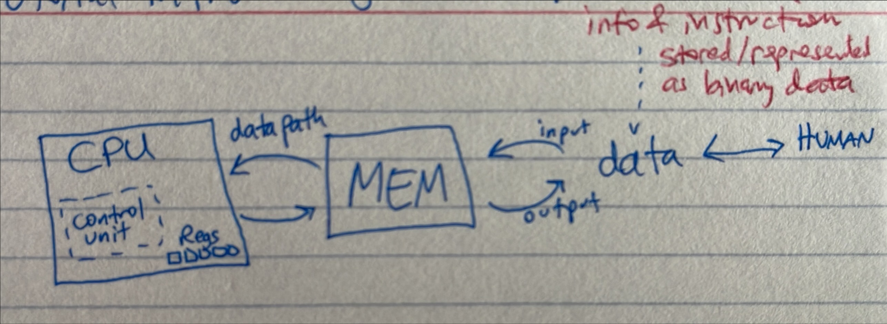
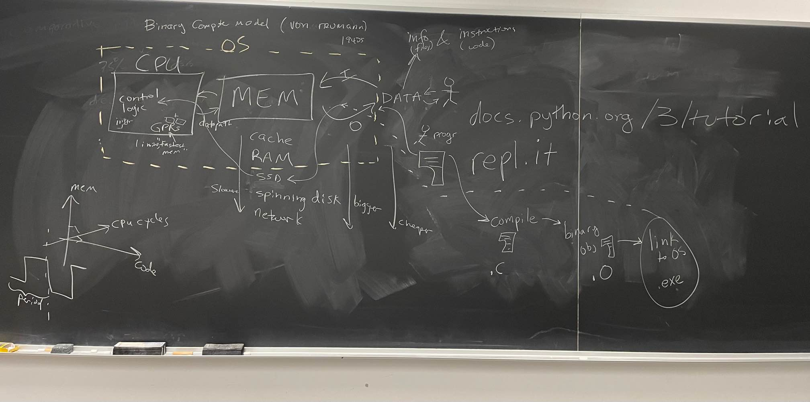
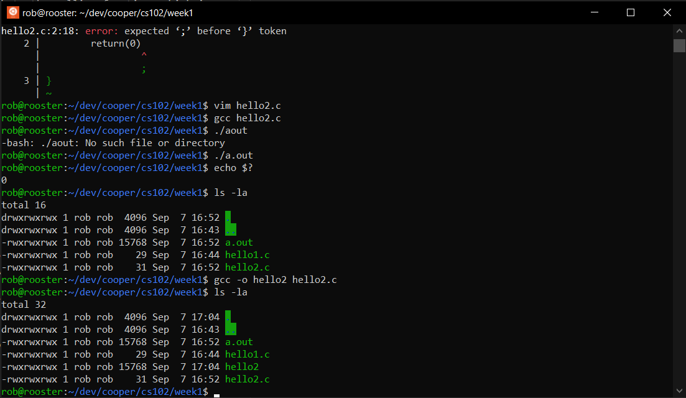

# CS 102 Weekly Course Notes
[<- back to syllabus](./cs102-syllabus-fall-2022.md)
# Week 1

## 1.0 Course Introduction
This course guides you to learn how to use the programming languages of C and of Python 3 as tools to identify, formulate, and solve engineering problems using the priciples of mathematics, science, and engineering. At the end of this course, you will be able to apply engineering principles to produce software that meets specific needs, that is, you will know how to confidently write programs that achieve a certain goal at the necessary level of quality, e.g., program execution speed within the computer's memory constraints as well as tested and documented for other engineers to understand, maintain, and expand functionality. Lastly, you will know how to test your software programs and verify their respective functionality with expected and unexpected inputs. As with all input to software, engineers expect outputs of a certain kind; so you will be able to visualize those outputs using ASCII characters on the console as well as graphs and charts using Python 3 libraries.

## 1.1 Required course resources
1. <u>The C Programming Language, 2nd Edition</u> by Brian W. Kernighan & Dennis M. Ritchie
2. The [official Python 3 Tutorial](https://docs.python.org/3/tutorial)

## 1.2 Know Thy Tools & Development Environment

### 1.2.1 The Computer (CPU + Memory <-> data)
The following is the von Neumann computer model that idealizes the modern digital computer and was postulated in the 1940s. Our modern digital computers (not the quantum ones) process logic using the binary number system, that is zero or one. Von Neumann's ***stored-program concept*** states that instructions and the data upon which they operate are represented by binary digits (bits). Therefore, when looking at binary code (bits), one cannot tell if it is instructions or data. The first generation of these computers were programmed manually by humans who set memory locations either zero or one. The second generation generalized the electronic computing circuits into compute commands, e.g., MOVE, LOAD, STORE, ADD, etc. Humans did not have to program in bits but now in what we call assembly language, an imperative language. As computers became more popular, electronics miniaturized further, the computer field (computer science, computer architecture) advanced to ease the effort of programming computers as well as increased the quality of programs, such as, optimization of code to increase speed of execution as well as increase efficieny of using (fast) memory, a limited resource. In summary, machine code was the first generation of programming; assembly language as the second generation; and procedural languages are the third generation, e.g., COBOL, FORTRAN, ALGOL, PL/1, BASIC, C.




### 1.2.2 The Bash Shell on Linux
The Linux operating system (OS) is the main program that runs on the computer (cs102.cooper.edu) and interfaces between you the user and the computer itself. The terminal (console) provides the command-line interface to the user to run programs. The Bash shell is the program that runs the terminal and provides console access to the user for input and for output. The EE Department's Micro Lab staff have provided this presentation in PDF format to introduce how to use the Bash shell; here is [the link to the document](./shell_slides.pdf), and [this link](./shell-cheat-sheet-v0.1.2.pdf) is a cheat sheet for the Bash shell.

### 1.2.3 Text Editor
Since we will be working in the Linux terminal environment, let's use ```vim```, the text editor that usually ships with almost all Linux OSes. There are many tutorials on how to use ```vim```, but here are two suggested ones:
* [The OpenVim Tutorial](https://www.openvim.com/)
* [Classic SysAdmin: Vim 101: A Beginner’s Guide to Vim](https://linuxfoundation.org/blog/classic-sysadmin-vim-101-a-beginners-guide-to-vim/)

When you're developing on your own laptop or desktop computer, feel free to use a text editor like [Sublime Text 3](https://www.sublimetext.com/) or [Microsoft Visual Code](https://code.visualstudio.com/).

### 1.2.4 Programming Paradigms
Computer scientists classify programming languages into many categories, based upon their respective functionality, e.g., how the code is organized, the execution model, style, syntax, or enabling side effects (modifying state variables values outside it local environment). In our course we will learn C and Python. These languages allow the programmer to instruct how the machine (computer) changes the state, i.e., the contents of a memory location. Memory can be a register, a cache location, a RAM address, a file in disk, etc. Computer science classifies C and Python as **imperative** programming paradigm. Subsets of imperative paradigms include but are not limited to **procedural** language and **object oriented** (OO). C is a procedural language, and so is Python 3, but the latter is also OO. C++, a superset of C, is OO. Procedural groups instructions into blocks, functions, or procedures (name depends upon the language history). OO groups instructions and state (memory) into units called classes, that are, in turn, instantiated into individal objects; for example, you can have a class called car, and an object for that class would be a Tesla X SUV. A class is like a cookie cutter template, and the object is the actual cookie you use, or eat. Declarative programming serves as another type of programming paradigm. With this classification, the language allows the programmer to declare the properties of the desired result after computation but not the logic of computation; SQL, HTML, CSS, XML serve as examples of declarative programming.

### 1.2.5 Evaluating Performance of Programs
In computer architecture and computer science, we evaluate performance of a program for a traditional von Neumann computer by measuring the speed of execution and the consumption of memory &mdash; that which is needed and actually used. The number of instructions running on the CPU and the number of memory loads and stores determine the speed of the program. The efficiency of memory usage determines the consumption of memory used. Note that computers have a hierarchy of memory from fastest to slowest, registers then cache within the circuitry of the CPU to RAM (random access memory) connected to the CPU via a bus then to disk drives (SSD to spinning disks), then to other computers connected via a network. The former are more sparse and limited than the latter; that is, less registers than cache addresses, less cache locations than RAM addresses, less RAM locations than disk drive space, etc. So just remember that compute (logic and time) is one axis of performance, and memory (storage and space) is the other.

*** 

## 2.0 Tutorial Introduction
Let's get started with the mainline ...

### 2.1 &mdash; C
The most rudimentary C program written into a file called ```hello1.c```
```c
/* This is a comment */
void main(void) {
    return;
}
```
```void``` is a type and think of it as "nothing." ```main()``` is the name of the function or procedure of instructions encapsulated within the braces, this is ```{ }```. This pair of left- and right-braces forms a ***code block***. Instructions within the code block run consecutively on the CPU, in general terms. This program enters ```main()``` and exits, or returns to the calling instruction, but what calls ```main()```? The operating system (OS) calls the mainline. For programs running on Unix or Linux or Windows-based computers, the entry into an application is the mainline, i.e., ```main()``` &mdash; be the program written in C, Python, or any other programming language. Note the ```void`` that serves as the formal argument for the function ```main()``` means there are no formal arguments for this function.

The program in C needs to be converted to object code (machine code) then linked to the OS in order to be able to be run.

##### Building (Compiling, Linking) and Executing
Working at the command-line interface (CLI) of Linux (on cs102.cooper.edu) and using the Bash shell environment:
```bash
$ cd $HOME
$ mkdir -p dev/cs102/week1
$ cd $HOME/dev/cs102/week1
$ vim hello1.c
```
Write the program above. Then ...
```bash
$ gcc ./hello1.c
$ ls -la
drwxrwxrwx 1 rob rob  4096 Sep  7 16:44 .
drwxrwxrwx 1 rob rob  4096 Sep  7 16:43 ..
-rwxrwxrwx 1 rob rob 15768 Sep  7 16:44 a.out
-rwxrwxrwx 1 rob rob    29 Sep  7 16:44 hello1.c
```
Note the ```./``` in front of hello1.c means "in this directory, used the file ...."```hello1.c```". The ```a.out``` is the executable file, or application. Usually in Windows, it ends in ```.exe```, and in Linux it does not have an extension. For the course, we will always add the ```.exe``` extension manually when building. To confirm the type of the file,
```bash
$ file ./a.out
a.out: ELF 64-bit LSB pie executable, x86-64, version 1 (SYSV), dynamically linked, interpreter /lib64/ld-linux-x86-64.so.2, BuildID[sha1]=15c161dc7adde7d0a0161636a10ce8f5672a4e19, for GNU/Linux 3.2.0, not stripped
```

And to run, or execute, the application,
```bash
$ ./a.out
$ 
```
Notice there is not output seen. Why? Because there is no instruction other than ```return;``` in the C program. That means, return back to the calling function, which in this case is the OS kernel (master OS program which controls the CPU and memory). The OS, in turn, returns back to the shell, from which you called ```./a.out```.

Let's now add the more normal Kernighan & Ritchie way of calling ```main()```
in a file called ```hello2.c```
```c
/* This is a comment */
int main(void) {
    return(0);
}
```
Let's build the program (compile and link) by using the C compiler and linker called ```gcc`` or "the GNU C Compiler."
```bash
$ gcc ./hello2.c
$ ./a.out
$ echo $?
0
```
This set of Bash shell commands compile and link the code file ```hello2.c``` to the executable program file ```a.out```. Then the ```echo``` Bash shell command prints out the variable name ```$?``` which is the numeric value of the output of the last program or command run, in this case ```0``` or zero. And that is what we wanted; see the instruction ```return(0)``` from hello2.c. Mainline applications in CLI programs return a numeric result, where zero means success, and any other number means an error, which the programmer needs to explain through documentation. If you would like to jump ahead, this is a [good tutorial on Linux C error handling](https://www.tutorialspoint.com/cprogramming/c_error_handling.htm), but ***caveat emptor***, it's advanced and may confuse you. We will cover later in the course.

Now, let's give a good name to the executable program file that we build by using arguments of the C compiler. The argument ```-o``` followed by a term ("hello2") means the application executable will be named that term.
```bash
$ gcc -o hello2 hello2.c
$ ls -la
drwxrwxrwx 1 rob rob  4096 Sep  7 17:04 .
drwxrwxrwx 1 rob rob  4096 Sep  7 16:43 ..
-rwxrwxrwx 1 rob rob 15768 Sep  7 16:52 a.out
-rwxrwxrwx 1 rob rob    29 Sep  7 16:44 hello1.c
-rwxrwxrwx 1 rob rob 15768 Sep  7 17:04 hello2
-rwxrwxrwx 1 rob rob    31 Sep  7 16:52 hello2.c
$ ./hello2
$ echo $?
0
```

Now let's write the traditional, timeless introductory first C program:
in a file called ```hello3.c```
```c
#include <stdio.h>

/* main function */
int main(void) {
    printf("Hello, World!\n");
    return(0);
}
```
The function ```printf()``` allows the programmer to write to the console (or terminal) the (formatted) string declared as the formal argument. ```#include``` is a compiler directive that has the include file (any file ending ```.h``` in a C program) copied directly and replacing the line of the said include statement. Think of the include file as a separate file of instructions that you write once and reuse as you need, or share with other programmers. The console, also generally called the terminal screen, is the grid of slots where human readable characters are printed, see image below:


Build and execute the program:
```bash
$ gcc -o hello3 hello3.c
$ ./hello3
Hello, World!
$
```

Let's make the string "Hello, World!\n" a symbolic constant named ```HELLO_STRING```, in this first example use, we will use the compiler directive ```#define```. The contents of the definition ```HELLO_STRING``` is placed wherever the symbolic constant is stated.
in a file called ```hello4.c```
```c
#include <stdio.h>

#define HELLO_STRING "Hello, World!\n"

/* main function */
int main(void) {
    printf(HELLO_STRING);
    return(0);
}
```

Build and execute the program:
```bash
$ gcc -o hello4 hello4.c
$ ./hello4
Hello, World!
$
```

***

### 2.2 &mdash;  Python

Python unlike C is an interpreted imperative language. Behind the scenes, the Python source files (```.py```) are compiled to (```.pyc```) binary files after you run the Python interpreter on the file the first time. If you edit the source file, then the next time you run Python on that file, it will be recompiled to an updated ```.pyc``` binary Python file.

To run the Python interpreter at the CLI on Linux using the Bash shell. You issue the Python command ```exit()``` or Ctrl-d key sequence to exit the interpreter.
```bash
$ python
rob@rooster:~/dev/cooper/cs102/week1$ python3
Python 3.10.4 (main, Jun 29 2022, 12:14:53) [GCC 11.2.0] on linux
Type "help", "copyright", "credits" or "license" for more information.
>>> exit()

```
After the symbols ```>>>```, you can issue Python source instructions, and after hitting enter, the Python interpreter will compile and execute your code. Note that running an interpreter like this does not store your files. Anything you write after the ```>>>``` is considered running in its ***mainline***.

For example,
```bash
$ python
rob@rooster:~/dev/cooper/cs102/week1$ python3
Python 3.10.4 (main, Jun 29 2022, 12:14:53) [GCC 11.2.0] on linux
Type "help", "copyright", "credits" or "license" for more information.
>>> print('hello')
hello
>>> 1+1
2
>>> foo=1
>>> bar=2
>>> foo+bar
3
>>> print('Hello, World!\n')
Hello, World!

>>> print('Hello, World!')
Hello, World!
>>> exit()
```
Notice the slight difference in console, or terminal, formatting with the newline character ```\n``` between Python and C.

When you use the interpreter mode of Python, you do not save your work. Rather to write programs in Python you will write your source code in a set of files and execute the programs. We will write our programs for now in one file, until we get to writing modular code later in the course.

Write a simple Python "Hello World" program as we did in C with symbolic constant
in the source file ```python1.py```
```python
# This is a comment
# global area for the Python program

HELLO_STRING = 'Hello, World!'


# Mainline
if __name__ == '__main__':
    print(HELLO_STRING)
```

***
***

# Week 2 &mdash; Types, Operators, Expressions

## Lecture Materials

*** 

## Hands-On Laboratory Work

*** 
***
# Week 15
Final projects presentations (Group C project & Individual Python mini-project)
