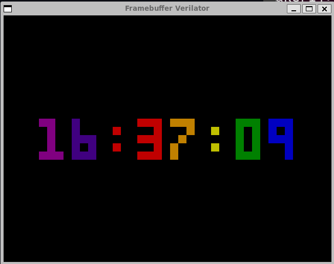

# Steps to Build a Computer

# The Human Computer Interface (HCI)

You will need to get programs into the computer, and the computer needs to output results so you can get output to see if those are the outcomes for which you programmed.

## Let's build a simulated terminal

_Reference: [Verilog Simulation with Verilator and SDL](https://projectf.io/posts/verilog-sim-verilator-sdl/) including its [GitHub repo](https://github.com/projf/projf-explore/tree/main/graphics/fpga-graphics/sim)._

### Tools
- SystemVerilog
- [Verilator](https://verilator.org/guide/latest/overview.html)

**Verilator** is a fast simulator that generates C++ models of **Verilog** designs. **SDL** (LibSDL) is a cross-platform library that provides low-level access to graphics hardware. Bring them together, and Verilator generates a model of your graphics hardware that SDL draws to a window on your PC.

To create your simulation, you need two things:
- Verilog top module
- C++ main function

### Verilator Top Module
Our Verilog top module is similar to that for FPGA dev boards. For simulation, we skip PLL clock generation and output the screen position and data enable as well as the pixel colour.

[`top_square.sv`](https://github.com/projf/projf-explore/blob/main/graphics/fpga-graphics/sim/top_square.sv) that is used as the Verilog top module:
```verilog
// Project F: FPGA Graphics - Square (Verilator SDL)
// (C)2023 Will Green, open source hardware released under the MIT License
// Learn more at https://projectf.io/posts/fpga-graphics/

`default_nettype none
`timescale 1ns / 1ps

module top_square #(parameter CORDW=10) (  // coordinate width
    input  wire logic clk_pix,             // pixel clock
    input  wire logic sim_rst,             // sim reset
    output      logic [CORDW-1:0] sdl_sx,  // horizontal SDL position
    output      logic [CORDW-1:0] sdl_sy,  // vertical SDL position
    output      logic sdl_de,              // data enable (low in blanking interval)
    output      logic [7:0] sdl_r,         // 8-bit red
    output      logic [7:0] sdl_g,         // 8-bit green
    output      logic [7:0] sdl_b          // 8-bit blue
    );

    // display sync signals and coordinates
    logic [CORDW-1:0] sx, sy;
    logic de;
    simple_480p display_inst (
        .clk_pix,
        .rst_pix(sim_rst),
        .sx,
        .sy,
        /* verilator lint_off PINCONNECTEMPTY */
        .hsync(),
        .vsync(),
        /* verilator lint_on PINCONNECTEMPTY */
        .de
    );

    // define a square with screen coordinates
    logic square;
    always_comb begin
        square = (sx > 220 && sx < 420) && (sy > 140 && sy < 340);
    end

    // paint colour: white inside square, blue outside
    logic [3:0] paint_r, paint_g, paint_b;
    always_comb begin
        paint_r = (square) ? 4'hF : 4'h1;
        paint_g = (square) ? 4'hF : 4'h3;
        paint_b = (square) ? 4'hF : 4'h7;
    end

    // display colour: paint colour but black in blanking interval
    logic [3:0] display_r, display_g, display_b;
    always_comb begin
        display_r = (de) ? paint_r : 4'h0;
        display_g = (de) ? paint_g : 4'h0;
        display_b = (de) ? paint_b : 4'h0;
    end

    // SDL output (8 bits per colour channel)
    always_ff @(posedge clk_pix) begin
        sdl_sx <= sx;
        sdl_sy <= sy;
        sdl_de <= de;
        sdl_r <= {2{display_r}};  // double signal width from 4 to 8 bits
        sdl_g <= {2{display_g}};
        sdl_b <= {2{display_b}};
    end
endmodule
```
**Note** SDL colour output is delayed one cycle in “SDL output”, so we need to delay sx, sy, and de to match. If we don’t do this, everything will be shifted left one pixel.

#### Display Module used in Top
The top module depends on the display module `simple_480.sv`. On real hardware, this module produces 640x480 output with a 60 Hz refresh rate. If you are interested in more details, check out [Beginning FPGA Graphics](https://projectf.io/posts/fpga-graphics/).

[`simple_480.sv`](https://github.com/projf/projf-explore/blob/main/graphics/fpga-graphics/simple_480p.sv):
```verilog
// Project F: FPGA Graphics - Simple 640x480p60 Display
// (C)2023 Will Green, open source hardware released under the MIT License
// Learn more at https://projectf.io/posts/fpga-graphics/

`default_nettype none
`timescale 1ns / 1ps

module simple_480p (
    input  wire logic clk_pix,   // pixel clock
    input  wire logic rst_pix,   // reset in pixel clock domain
    output      logic [9:0] sx,  // horizontal screen position
    output      logic [9:0] sy,  // vertical screen position
    output      logic hsync,     // horizontal sync
    output      logic vsync,     // vertical sync
    output      logic de         // data enable (low in blanking interval)
    );

    // horizontal timings
    parameter HA_END = 639;           // end of active pixels
    parameter HS_STA = HA_END + 16;   // sync starts after front porch
    parameter HS_END = HS_STA + 96;   // sync ends
    parameter LINE   = 799;           // last pixel on line (after back porch)

    // vertical timings
    parameter VA_END = 479;           // end of active pixels
    parameter VS_STA = VA_END + 10;   // sync starts after front porch
    parameter VS_END = VS_STA + 2;    // sync ends
    parameter SCREEN = 524;           // last line on screen (after back porch)

    always_comb begin
        hsync = ~(sx >= HS_STA && sx < HS_END);  // invert: negative polarity
        vsync = ~(sy >= VS_STA && sy < VS_END);  // invert: negative polarity
        de = (sx <= HA_END && sy <= VA_END);
    end

    // calculate horizontal and vertical screen position
    always_ff @(posedge clk_pix) begin
        if (sx == LINE) begin  // last pixel on line?
            sx <= 0;
            sy <= (sy == SCREEN) ? 0 : sy + 1;  // last line on screen?
        end else begin
            sx <= sx + 1;
        end
        if (rst_pix) begin
            sx <= 0;
            sy <= 0;
        end
    end
endmodule
```
### SDL/C++ Creates Your Display
To drive our simulation, we need a C++ main function. SDL has many ways to draw on the screen. I’ve chosen a straightforward approach that should work for any graphics design. We write the Verilog video “beam” to an array of pixels. Once per frame, we convert the pixel array to an SDL texture and update our application window.

The following C++ code should be taken as is. We will work through more examples to generalize and have you use this as a template. We will build this all in a Unix environment so you can develop on Windows (through WSL Ubuntu), MacOS, and Linux. This will create a graphics output that emulates a terminal for your computer!

[`main_square.cpp`](https://github.com/projf/projf-explore/blob/main/graphics/fpga-graphics/sim/main_square.cpp)
```verilog
// Project F: FPGA Graphics - Square Verilator C++
// (C)2023 Will Green, open source software released under the MIT License
// Learn more at https://projectf.io/posts/fpga-graphics/

#include <stdio.h>
#include <SDL.h>
#include <verilated.h>
#include "Vtop_square.h"

// screen dimensions
const int H_RES = 640;
const int V_RES = 480;

typedef struct Pixel {  // for SDL texture
    uint8_t a;  // transparency
    uint8_t b;  // blue
    uint8_t g;  // green
    uint8_t r;  // red
} Pixel;

int main(int argc, char* argv[]) {
    Verilated::commandArgs(argc, argv);

    if (SDL_Init(SDL_INIT_VIDEO) < 0) {
        printf("SDL init failed.\n");
        return 1;
    }

    Pixel screenbuffer[H_RES*V_RES];

    SDL_Window*   sdl_window   = NULL;
    SDL_Renderer* sdl_renderer = NULL;
    SDL_Texture*  sdl_texture  = NULL;

    sdl_window = SDL_CreateWindow("Square", SDL_WINDOWPOS_CENTERED,
        SDL_WINDOWPOS_CENTERED, H_RES, V_RES, SDL_WINDOW_SHOWN);
    if (!sdl_window) {
        printf("Window creation failed: %s\n", SDL_GetError());
        return 1;
    }

    sdl_renderer = SDL_CreateRenderer(sdl_window, -1,
        SDL_RENDERER_ACCELERATED | SDL_RENDERER_PRESENTVSYNC);
    if (!sdl_renderer) {
        printf("Renderer creation failed: %s\n", SDL_GetError());
        return 1;
    }

    sdl_texture = SDL_CreateTexture(sdl_renderer, SDL_PIXELFORMAT_RGBA8888,
        SDL_TEXTUREACCESS_TARGET, H_RES, V_RES);
    if (!sdl_texture) {
        printf("Texture creation failed: %s\n", SDL_GetError());
        return 1;
    }

    // reference SDL keyboard state array: https://wiki.libsdl.org/SDL_GetKeyboardState
    const Uint8 *keyb_state = SDL_GetKeyboardState(NULL);

    printf("Simulation running. Press 'Q' in simulation window to quit.\n\n");

    // initialize Verilog module
    Vtop_square* top = new Vtop_square;

    // reset
    top->sim_rst = 1;
    top->clk_pix = 0;
    top->eval();
    top->clk_pix = 1;
    top->eval();
    top->sim_rst = 0;
    top->clk_pix = 0;
    top->eval();

    // initialize frame rate
    uint64_t start_ticks = SDL_GetPerformanceCounter();
    uint64_t frame_count = 0;

    // main loop
    while (1) {
        // cycle the clock
        top->clk_pix = 1;
        top->eval();
        top->clk_pix = 0;
        top->eval();

        // update pixel if not in blanking interval
        if (top->sdl_de) {
            Pixel* p = &screenbuffer[top->sdl_sy*H_RES + top->sdl_sx];
            p->a = 0xFF;  // transparency
            p->b = top->sdl_b;
            p->g = top->sdl_g;
            p->r = top->sdl_r;
        }

        // update texture once per frame (in blanking)
        if (top->sdl_sy == V_RES && top->sdl_sx == 0) {
            // check for quit event
            SDL_Event e;
            if (SDL_PollEvent(&e)) {
                if (e.type == SDL_QUIT) {
                    break;
                }
            }

            if (keyb_state[SDL_SCANCODE_Q]) break;  // quit if user presses 'Q'

            SDL_UpdateTexture(sdl_texture, NULL, screenbuffer, H_RES*sizeof(Pixel));
            SDL_RenderClear(sdl_renderer);
            SDL_RenderCopy(sdl_renderer, sdl_texture, NULL, NULL);
            SDL_RenderPresent(sdl_renderer);
            frame_count++;
        }
    }

    // calculate frame rate
    uint64_t end_ticks = SDL_GetPerformanceCounter();
    double duration = ((double)(end_ticks-start_ticks))/SDL_GetPerformanceFrequency();
    double fps = (double)frame_count/duration;
    printf("Frames per second: %.1f\n", fps);

    top->final();  // simulation done

    SDL_DestroyTexture(sdl_texture);
    SDL_DestroyRenderer(sdl_renderer);
    SDL_DestroyWindow(sdl_window);
    SDL_Quit();
    return 0;
}
```
#### Explaining the C++ code
##### C++ Includes
There are four includes:
- `#include <stdio.h>` - for printf; you can use iostream and cout if you prefer
- `#include <SDL.h>` - SDL header
- `#include <verilated.h>` - common Verilator routines
- `#include "Vtop_square.h"` - generated by Verilator to match our Verilog top module. The name of the final include depends on the name of your top module.

##### Screen Size
We define our screen size to match our display module, simple_480p:
```c++
// screen dimensions
const int H_RES = 640;
const int V_RES = 480;
```

##### Pixel Type
We create a 32-bit Pixel type to represent each pixel:
```c++
typedef struct Pixel {  // for SDL texture
    uint8_t a;  // transparency
    uint8_t b;  // blue
    uint8_t g;  // green
    uint8_t r;  // red
} Pixel;
```

##### SDL Initialization
The next few lines create the pixel array and three SDL objects: window, renderer, and texture.
```c++
Pixel screenbuffer[H_RES*V_RES];

SDL_Window*   sdl_window   = NULL;
SDL_Renderer* sdl_renderer = NULL;
SDL_Texture*  sdl_texture  = NULL;
```
We will explain the SDL create call options in this post; you can read about them on the SDL wiki:
- [SDL_CreateWindow](https://wiki.libsdl.org/SDL_CreateWindow)
- [SDL_CreateRenderer](https://wiki.libsdl.org/SDL_CreateRenderer)
- [SDL_CreateTexture](https://wiki.libsdl.org/SDL_CreateTexture)

##### Keyboard State As You Run Simulation
We reference the keyboard state and tell the user how to quite the simulation.
```c++
// reference SDL keyboard state array: https://wiki.libsdl.org/SDL_GetKeyboardState
const Uint8 *keyb_state = SDL_GetKeyboardState(NULL);

printf("Simulation running. Press 'Q' in simulation window to quit.\n\n");
```
You can also quit by closing the simulation window or by pressing CMD-Q on macOS.

##### Verilog Initialization Within C++ program
We create an instance of our Verilog module, then reset it:
```c++
// initialize Verilog module
Vtop_square* top = new Vtop_square;

// reset
top->sim_rst = 1;
top->clk_pix = 0;
top->eval();
top->clk_pix = 1;
top->eval();
top->sim_rst = 0;
top->clk_pix = 0;
top->eval();
```
The model is run (evaluated) when you call `top->eval()`.

##### Performance Counters
We create a couple of counters to measure the frame rate:
```c++
// initialize frame rate
uint64_t start_ticks = SDL_GetPerformanceCounter();
uint64_t frame_count = 0;
```

##### Main Loop
Our simulation runs in the main loop, which has four parts.

(1) The pixel clock (`clk_pix`) drives our hardware; we flip it to `1` and back to `0`, evaluating our model step by step over each phase of every clock level change:
```c++
    // cycle the clock
    top->clk_pix = 1;
    top->eval();
    top->clk_pix = 0;
    top->eval();
```
If we’re in the active drawing part of the screen (i.e. not the blanking interval), we get a pointer to the current pixel `p` then update its colour:
```c++
    // update pixel if not in blanking interval
    if (top->sdl_de) {
        Pixel* p = &screenbuffer[top->sdl_sy*H_RES + top->sdl_sx];
        p->a = 0xFF;  // transparency
        p->b = top->sdl_b;
        p->g = top->sdl_g;
        p->r = top->sdl_r;
    }
```
We don’t check the `screenbuffer` array index is valid. Our display module should handle this correctly, but this assumption is dangerous: you’ll probably get a core dump if the index is not in range. So be deliberate and CHECK IT!

Once per frame, we poll for a quit event and check if the user pressed `Q` to quit:
```c++
    // update texture once per frame (in blanking)
    if (top->sdl_sy == V_RES && top->sdl_sx == 0) {
        // check for quit event
        SDL_Event e;
        if (SDL_PollEvent(&e)) {
            if (e.type == SDL_QUIT) {
                break;
            }
        }

        if (keyb_state[SDL_SCANCODE_Q]) break;  // quit if user presses 'Q'
```
Then we update the texture and increment the frame counter:
```c++
        SDL_UpdateTexture(sdl_texture, NULL, screenbuffer, H_RES*sizeof(Pixel));
        SDL_RenderClear(sdl_renderer);
        SDL_RenderCopy(sdl_renderer, sdl_texture, NULL, NULL);
        SDL_RenderPresent(sdl_renderer);
        frame_count++;
    }
```
**Note**: The call to [SDL_UpdateTexture](https://wiki.libsdl.org/SDL_UpdateTexture) is expensive, so we limit it to once per frame. Of course, you can update the texture after every pixel, but your simulation will run approximately 1000x slower! That's ok when you are trying to learn, but it's not performant for real-world use.

##### Clean Up
After breaking out of the while loop, we calculate the frame rate:
```c++
    // calculate frame rate
    uint64_t end_ticks = SDL_GetPerformanceCounter();
    double duration = ((double)(end_ticks-start_ticks))/SDL_GetPerformanceFrequency();
    double fps = (double)frame_count/duration;
    printf("Frames per second: %.1f\n", fps);
```

The perform some clean up before quitting:
```c++
    top->final();  // simulation done

    SDL_DestroyTexture(sdl_texture);
    SDL_DestroyRenderer(sdl_renderer);
    SDL_DestroyWindow(sdl_window);
    SDL_Quit();
    return 0;
}
```

### Building and Running on your Development Computer
Building and running Verilator simulations is relatively simple. We use `sdl2-config` command to set the correct compiler and linker options for us.

To make it easy to following, grab the GitHub repo for this [`projectf.io`](https://github.com/projf/projf-explore/tree/main) project, and do the following in a Bash terminal of your Unix environment, that is, Windows WSL-Ubuntu, Linux, or MacOS command-line interface.
```bash
cd $HOME
mkdir dev && cd ./dev
git clone https://github.com/projf/projf-explore.git
```

To build the square simulation from the Project F repo, let's use the following Bash commands in Unix:
```bash
cd projf-explore/graphics/fpga-graphics/sim

verilator -I../ -cc top_square.sv --exe main_square.cpp -o square \
    -CFLAGS "$(sdl2-config --cflags)" -LDFLAGS "$(sdl2-config --libs)"

make -C ./obj_dir -f Vtop_square.mk
```
You can then run the simulation executable from obj_dir:
```bash
./obj_dir/square
```

When building your own designs, you may need to adjust the -I option that tells Verilator where to find included Verilog modules.

#### Makefile
We can automate building with a [Makefile](https://github.com/projf/projf-explore/blob/main/graphics/fpga-graphics/sim/Makefile):
```Makefile
VFLAGS = -O3 --x-assign fast --x-initial fast --noassert
SDL_CFLAGS = `sdl2-config --cflags`
SDL_LDFLAGS = `sdl2-config --libs`

square: square.exe
flag_ethiopia: flag_ethiopia.exe
flag_sweden: flag_sweden.exe
colour: colour.exe

%.exe: %.mk
	make -C ./obj_dir -f Vtop_$<

%.mk: top_%.sv
	verilator ${VFLAGS} -I.. \
		-cc $< --exe main_$(basename $@).cpp -o $(basename $@) \
		-CFLAGS "${SDL_CFLAGS}" -LDFLAGS "${SDL_LDFLAGS}"

all: square flag_ethiopia flag_sweden colour

clean:
	rm -rf ./obj_dir

.PHONY: all clean
```
With the Makefile in place you can simply run:
```bash
make square
```
**ProTip:*** `VFLAGS` are options passed to Verilator: the selected settings deliver [best performance](https://verilator.org/guide/latest/simulating.html#benchmarking-optimization).

#### Simulation Running
The simulation looks like this:


Press `Q` in the simulation window to quit.

Now you're ready to try some examples before doing it yourself.
* [VGA Clock in Verilog](https://github.com/mattvenn/vga-clock)
  * 