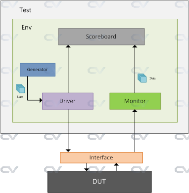

# Verilog & SystemVerilog

# References

- [Verilog HDL Design Examples](https://www.taylorfrancis.com/books/mono/10.1201/b22315/verilog-hdl-design-examples-joseph-cavanagh) by Joseph Cavanagh, ISBN 978-1-138-09995-1

# Logic Elements

## Comments

```verilog
// This is a single-line comment like in C++
/*
 * This is a multi-line comment like in C
 */

```

## Assignment Operators

`=` is **blocking statement**. In an `always` block, the line of code will be executed **only after** its previous line has executed. Hence, they execute one after the other. `<=` is a **non-blocking statement**. This means that in an `always` block, every line will be executed in parallel.

## Logic Gates

- and
- or
- not (inverter)
- nand
- nor
- xor

## Logic Macro Functions

Logic macro functions serve as those circuits which consist of several logic primitives to form larger more complex functions.

### Combinational logic macros

- multiplexers
- decoders
- encoders
- comparators
- adders
- subtractors
- array multipliers
- array dividers
- error detection and correction circuits

#### Multiplexers

A multiplexer is a logic macro device that allows digital information from two or more data inputs to be directed to a single output. Data input selection is controlled by a set of select inputs that determine which data input is gated to the out- put.

**4:1 Multiplexer**  
4-bit input (d3d2d1d0)  
2-bit selector (s1s0)  
1-bit multiplexed output (z)

```verilog
z = s1's0'd0 + s1's0d1 + s1s0'd2 + s1s0d3
```

#### Decoders

A decoder is a combinational logic macro that is characterized by the following property: For every valid combination of inputs, a unique output is generated.

In general, a decoder has `n` binary inputs and `m` mutually exclusive outputs, where 2^n >= m. An n:m (n-to-m) decoder is a demultiplexer. Each output represents a minterm that corresponds to the binary representation of the input vector. Thus, zi = mi, where mi is the ith minterm of the n input variables.

A decoder with n inputs, therefore, has a maximum of 2^n outputs. Because the outputs are mutually exclusive, only one output is active for each different combination of the inputs. The decoder outputs may be asserted high or low. Decoders have many applications in digital engineering, ranging from instruction decoding to memory addressing to code conversion.

For example, if n = 3 and x1 x2 x3 = 101, then output z5 is asserted, that is, the fifth bit.

#### Encoders

A simple encoder circuit is a one-hot to binary converter. That is, if there are 2^n input lines, and at most only one of them will ever be high, the binary code of this 'hot' line is produced on the n-bit output lines.

The function of an encoder can be considered to be the inverse of a decoder; that is, the mutually exclusive inputs are encoded into a corresponding binary number. An encoder inputs are mutually exclusive, meaning only one input is asserted, or set to on/true.

An encoder is a macro logic circuit with n mutually exclusive inputs and m binary outputs, where n <= 2^m. The inputs are mutually exclusive to prevent errors from appearing on the outputs. The outputs generate a binary code that corresponds to the active input value.

##### Priority Encoders

An encoder inputs are mutually exclusive. In certain applications more than one input can be active at a time. Then a **priority** must be established to select and encode a particular input. This is referred to as a **priority encoder**.

#### Comparators

A comparator is a logic macro circuit that compares the magnitude of two n-bit binary numbers X1 and X2.

Therefore, there are 2^n inputs and three outputs that indicate the relative magnitude of the two numbers. The outputs are mutually exclusive, specifying

- X1 < X2,
- X1 = X2, or
- X1 > X2

(X1 < X2) = x11'x21 + (x11 &#x2295; x21)' x12'x22 + (x11 &#x2295; x21)' (x12 &#x2295; x22)'x13' x23

(X1 = X2) = (x11 &#x2295; x21)'(x12 &#x2295; x22)'(x13 &#x2295; x23)'

(X1 > X2) = x11 x21' + (x11 &#x2295; x21)'x12x22' + (x11 &#x2295; x21)'(x12 &#x2295; x22)'x13 x23'⊕

### Sequential logic macros

- SR latches
- D and JK flip-flops
- counters of various moduli, including count-up and count-down counters
- registers, including shift registers
- sequential multipliers and dividers

We will cover this later in this document...

# Procedural Flow Control

Procedural flow control statements modify the flow in a behavior by selecting branch options, repeating certain activities, selecting a parallel activity, or terminating an ac- tivity.

The activity can occur in sequential blocks or in parallel blocks.

## `begin ... end` code block

This creates a group of multiple statements into a sequential block.

## `disable` keyword

terminates a named block of procedural statements or a task and transfers control to the statement immediately following the block or task. The disable statement can also be used to exit a loop.

## `for` loop

specifies a loop. The for loop repeats the execution of a procedural statement or a block of procedural statements a specified number of times. The for loop is used when there is a specified beginning and end to the loop. The format and function of a for loop is similar to the for loop used in the C program- ming language. The parentheses following the keyword for contain three expressions separated by semicolons:

```verilog
for (<register initialization>; <test condition>; <update register control variable>)
begin
// procedural statement or block (using the begin..end) of procedural statements
```

## `forever` loop

executes the procedural statements continuously. The loop is primarily used for timing control constructs, such as clock pulse generation. The forever procedural statement must be contained within an initial or an always block. In order to exit the loop, the disable statement may be used to pre- maturely terminate the procedural statements. An always statement executes at the beginning of simulation; the forever statement executes only when it is encountered in a procedural block.

## `if ... else` conditional statement

These keywords are used as conditional statements to alter the flow of activity through a behavioral module. They permit a choice of alternative paths based upon a Boolean value obtained from a condition.

```verilog
if (<condition>)
  // if condition true
  begin
    <procedural statement(s)>
  end
else
  // if condition false
  begin
    <procedural statement(s)>
  end
```

or if you need to nest your conditional logic:

```verilog
if (<condition1>)
  // if condition1 true
  begin
    <procedural statement(s)>
  end
// if condition1 false
else if (<condition2>)
  // if condition2 true
  begin
    <procedural statement(s)>
  end
// if condition2 false
else if (<condition3>)
  // if condition3 true
  begin
    <procedural statement(s)>
  end
else
  // if condition3 false
  begin
    <procedural statement(s)>
  end
```

## `case` Statements
	
`Case` statements are used where we have one variable which needs to be checked for multiple values, like an address decoder, where the input is an address and needs to be checked for all the values that it can take. Instead of using multiple nested `if-else` statements, one for each value we're looking for, we use a single `case` statement. This is similar to switch statements in languages like C/C++. Here is a simple example,

```verilog
case(address)
  0 : $display ("value = 0");
  1 : $display ("value = 1");
  2 : $display  ("value = 2");
  default : $display  ("unknown");
endcase
```

`Case` statements begin with the reserved word `case` and end with the reserved word `endcase`. The cases, followed with a colon and the statements to be conditionally executed, are listed within these two delimiters. It's recommended to have a `default` case. Just like with a finite state machine (FSM), if the Verilog machine enters into a non-covered statement, the machine hangs, looping for infinity. Defaulting the statement with a return to idle would avoid that indeterminate state.

**NOTE**: One thing that is common to `if-else` and `case` statements is that, if you don't cover all the cases (don't have `else` in `if-else` or `default` in `case`), and you are trying to write a combinational statement, the synthesis tool will infer `latch`.


## `repeat` keyword

execute a loop a fixed number of times as specified by a constant contained within parentheses following the repeat keyword. The loop can be a single statement or a block of statements contained within `begin ... end` keywords. When the activity flow reaches the repeat construct, the expression in parentheses is evaluated to determine the number of times that the loop is to be executed. The expression can be a constant, a variable, or a signal value. If the expression evaluates to x or z, then the value is treated as 0 and the loop is not executed.

```verilog
repeat (<expression>) begin
  <statement(s)>
end
```

## `while` loop

A `while` statement executes the code within it repeatedly if the condition it is assigned to check returns true. `While` loops are not normally used for models in real life, but they are used in test benches. As with other statement blocks, they are delimited by begin and end.

A `while` loop executes a statement or a block of statements while an expression is true. The expression is evaluated and a Boolean value, either true (a logical 1) or false (a logical 0) is returned. If the expression is true, then the procedural statement or block of statements is executed. The while loop executes until the expression be- comes false, at which time the loop is exited and the next sequential statement is ex- ecuted. If the expression is false when the loop is entered, then the procedural statement is not executed. If the value returned is `x` (don't care) or `z` (unknown/floating), then the value is treated as false.

```verilog
while (<expression>) begin
  <statement(s)>
end
```

## `disable` keyword

One can disable a block of code by using the reserve word disable. For example,
### `counter.sv`
```verilog
module counter (clk,rst,enable,count);
  input clk, rst, enable;
  output [3:0] count;
  reg [3:0] count;

  always @ (posedge clk or posedge rst)
    if (rst) begin
      count <= 0;
    end
    else begin : COUNT // this creates a code block named "COUNT" from begin to end
      while (enable) begin
        count <= count + 1;
        disable COUNT; // when enable = 1, the count is incremented and the block is disabled
      end
    end
endmodule
```

### `tb_counter.sv`
```verilog
module tb_counter;
  //
  // ---------------- DECLARATIONS OF DATA TYPES ----------------
  //
  //inputs are reg for test bench - or use logic
  reg CLK;
  reg RST;
  reg EN;
  //outputs are wire for test bench - or use logic
  wire [3:0] Z1;

  //
  // ---------------- INITIALIZE TEST BENCH ----------------
  //
  initial begin : initialize_signals
    CLK = 1'b0;
    RST = 1'b0;
    EN = 1'b0;
  end

  initial begin
    $monitor ($time,"\tCLK=%b EN=%b RST=%b Z1=%b", CLK, RST, EN, Z1);
  end

  initial begin
    $dumpfile("tb_counter.vcd"); // for Makefile, make dump file same as module name
    $dumpvars(0, dut);
  end
  
  // a simple clock with 50% duty cycle
  always begin: clock
    #10 CLK = ~CLK;
  end


  //
  // ---------------- APPLY INPUT VECTORS ----------------
  //

  initial begin: prog_apply_stimuli
    #0
    #10	RST = 1'b1;
    #10 RST = 1'b0;
    #10 EN = 1'b1;
    #5
    #100 EN = 1'b0;
    #30
    $finish;
  end

  //
  // ---------------- INSTANTIATE UNIT UNDER TEST (UUT) ----------------
  //
  counter dut(
    .clk(CLK), .rst(RST), .enable(EN), .count(Z1)
  );
endmodule
```
In the example above the `always` block will run when either `rst` or `clk` reaches a positive edge, that is, when their value has risen from `0` to `1` - for positive logic. You can have two or more `always` blocks in a program going at the same time (not shown yet here, but commonly used).

We can disable a block of code, by using the reserve word `disable`. In the above example, after each counter increment, the COUNT block of code (not shown here) is disabled.

## Net Data Types

Verilog defines two data types, i.e., net (wire) or register (reg). These predefined data types are used to connect logical elements and to provide storage. A `net` or `wire` is a physical wire or group of wires connecting hardware elements in a module or between modules. SystemVerilog condenses net(wire) and reg into `logic`.

## Register Data Types

A register data type represents a variable that can retain a value. Verilog registers are similar in function to hardware registers, but are conceptually different. Hardware registers are synthesized with storage elements such as D flip-flops, JK flip-flops, and SR latches. Verilog registers are an abstract representation of hardware registers and are declared as `reg`.

The default size of a register is 1-bit, but a larger width can be specified in the declaration.

The general syntax to declare a width of more than 1-bit

```verilog
reg [<msb>:<lsb>] register_name;
```

where &lt;msb&gt; = most significant bit number, e.g., 7 for an 8-bit number, and &lt;lsb&gt; = least significant bit number, e.g., 0; for example, a one-byte register called data_register:

```verilog
reg[7:0] data_register;
```

## Memories

You can model a memory in Verilog using an array of registers; for example, a 32-word register with one byte per word:

```verilog
reg[7:0] data_memory[0:31]; // [0:31] defines the 32 word array
```

A register can be assigned a value using one statement, as long as the bit widths line up. For example,

```verilog
reg[15:0] buffer; // 16-bit register
buffer = 16'h8a04; // same as 16'b1000_1010_0000_0100
```

Values can be stored in memory elements by assigning a value to each word individually; for example,

```verilog
reg[7:0] cache[0:4];
cache[0] = 8'h01;
cache[1] = 8'h02;
cache[2] = 8'h03;
cache[3] = 8'h04;
```

# Verilog Expressions

Expressions consist of operands and operators, which are the basis of Verilog HDL.

The result of a **right-hand side** expression can be assigned to a **left-hand side** net variable or register variable using the keyword `assign`.

The value of an expression is determined from the combined operations on the operands. An expression can consist of a single operand or two or more operands in conjunction with one or more operators. The result of an expression is represented by one or more bits.

## Operands

|        Operands | Notes                                                                 |
| --------------: | :-------------------------------------------------------------------- |
|        constant | `signed` or `unsigned`                                                |
|     `parameter` | similar to a constant but used to parametrize modules, like bit-width |
| `net` or `wire` | scalar or vector, or `logic` for SystemVerilog                        |
|           `reg` | scalar or vector                                                      |
|      bit-select | choose one bit from a vector                                          |
|     part-select | choose contiguous bits of a vector                                    |
|  memory element | one word of a memory                                                  |

### Constant

Constants can be signed or unsigned. A decimal integer is treated as a signed number. An integer that is specified by a base is interpreted as an unsigned number.

|     Constant | Notes                                                                     |
| -----------: | :------------------------------------------------------------------------ |
|          127 | Signed decimal: Value = 8-bit binary vector: 0111_1111                    |
|           –1 | Signed decimal: Value = 8-bit binary vector: 1111_1111                    |
|         –128 | Signed decimal: Value = 8-bit binary vector: 1000_0000                    |
|      4'b1110 | Binary base: Value = unsigned decimal 14                                  |
| 8'b0011_1010 | Binary base: Value = unsigned decimal 58                                  |
|     16'h1A3C | Hexadecimal base: Value = unsigned decimal 6716                           |
|     16'hBCDE | Hexadecimal base: Value = unsigned decimal 48,350                         |
|       9'o536 | Octal base: Value = unsigned decimal 350                                  |
|          –22 | Signed decimal: Value = 8-bit binary vector: 1110_1010                    |
|      –9'o352 | Octal base: Value = 8-bit binary vector: 1110_1010 = unsigned decimal 234 |

The number –22 (base 10) is a signed decimal value; the number –9'o352 is treated as an unsigned number with a decimal value of 234 (base 10).

## Parameter

A parameter is similar to a constant and is declared by the keyword pa- rameter. Parameter statements assign values to constants; the values cannot be changed during simulation. Wherever the parameter name is used in the code, it is replaced by the value assigned to the parameter name.

|                   Parameter Example | Notes                                                         |
| ----------------------------------: | :------------------------------------------------------------ |
|               `parameter` width = 8 | Used to define a bus width of 8 bits                          |
| `parameter` width = 16, depth = 512 | Used to define a memory with two bytes per word and 512 words |
|            `parameter` out_port = 8 | Used to define an output port with an address of 8            |

### Specify Parameters
These are primarily used for providing timing and delay values. They are declared using the `specparam` keyword. It is allowed to be used both within the `specify` block and the main module body.

```verilog
// use of specify block
specify
  specparam t_rise = 200, t_fall = 150; // units? check `timescale
  specparam clk_to_q = 70, d_to_q = 100;
endspecify

// use within main module
module my_block ( ... );
  specparam dhold = 2.0;
  specparam ddly = 1.5;

  parameter WIDTH = 32;
...
endmodule
```

See [ChipVerify's Verilog Parameters page](https://www.chipverify.com/verilog/verilog-parameters) for more details.

## Operators

Verilog has a set of operators that perform various operations on different types of data to yield results on nets and registers. Some operators are similar to those used in the C programming language.

| Operator Type | Operator Symbol | Operation             | # Operands |
| ------------: | :-------------- | :-------------------- | :--------- |
|    Arithmetic | +               | Add                   | 2 or 1     |
|               | -               | Subtract              | 2 or 1     |
|               | \*              | Multiply              | 2          |
|               | /               | Divide                | 2          |
|               | %               | Modulus               | 2          |
|       Logical | &&              | logical AND           | 2          |
|               | \|\|            | logical OR            | 2          |
|               | !               | logical negation      | 1          |
|    Relational | &gt;            | greater than          | 2          |
|               | &lt;            | less than             | 2          |
|               | &gt;=           | greater than or equal | 2          |
|               | &lt;=           | less than or equal    | 2          |
|      Equality | ==              | logical equality      | 2          |
|               | !=              | logical inequality    | 2          |
|               | ===             | case equality         | 2          |
|               | !==             | case inequality       | 2          |
|       Bitwise | &               | AND                   | 2          |
|               | \|              | OR                    | 2          |
|               | ~               | Negation              | 1          |
|               | ^               | Exclusive OR          | 2          |
|               | ^~ or ~^        | Exclusive NOR         | 2          |
|     Reduction | &               | AND                   | 1          |
|               | ~&              | NAND                  | 1          |
|               | \|              | OR                    | 1          |
|               | ~\|             | NOR                   | 1          |
|               | ^               | Exclusive OR          | 1          |
|               | ^~ or ~^        | Exclusive NOR         | 1          |
|         Shift | <<              | Shift LEFT            | 1          |
|               | >>              | Shift RIGHT           | 1          |
|   Conditional | ?:              | Conditional (if/else) | 3          |
| Concatenation | {}              | Concatenation         | 2 or more  |
|   Replication | {{ }}           | Replication           | 2 or more  |

### Let's review the arithmetic terminologies

|      Operation | Terminology                              |
| -------------: | :--------------------------------------- |
|       Addition | Augend + Addend = Sum                    |
|    Subtraction | Minuend - Subtrahend = Difference        |
| Multiplication | Multiplicand \* Multiplier = Product     |
|       Division | Dividend / Divisor = Quotient, Remainder |

### Concatenation

The concatenation operator ( { } ) forms a single operand from two or more operands by joining the different operands in sequence separated by commas. The operands to be appended are contained within braces. The size of the operands must be known before concatenation takes place.

```verilog
reg a[1:0] = 2'b11;
reg b[2:0] = 3'b001;
reg c[3:0] = 4'b1100;
reg d = 1'b1;
reg z1[9:0] = {a,c}; // 10'b0000_11_1100
reg z2[9:0] = {b,a}; // 10'b00000_001_11
reg z3[9:0] = {c,b,a}; // 10'b0_1100_001_11
reg z4[9:0] = {a,b,c,d}; // 10'b11_001_1100_1
```

### Replication

Replication is a means of performing repetitive concatenation. Replication specifies the number of times to duplicate the expressions within the innermost braces.

Syntax:

```verilog
{number_ of_ repetitions {expression_1, expression_2, ... , expression_n}};
```

For example,

```verilog
reg a[1:0] = 2'b11;
reg b[2:0] = 3'b001;
reg c[3:0] = 4'b1100;
reg z1[9:0] = 11_0011_11_0011, //z1 = {2{a, c}}
reg z2[9:0] = 010_0011_0111_010_0011_0111 //z2 = {2{b, c, 4'b0111}}
```

# Module and Ports

A `module`` is the basic unit of design in Verilog. It describes the functional operation of some logical entity and can be a standalone module or a collection of modules that are instantiated into a structural module.

**Instantiation** means to use one or more lower-level modules in the construction of a higher-level structural module. A module can be a logic gate, an adder, a multiplexer, a counter, or some other logical function.

A module consists of declarative text which specifies the function of the module using Verilog constructs. A Verilog module is a software representation of the physical hardware structure and behavior. The declaration of a module is indicated by the keyword `module` and is always terminated by the keyword `endmodule`. Modules contain **ports** which allow communication with the external environment or other modules.

Verilog has predefined logical elements called **primitives**. These built-in primitives are structural elements that can be instantiated into a larger design to form a more complex structure. Examples are: `and`, `or`, `xor`, and `not`.

# Designing a Test Bench for Simulation

A test bench allows the computer architect or systems designer to verify the functionality of a logic design through simulations. As a work bench, it lays out the design and drives the circuit with input stimuli.

1. Generate different types of input stimulus
2. Drive the design inputs with the generated stimulus
3. Allow the design to process input and provide an output
4. Check the output with expected behavior to find functional defects
5. If a functional bug is found, then change the design to fix the bug
6. Perform the above steps until there are no more functional defects

The various components that setup and facilitate the data transfer from the stimuli to the device under test (DUT), i.e, the module you would like to test and verify.



See [ChipVerify's Intro to SystemVerilog TestBench](https://www.chipverify.com/systemverilog/systemverilog-simple-testbench)
 for further details on each of the components.

|Component|Description|
|--:|:--|
|Generator	|Generates different input stimulus to be driven to DUT|
|Interface|	Contains design signals that can be driven or monitored|
|Driver	|Drives the generated stimulus to the design|
|Monitor|	Monitor the design input-output ports to capture design activity|
|Scoreboard|	Checks output from the design with expected behavior|
|Environment	|Contains all the verification components mentioned above|
|Test|	Contains the environment that can be tweaked with different configuration settings|

This section describes the techniques for writing test benches in Verilog HDL. When a Verilog module is finished, it must be tested to ensure that it operates according to the machine specifications. The functionality of the module can be tested by applying stimulus to the inputs and checking the outputs. The test bench will display the inputs and outputs in a radix (binary, octal, hexadecimal, or decimal).

The test bench contains an instantiation of the unit under test and Verilog code to generate input stimulus and to monitor and display the response to the stimulus.

A Verilog module defines the information that describes the relationship between the inputs and outputs of a logic circuit. A structural module will have one or more in- stantiations of other modules or logic primitives.

**Simple template for a testbench**

Using a two-port and module as an example; see below.

```verilog
///////////////////////////////////////////////////////////////////////////////
//
// Module: Testbench for module and2
//
// An example module for your Computer Architecture Elements Catalog
//
// module: tb_and2
// hdl: SystemVerilog
//
// author: Prof. Rob Marano <rob@cooper.edu>
//
///////////////////////////////////////////////////////////////////////////////
`timescale 1ns/100ps

`include "and2.sv"

module tb_and2;
    //
    // ---------------- DECLARATIONS OF DATA TYPES ----------------
    //
    //inputs are reg for test bench - or use logic
    reg X1, X2; // In SystemVerilog reg -> logic
    //outputs are wire for test bench - or use logic
    wire Z1;    // In SystemVerilog wire -> logic

    //
    // ---------------- INITIALIZE TEST BENCH ----------------
    //
    initial begin
        $dumpfile("and2.vcd"); // for Makefile, make dump file same as module name
        $dumpvars(0, dut);
    end

    /*
    * display variables
    */
    initial begin
    $monitor ("X1 = %b, X2 = %b, Z1 = %b", X1, X2, Z1);
    end

    //
    // ---------------- APPLY INPUT VECTORS ----------------
    //
    initial begin
    #0
        X1 = 1'b0;
        X2 = 1'b0;
    #10
        X1 = 1'b0;
        X2 = 1'b1;
    #10
        X1 = 1'b1;
        X2 = 1'b0;
    #10
        X1 = 1'b1;
        X2 = 1'b1;
    #10
        $finish;
    end

    //
    // ---------------- INSTANTIATE UNIT UNDER TEST (UUT) ----------------
    //
    and2 dut(
        .x1(X1), .x2(X2), .z1(Z1)
    );

endmodule
```

```verilog
//////////////////////////////////////////////////////////////////////////////
//
// Module: and2
//
// An example module for your Computer Architecture Elements Catalog
//
// module: and2
// hdl: SystemVerilog
// modeling: Gate Level Modeling
//
// author: Prof. Rob Marano <rob@cooper.edu>
//
///////////////////////////////////////////////////////////////////////////////
`ifndef AND2
`define AND2

module and2 (x1, x2, z1);
    //
    // ---------------- DECLARATIONS OF PORT IN/OUT & DATA TYPES ----------------
    //
    input x1, x2;
    output z1;

    // recall in SV, logic is either a wire or a reg
    // and in SV, data type always default to "logic"
    logic x1, x2;
    logic z1;


    //
    // ---------------- MODULE DESIGN IMPLEMENTATION ----------------
    //
    assign z1 = x1 & x2;

endmodule

`endif // AND2
```

# `always` Blocks

As the name suggests, an `always` block executes always, unlike `initial` blocks which execute **only once** (at the beginning of simulation). A second difference is that an `always` block should have a _sensitivity list_ **or** a delay associated with it.

Most software languages execute sequentially, that is, statement by statement, one after another. Verilog programs, on the other hand, often have many statements executing in parallel, or concurrently. All blocks marked `always` will run simultaneously when one or more of the conditions listed in the sensitivity list is fulfilled.

The sensitivity list is the one which tells the `always` block when to execute the block of code, as shown below. The `@` symbol after `always`, indicates that the block will be triggered "at" the condition in parenthesis after symbol `@`.

**NOTE**: One important note about `always` block: it can *not* drive wire data type, but can drive reg and integer data types.


```verilog
always  @ (a or b or sel)
begin
  y = 0;
  if (sel == 0) begin
    y = a; // notice blocking statement
  end else begin
    y = b; // notice blocking statement
  end
end
```

The above example is a 2:1 mux (behavioral model), with input a and b; sel is the select input and y is the mux output. In any combinational logic, output changes whenever input changes. This theory when applied to `always` blocks means that the code inside `always` blocks needs to be executed whenever the input variables (or output controlling variables) change. These variables are the ones included in the sensitive list, namely a, b and sel.

There are two types of sensitivity lists: **level sensitive** (for combinational circuits) and **edge sensitive** (for sequential circuits like flip-flops). The code below is the same 2:1 mux but the output y is now a flip-flop output.

```verilog
always  @ (posedge clk )
if (reset == 0) begin
  y <= 0; // notice non-blocking statement
end else if (sel == 0) begin
  y <= a; // notice non-blocking statement
end else begin
  y <= b;
end
```

We normally have to reset flip-flops, thus every time the clock makes the transition from 0 to 1 (`posedge`), we check if reset is asserted (synchronous reset), then we go on with normal logic. If we look closely we see that in the case of combinational logic we had `=` for assignment, and for the sequential block we had the `<=` operator. Recall, `=` is blocking assignment and `<=` is nonblocking assignment. `=` executes code sequentially inside a code block (delimited with `begin` then `end`, whereas nonblocking `<=` executes in parallel.

We can have an `always` block without sensitive list, in this case we need to have a delay as shown in the code below.

```verilog
// a simple clock with 50% duty cycle
always  begin
  #5 clk = ~clk;
end
```

# `assign` Statement

An assign statement is used for modeling only combinational logic, and it is executed continuously. So the assign statement is called **"continuous assignment statement"** as there is no sensitivity list.

```verilog
assign out = (enable) ? data : 1'bz; // tri-state buffer
```

The above example is a **tri-state buffer**. When `enable` is `1`, `data` is driven to `out`, else `out` is pulled to high-impedance. We can have nested conditional operators to construct multiplexers, decoders, and encoders.

# Task and Functions

When repeating the same clde again and again, Verilog, like any other programming languages, provides mechanisms to address repeatedly used code, these are called `Tasks` and `Functions`. Functions and tasks have the same syntax but two distinct differences. Firstly, a task can have delays, whereas functions can not have any delay. This means that functions can be used for modeling combinational logic. Secondly, functions can return a value, whereas tasks can not.

Here's an example of a function that calculates even parity:
```verilog
function parity;
  input [31:0] data;
  integer i;
    begin
      parity = 0;
        for (i= 0; i < 32; i = i + 1) begin
          parity = parity ^ data[i];
        end
    end
endfunction
```

# Built-in Primitives

Logic primitives such as and, nand, or, nor, and not gates, as well as xor (exclusive- OR), and xnor (exclusive_NOR) functions are part of the Verilog language and are classified as multiple-input gates. These are built-in primitives that can be instantiated into a module using **Gate Level Modeling**.

These are built-in primitive gates used to describe a net and have one or more scalar inputs, but only one scalar output. The output signal is listed first, followed by the inputs in any order. The outputs are declared as wire; the inputs can be declared as either wire or reg. The gates represent a combinational logic function and can be instantiated into a module, as follows, where the instance name is optional.

**NOTE:** For built-in primitives, the **first** parameter is the output, followed by the input(s).

```verilog
// single instance construct
primitive_gate <instatiated_name> (output, input1, ..., input_n);

// multiple instances construct of the same gate type
primitive_gate <instatiated_name> (output1, input11, ..., input_1n),
               <instatiated_name> (output2, input21, ..., input_2n),
               ...
               <instatiated_name> (output_m, inputm1, ..., input_mn);

```

| Primitive | Notes                                                                                                                                                                                                                                                                                                                     |
| --------: | :------------------------------------------------------------------------------------------------------------------------------------------------------------------------------------------------------------------------------------------------------------------------------------------------------------------------ |
|     `and` | This is a multiple-input built-in primitive gate that performs the AND function for a multiple-input AND gate. If any input is an x, then this represents an unknown logic value. If an entry is a z, then this represents a high impedance state, which indicates that the driver of a net is disabled or not connected. |
|     `buf` | A buf gate is a noninverting primitive with one scalar input and one or more scalar outputs.                                                                                                                                                                                                                              |
|    `nand` | This is a multiple-input built-in primitive gate that operates as an AND func- tion with a negative output.                                                                                                                                                                                                               |
|     `nor` | This is a multiple-input built-in primitive gate that operates as an OR function with a negative output.                                                                                                                                                                                                                  |
|     `not` | A not gate is an inverting built-in primitive with one scalar input and one or more scalar outputs. The output terminals are listed first when instantiated; the input is listed last.                                                                                                                                    |
|      `or` | This is a multiple-input built-in primitive gate that operates as an OR function.                                                                                                                                                                                                                                         |
|    `xnor` | This is a built-in primitive gate that functions as an exclusive-OR gate with a negative output. An exclusive-NOR gate is also called an **equality function** because the output is a logical 1 whenever the two inputs are equal.                                                                                       |
|     `xor` | This is a built-in primitive gate that functions as an exclusive-OR circuit.                                                                                                                                                                                                                                              |

## Let's work through an example for a module that would be testing using map-entered variables

For this example, the digital circuit created has four inputs, so all 16 combinations of the four logic variables must be applied to the circuit. This is accomplished by a `for` loop statement.

```verilog
///////////////////////////////////////////////////////////////////////////////
//
// Module: Testbench for module mev
//
// Testbanch for a minimized sum-of-products equation
//  z1 = x1'x3'x4 + x1'x2 + x1x2'
//
// module: tb_and2
// hdl: SystemVerilog
//
// author: Prof. Rob Marano <rob@cooper.edu>
//
///////////////////////////////////////////////////////////////////////////////
`timescale 1ns/100ps

`include "mev.sv"

module tb_mev;
    //
    // ---------------- DECLARATIONS OF DATA TYPES ----------------
    //
    //inputs are reg for test bench - or use logic
    reg X1, X2, X3, X4; // In SystemVerilog reg -> logic
    //outputs are wire for test bench - or use logic
    wire Z1;    // In SystemVerilog wire -> logic

    //
    // ---------------- INITIALIZE TEST BENCH ----------------
    //
    initial begin : initialize_variable
    X1 = 1'b0;
    X2 = 1'b0;
    X3 = 1'b0;
    X4 = 1'b0;
    end

    initial begin
        $dumpfile("mev.vcd"); // for Makefile, make dump file same as module name
        $dumpvars(0, dut);
    end

    /*
    * display variables
    */
//    initial begin
        // note: currently only simple signals or constant expressions may be passed to $monitor.
//        $monitor ("X1-X2-X4-X4 = %b, Z1 = %b", {X1,X2,X3,X4}, Z1);
//    end

    //
    // ---------------- APPLY INPUT VECTORS ----------------
    //
    // note: following the keyword begin is the name of the block: apply_stimulus
    initial begin : apply_stimulus
        reg[4:0] invect; // 5-bit input vector
        for (invect=0; invect < 16; invect=invect+1) begin
            {X1,X2,X3,X4} = invect[4:0];
            #10
            $display ("X1X2X3X4 = %b, Z1 = %b", {X1, X2, X3, X4}, Z1);
        end
    end
    // note: do not need $finish, since the simulation runs for the set increments and ends.

    //
    // ---------------- INSTANTIATE UNIT UNDER TEST (UUT) ----------------
    //
    mev dut(
        .x1(X1), .x2(X2), .x3(X3), .x4(X4), .z1(Z1)
    );

endmodule
```

```verilog
//////////////////////////////////////////////////////////////////////////////
//
// Module: mev
//
// A minimized sum-of-products equation
//  z1 = x1'x3'x4 + x1'x2 + x1x2'
//
// module: mev
// hdl: SystemVerilog
// modeling: Gate Level Modeling
//
// author: Prof. Rob Marano <rob@cooper.edu>
//
///////////////////////////////////////////////////////////////////////////////
`ifndef MEV
`define MEV

module mev (x1, x2, x3, x4, z1);
    //
    // ---------------- DECLARATIONS OF PORT IN/OUT & DATA TYPES ----------------
    //
    input logic x1, x2, x3, x4;
    output logic z1;

    // recall in SV, logic is either a wire or a reg
    // and in SV, data type always default to "logic"
    logic net1, net2, net3;


    //
    // ---------------- MODULE DESIGN IMPLEMENTATION ----------------
    //
    and inst1 (net1, ~x1, ~x3, x4);
    and inst2 (net2, ~x1, x2);
    and inst3 (net3, x1, ~x2);
    or inst4 (z1, net1, net2, net3);

endmodule

`endif // MEV
```

# SystemVerilog Display Tasks in Test Bench
Display system tasks are mainly used to display informational and debug messages to track the flow of simulation from log files and also helps to debug faster. There are different groups of display tasks and formats in which they can print values.

These tasks include `$display` and `$write`. Both display arguments in the order they appear in the argument list. `$write` does not append the newline character to the end of its string, while `$display` does.

`$strobe` prints the final values of variables at the end of the current delta time-step and has a similar format like `$display`.

`$monitor` helps to automatically print out variable or expression values whenever the variable or expression in its argument list changes. It achieves a similar effect of calling `$display` after every time any of its arguments get updated.

**NOTE**: `$monitor` is like a task that is spawned to run in the background of the main thread which monitors and displays value changes of its argument variables. A new `$monitor` task can be issued any number of times during simulation.

## Verilog Format Specifiers

In order to print variables inside display functions, appropriate *format specifiers* have to be given for each variable.

|Argument|Description|
|--:|:--|
|%h, %H|Display in hexadecimal format|
|%d, %D|Display in decimal format|
|%b, %B|Display in binary format|
|%m, %M|Display hierarchical name|
|%s, %S|Display as a string|
|%t, %T|Display in time format|
|%r, %R|Display "real" in a decimal format|
|%e, %E|Display "real" in an exponential format|

See [ChipVerify's Verilog Display Tasks page](https://www.chipverify.com/verilog/verilog-display-tasks) for more information.

# SystemVerilog built-in tasks

A quick review of a selected few, so far:

|  Primitive | Notes                                                                                                                                                                                                           |
| ---------: | :-------------------------------------------------------------------------------------------------------------------------------------------------------------------------------------------------------------- |
|    `$stop` | Pauses simulation, does not end it                                                                                                                                                                              |
|  `$finish` | Halts the simulation immediately when it is executed. It can be called from anywhere in the testbench. Best way to halt your simulation, especially if you have free-running circuits (e.g., a clock generator) |
| `$display` | Like `printf()` in C, prints text to the console terminal formatted as defined.                                                                                                                                 |

---

# Verilog Debugging Suggestions

Use $write() statements
Use lots of $write, $display, or $monitor statements to print out wires, registers, and other variables.

Start from the inputs and work towards the outputs
Verify the inputs are as you expect and then work a stage/level at a time until you get to the outputs. When you find an error, focus 100% on fixing the first one you find before moving on.

---

# Common Mistakes

See [Common Mistakes handout](./Handout.verilog4.mistakes.pdf)

- There is no `assign` in an `always` block. The purpose of an ` always` block is to define a `reg`
- There are no module instantiations in `always` blocks
- Do not set the same `reg` in multiple `always` blocks
- see handout
