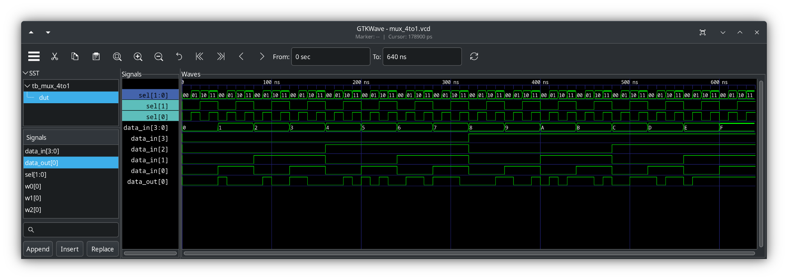
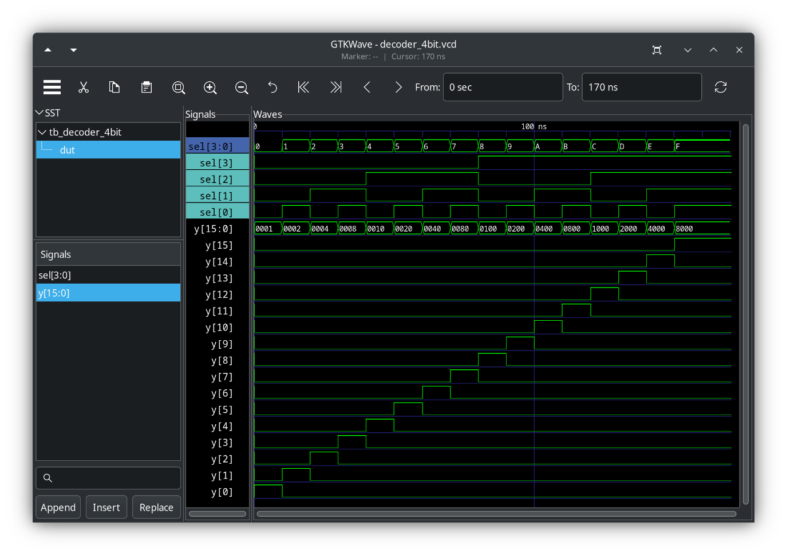
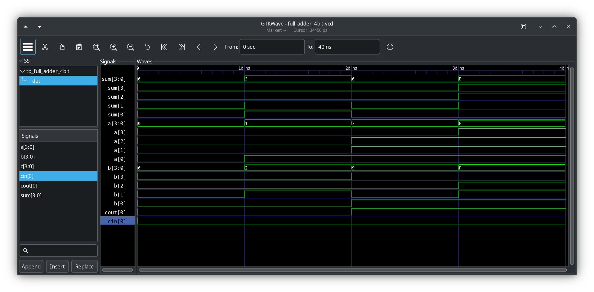

# Assignment 1

<5 points>

## Problem Set

**GitHub Classroom Assignment Link:** https://classroom.github.com/a/GSFzh7kV

Write up your solution on paper then scan into a PDF or write in an editor then export to a PDF. Then add the PDF to the GitHub Classroom assignment repository. Remember to just add the GitHub repository to the Microsoft Team's assignment from here.

### Problem 1
Convert the following pairs of decimal number to 6-bit 2's-complement numbers. Then perform addition and subtraction on each pair. Indicate whether or not overlow occurs for each case.
1. $16$ and $29$
1. $-26$ and $19$
#### Solution
Let's review the range of values for a 6-bit number using 2's-complement $-2^{n-1}$ to $+2^{n-1}-1$. So for integers represented by $n$ = 6 bits, the range of numbers that can be represented is $-32$ to $+31$.

Let's review definition of overflow. Overflow in 2's-complement **addition** occurs when you add two **positive** numbers and the **result** is **negative**, or when you add two **negative** numbers and the **result** is **positive**.

##### (a) $16$ and $29$

Convert each number to its 6-bit 2's-complement equivalent:

__Note__ the following when converting from base-10 numbers to 2's-complement binary <br>
If the base-10 number is
1. **positive**, 2's-complement equivalent is same as binary representation,
2. **negative**, derive its 2's-complement equivalent by negating the binary representation then adding one.

###### 6-bit 2's-complement of $16$ and $29$
$16$ in binary: `10000`, and in 6-bit 2's complement $16$ = `010000` <br>
$29$ in binary: `11101`, and in 6-bit 2's complement $29$ = `011101`

Therefore, <br>
$16$ = `010000`
$29$ = `011101`

###### Addition of $16$ and $29$
```
  010000 (16)
+ 011101 (29)
--------
  101101 (-19) since most significant bit (MSb) is 1, the result is negative. Therefore, perform 2's-complement to find the positive value of the result.
```

###### ANSWER of $16 + 29$
Since the MSb is `1`, the sum is negative, and we know $16+29=45$, a positive number outside the 6-bit 2's-complement range. <br>
Therefore, the answer calculated here is $-19$, and there is an `overflow`.

Since we added two positive numbers (both have a `0` in the MSb), and the result is negative (`1` in the MSB), this is an overflow situation.  The result, `101101`, is not the correct representation of $45$ in 6-bit 2's complement.  $45$ is outside the range of what we can represent with 6 bits ($-32$ to $+31$).

###### Subtraction of $16$ and $29$
$16 - 29$ is the same as $16 + (-29)$. We have $16$ in 2's-complement, so let's convert $-29$ to it's 2's-complement equivalent. <br>

Therefore, <br>
$16$ in binary: `10000`, and in 6-bit 2's complement $16$ = `010000` <br>
$29$ in binary: `11101`, and in 6-bit 2's complement, (negate $+29$ &#x2192; `100010`, add 1 &#x2192; `100011`) <br>

So,
```
  010000 (16)
+ 100011 (-29)
--------
  110011 (-13) since most significant bit (MSb) is 1, the result is negative. Therefore, perform 2's-complement to find the positive value of the result.
```

###### ANSWER of $16 - 29$
Since the MSb is `1`, the sum is negative, and we know `16-29=-13`, the result is as expected and is within the range of 6-bit 2's-complement.

Therefore, the answer calculated here is $-13$, and there is **no** overflow.

##### (b) $-26$ and $19$

###### 6-bit 2's-complement of $-26$ and $19$
$-26$ in binary: first $+26$ =`11010`, and in 6-bit 2's-complement, (negate `+26` &#x2192; `100101`, add 1 &#x2192; $-26$ = `100110`) <br>
$19$ in binary: `10011`, and in 6-bit 2's-complement $19$ = `010011` (it's already positive, so 2's-complement same)

Therefore, <br>
$-26$ = `100110` <br>
$19$ = `010011`

###### Addition of $-26$ and $19$
```
  100110 (-26)
+ 010011 (19)
--------
  111001 (-7) since most significant bit (MSb) is 1, the result is negative. Therefore, perform 2's-complement to find the positive value of the result.
```

###### ANSWER of $-26 - 19$
Since the MSb is `1`, the sum is negative, and we know `-26+19=-7`, the result is as expected and is within the range of 6-bit 2's-complement.

Therefore, the answer calculated here is $-7$, and there is **no** overflow.

###### Subtraction of $-26$ and $19$
$-26 - 19$ is the same as $-26 + (-19)$. We have $-26$ in 2's-complement, so let's convert $-19$ to it's 2's-complement equivalent. <br>

Therefore, <br>
$-26$ in 6-bit 2's-complement: `100110`, from above <br>
$-19$ in 6-bit 2's-complement: `101101` ; $+19$ in binary: `10011`, and in 6-bit 2's complement, (negate $+19$ &#x2192; `101100`, add 1 &#x2192; `101101`) <br>

So,
```
  100110 (-26)
+ 101101 (-19)
--------
 1010011 (+19) since most significant bit (MSb) is 0, the result is positive. Note, there is a carry-out bit for the MSb
```

###### ANSWER of $-26 - 19$
Since the MSb is `0`, the sum is positive, and we know $-26-19=-45$, the result is NOT as expected and is NOT within the range of 6-bit 2's-complement.

Therefore, the answer calculated here is $+19$, and there is `overflow`.

### Problem 2
Create the module and test bench in SystemVerilog for the following digital circuits; you must use the [Verilog module template](../catalog/templates/module.sv) and the [Verilog test bench template](../catalog/templates/tb_module.sv). Each module will have its own directory. Therefore, for each module, you will also need include the command-line build files, as we discussed in class. <br>
#### Solution

##### (a) 4-to-1 multiplexer, using gate-level modeling
###### Module code
`mux_4to1.sv`
```verilog
//////////////////////////////////////////////////////////////////////////////
//
// Module: mux_4to1
//
// 4-to-1 multiplexer
//
// module: mux_4to1
// hdl: SystemVerilog
// modeling: Gate-Level Modeling
//
// author: Prof. Rob Marano <rob@cooper.edu>
//
//
///////////////////////////////////////////////////////////////////////////////
`ifndef mux_4to1
`define mux_4to1

module mux_4to1 (
  input logic [3:0] data_in,
  input logic [1:0] sel,
  output logic data_out
);

  logic w0, w1, w2, w3; // Intermediate wires

  // Instantiate AND gates for each data input
  and g0 (w0, data_in[0], ~sel[1], ~sel[0]);
  and g1 (w1, data_in[1], ~sel[1], sel[0]);
  and g2 (w2, data_in[2], sel[1], ~sel[0]);
  and g3 (w3, data_in[3], sel[1], sel[0]);

  // Instantiate an OR gate to combine the AND gate outputs
  or g4 (data_out, w0, w1, w2, w3);

endmodule

`endif // mux_4to1
```

###### Test bench code
`tb_mux_4to1.sv`
```verilog
///////////////////////////////////////////////////////////////////////////////
//
// Module: Testbench for module mux_4to1
//
// Testbench for decoder_2mux_4to1to1
//
// module: tb_mux_4to1
// hdl: SystemVerilog
//
// author: Prof. Rob Marano <rob@cooper.edu>
//
///////////////////////////////////////////////////////////////////////////////

`timescale 1ns/100ps
// ensure you note the scale (ns) below in $monitor

`include "mux_4to1.sv"

module tb_mux_4to1;
    //
    // ---------------- DECLARATIONS OF DATA TYPES ----------------
    //
    //inputs are reg for test bench - or use logic
    //outputs are wire for test bench - or use logic
    logic [3:0] data_in;
    logic [1:0] sel;
    logic data_out;

    //
    // ---------------- INSTANTIATE DEVICE UNDER TEST (DUT) ----------------
    //
    mux_4to1 dut (
        .data_in(data_in),
        .sel(sel),
        .data_out(data_out)
    );

    //
    // ---------------- INITIALIZE TEST BENCH ----------------
    //
    initial begin : initialize_variables
        data_in = 4'b0000; // binary value, 4 bits wide
        sel = 2'b00; // binary value, 2 bits wide
    end

    //
    // display variables
    //
    //initial begin: display_variables
    //    // note: currently only simple signals or constant expressions may be passed to $monitor.
    //    $monitor ($time,"ns,\t sel = %b\t data_in = %b\t data_out = %b",sel,data_in,data_out);
    //end

    initial begin : dump_variables
        $dumpfile("mux_4to1.vcd"); // for Makefile, make dump file same as module name
        $dumpvars(2, dut);
    end

    //
    // ---------------- APPLY INPUT VECTORS ----------------
    //
    // note: following the keyword begin is the name of the block: apply_stimulus
    initial begin : apply_stimuli
        // Test all possible combinations
        // Loop on data_in
        for (int i = 0; i < 16; i++) begin
            data_in = i;
            // Loop on sel
            for (int j = 0; j < 4; j++) begin
                sel = j;
                #10; // Small delay for simulation

                $display("Data In: %4b, Select: %2b, Output: %b", data_in, sel, data_out);

                // Verification (optional, but highly recommended)
                case (sel)
                    2'b00: if (data_out !== data_in[0]) $error("Test failed!");
                    2'b01: if (data_out !== data_in[1]) $error("Test failed!");
                    2'b10: if (data_out !== data_in[2]) $error("Test failed!");
                    2'b11: if (data_out !== data_in[3]) $error("Test failed!");
                endcase
            end
        end
        $finish;
    end

endmodule
```
###### GTKwave output from tb_mux_4to1.sv


##### (b) 4-bit decoder, using behavioral modeling
###### Module code
`decoder_4bit.sv`
```verilog
//////////////////////////////////////////////////////////////////////////////
//
// Module: decoder_4bit
//
// 4-bit Decoder
//
// module: decoder_4bit
// hdl: SystemVerilog
// modeling: Behavioral Modeling
//
// author: Prof. Rob Marano <rob@cooper.edu>
//
//
// Notes on this digital circuit
//
// 1- Uses always_comb for combinational logic, which is more efficient than always @* in modern SystemVerilog.
///////////////////////////////////////////////////////////////////////////////
`ifndef decoder_4bit
`define decoder_4bit

module decoder_4bit(
    //
    // ---------------- DECLARATIONS OF PORT IN/OUT & DATA TYPES ----------------
    //
    input logic [3:0] sel,
    output logic [15:0] y
);

    //
    // ---------------- MODULE DESIGN IMPLEMENTATION ----------------
    //
    always_comb begin
        y = 16'b0; // Initialize all outputs to 0

        case (sel)
        4'b0000: y[0] = 1;
        4'b0001: y[1] = 1;
        4'b0010: y[2] = 1;
        4'b0011: y[3] = 1;
        4'b0100: y[4] = 1;
        4'b0101: y[5] = 1;
        4'b0110: y[6] = 1;
        4'b0111: y[7] = 1;
        4'b1000: y[8] = 1;
        4'b1001: y[9] = 1;
        4'b1010: y[10] = 1;
        4'b1011: y[11] = 1;
        4'b1100: y[12] = 1;
        4'b1101: y[13] = 1;
        4'b1110: y[14] = 1;
        4'b1111: y[15] = 1;
        default: y = 16'b0; // Default case to ensure all outputs are 0
        endcase
    end

endmodule

`endif // decoder_4bit
```
###### Test bench code
`tb_decoder_4bit.sv`
```verilog
///////////////////////////////////////////////////////////////////////////////
//
// Module: Testbench for module decoder_4bit
//
// Testbench for decoder_4bit
//
// module: tb_decoder_4bit
// hdl: SystemVerilog
//
// author: Prof. Rob Marano <rob@cooper.edu>
//
///////////////////////////////////////////////////////////////////////////////
`timescale 1ns/100ps

`include "decoder_4bit.sv"

module tb_decoder_4bit;
    //
    // ---------------- DECLARATIONS OF DATA TYPES ----------------
    //

    //inputs are reg for test bench - or use logic
    logic [3:0] sel;

    //outputs are wire for test bench - or use logic
    wire [15:0] y;

    //
    // ---------------- INSTANTIATE UNIT UNDER TEST (UUT) ----------------
    //
    decoder_4bit dut (
        .sel(sel),
        .y(y)
    );

    //
    // ---------------- INITIALIZE TEST BENCH ----------------
    //
    initial begin : initialize_variables
        sel = 4'b0000; // initialize sel 4-bit vector to zero.
    end

    initial begin : dump_variables
        $dumpfile("decoder_4bit.vcd"); // for Makefile, make dump file same as module name
        $dumpvars(2, dut);
    end

    //
    // display variables
    //
    //initial begin: display_variables
        // note: currently only simple signals or constant expressions may be passed to $monitor.
        // $monitor ($time,"ns, X1-X2-X4-X4 = %b, Z1 = %b", {X1,X2,X3,X4}, Z1);
    //end

    //
    // ---------------- APPLY INPUT VECTORS ----------------
    //
    // note: following the keyword begin is the name of the block: apply_stimulus
    initial begin : apply_stimuli
    // Test all possible select values
        for (int i = 0; i < 16; i++) begin
            sel = i;
            #10; // Small delay
            //$display("Select: %04b, Output: %16b", sel, y);
            // Verification (essential for a good testbench)
            for (int j = 0; j < 16; j++) begin
                if (j == i) begin
                    if (y[j] !== 1) begin
                        //$error("Test failed for sel = %0d, y[%0d] should be 1", i, j);
                    end
                    else begin
                        if (y[j] !== 0) begin
                            //$error("Test failed for sel = %0d, y[%0d] should be 0", i, j);
                        end
                    end
                end
            end
        end
        #10 $finish;
    end
endmodule
```

###### GTKwave output from tb_decoder_4bit.sv


##### (c) 4-bit full adder, using gate-level modeling
###### Module code

`full_adder_4bit.sv`
```verilog
//////////////////////////////////////////////////////////////////////////////
//
// Module: full_adder_4bit
//
// 4-bit full adder
//
// module: full_adder_4bit
// hdl: SystemVerilog
// modeling: Gate Level Modeling
//
// author: Prof. Rob Marano <rob@cooper.edu>
//
///////////////////////////////////////////////////////////////////////////////
`ifndef adder_4bit
`define adder_4bit

`include "full_adder_1bit.sv"

module full_adder_4bit(
    //
    // ---------------- DECLARATIONS OF PORT IN/OUT & DATA TYPES ----------------
    //
    input [3:0] a,
    input [3:0] b,
    input cin,
    output [3:0] sum,
    output cout
);

    //
    // ---------------- MODULE DESIGN IMPLEMENTATION ----------------
    //
    wire [3:0] c; // Internal carries

    // Instantiate full adders for each bit
    full_adder_1bit fa0 (
        .a(a[0]),
        .b(b[0]),
        .cin(cin),
        .sum(sum[0]),
        .cout(c[0])
    );

    full_adder_1bit fa1 (
        .a(a[1]),
        .b(b[1]),
        .cin(c[0]),
        .sum(sum[1]),
        .cout(c[1])
    );

    full_adder_1bit fa2 (
        .a(a[2]),
        .b(b[2]),
        .cin(c[1]),
        .sum(sum[2]),
        .cout(c[2])
    );

    full_adder_1bit fa3 (
        .a(a[3]),
        .b(b[3]),
        .cin(c[2]),
        .sum(sum[3]),
        .cout(cout) // Output carry
    );
endmodule

`endif // full_adder_4bit
```

`full_adder_1bit.sv`
```verilog
//////////////////////////////////////////////////////////////////////////////
//
// Module: full_adder_1bit
//
// 1-bit adder
//
// module: full_adder_1bit
// hdl: SystemVerilog
// modeling: Gate Level Modeling
//
// author: Prof. Rob Marano <rob@cooper.edu>
//
///////////////////////////////////////////////////////////////////////////////
`ifndef full_adder_1bit
`define full_adder_1bit
// DO NOT FORGET TO RENAME MODULE_NAME to match your module_name

module full_adder_1bit(
    //
    // ---------------- DECLARATIONS OF PORT IN/OUT & DATA TYPES ----------------
    //
    input a,
    input b,
    input cin,
    output sum,
    output cout
);

    //
    // ---------------- MODULE DESIGN IMPLEMENTATION ----------------
    //
    wire w1, w2, w3;

    xor g1 (w1, a, b);
    and g2 (w2, w1, cin);
    xor g3 (sum, w1, cin);
    and g4 (w3, a, b);
    or g5 (cout, w2, w3);
endmodule

`endif // full_adder_1bit
```

###### Test bench code
`tb_full_adder_4bit.sv`
```verilog
///////////////////////////////////////////////////////////////////////////////
//
// Module: Testbench for module full_adder_4bit
//
// Testbench for full_adder_4bit
//
// module: tb_full_adder_4bit
// hdl: SystemVerilog
//
// author: Prof. Rob Marano <rob@cooper.edu>
//
///////////////////////////////////////////////////////////////////////////////
`timescale 1ns/100ps
// ensure you note the scale (ns) below in $monitor

`include "full_adder_4bit.sv"

module tb_full_adder_4bit;
    //
    // ---------------- DECLARATIONS OF DATA TYPES ----------------
    //

    //inputs are reg for test bench - or use logic
    reg [3:0] a;
    reg [3:0] b;
    reg cin;

    //outputs are wire for test bench - or use logic
    wire [3:0] sum;
    wire cout;

    //
    // ---------------- INSTANTIATE UNIT UNDER TEST (UUT) ----------------
    //
    full_adder_4bit dut (
        .a(a),
        .b(b),
        .cin(cin),
        .sum(sum),
        .cout(cout)
    );

    //
    // ---------------- INITIALIZE TEST BENCH ----------------
    //
    initial begin : initialize_variables
        cin = 0;
        a = 4'b0000;
        b = 4'b0000;
    end

    initial begin : dump_variables
        $dumpfile("full_adder_4bit.vcd"); // for Makefile, make dump file same as module name
        $dumpvars(1, dut);
    end

    /*
    * display variables
    */
    initial begin: display_variables
        // note: currently only simple signals or constant expressions may be passed to $monitor.
        $monitor($time, "ns\t sum = %04b, a = %04b, b = %04b, cin = %b, cout = %b", sum, a, b, cin, cout);
    end

    //
    // ---------------- APPLY INPUT VECTORS ----------------
    //
    // note: following the keyword begin is the name of the block: apply_stimulus
    initial begin : apply_stimuli
        // Test cases
        // cin = 0;
        a = 4'b0000;
        b = 4'b0000;
        #10; // Wait for propagation delay

        // cin = 0;
        a = 4'b0001;
        b = 4'b0010;
        #10;

        // cin = 1;
        a = 4'b0111;
        b = 4'b1001;
        #10;

        // cin = 0;
        a = 4'b1111;
        b = 4'b1111;
        #10 $finish;
    end

endmodule
```

###### GTKwave output from tb_decoder_4bit.sv


# Refresher
## Arithmetic with 2's-complement numbers
2's-complement is a way to represent **signed integers** (positive and negative numbers) in binary. <br>
Here's how you represent a base-10 number in 2's complement: 

1. Determine or Define the Number of Bits
    * This determines the range of values you can represent. 
    * In our case we were told to work with 6-bit integers.
2. For Positive Numbers
    * If the number is positive, simply convert it to its binary equivalent.
    * Pad the left with leading zeros until you have the desired number of bits.
3. For Negative Numbers
    * Convert to Binary:
        * First, ignore the negative sign and convert the absolute value of the number to its binary equivalent.
    * Invert the Bits:
        * Change all the `0`s to `1`s and all the `1`s to `0`s. <br>
        **Note** this is called the **1's complement**.
    * Add `1`:
        * Add `1` to the result from the previous step. <br>
        This gives you the 2's complement representation **of the negative number**.

### Refresh on overflow in integer arithmetic
Using 2's-complement representation, `n` bits can represent values in the range $-2^{n-1}$ to $+2^{n-1}-1$. So for 6 bit numbers, the range of numbers that can be represented is $-32$ to $+31$. When the actual result of an arithmetic operation is outside the representable range, an __arithmetic overflow__ has occurred.

When adding **unsigned numbers**, a carry-out of $1$ from the most significant bit (MSb) position indicates that an **overflow** has occurred. However, this is not always true when adding **signed numbers**. For example, using 2's-complement representation for 4-bit **signed numbers**, if we add $+7$ (`0111`) and $+4$ (`0100`), the sum vector (bit representation) is `1011`, which is the representation of $-5$, an incorrect result for $7+4$. In this case, the carry-out bit from the MSb position is `0`, meaning the leading zero here `01011`. If we add $-4$ and $-6$, we get $+6$ = `0110`, also an incorrect result. In this case, the carry-out bit is `1`, meaning `10110`, that is $-4$ (`1100`) + $-6$ (`1010`) = `10110`. Hence, the value of the carry-out bit from the sign-bit position is NOT an indicator of overflow. Clearly, overflow may occur **only** if both summands have the same sign. The addition of numbers with different signs cannot cause overflow because the result is always within the representable range.

These observations lead to the following way to detect overflow when **adding** two numbers in 2's-complement representation:
1. Examine the signs of the two summands and the sign of the result.
2. When both summands have the same sign, an overflow has occurred when the sign of the sum is not the same as the signs of the summands.

To detect overflow when **subtracting** two numbers $A+B$ in 2's-complement representation:
1. Look at the signs of the minuend ($A$), the subtrahend ($B$), and the result ($A - B$).
2. Apply the addition rule (with adjustment for negation):  Remember, we're actually doing $A + (-B)$.
3. If $A$ and $B$ have **different signs**: This means $A$ and $-B$ will have the same sign.  An overflow occurs if the result of $A + (-B)$ has a different sign than $A$ (which is the same sign as $-B$).
4. If $A$ and $B$ have the **same sign**: This means $A$ and $-B$ will have different signs.  Adding numbers with different signs cannot cause an overflow.  **The result will always be within the representable range.**

An overflow occurs when subtracting two 2's-complement numbers only if the minuend ($A$) and the subtrahend ($B$) have different signs, and the result ($A - B$) has the same sign as the subtrahend ($B$).

