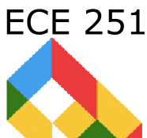
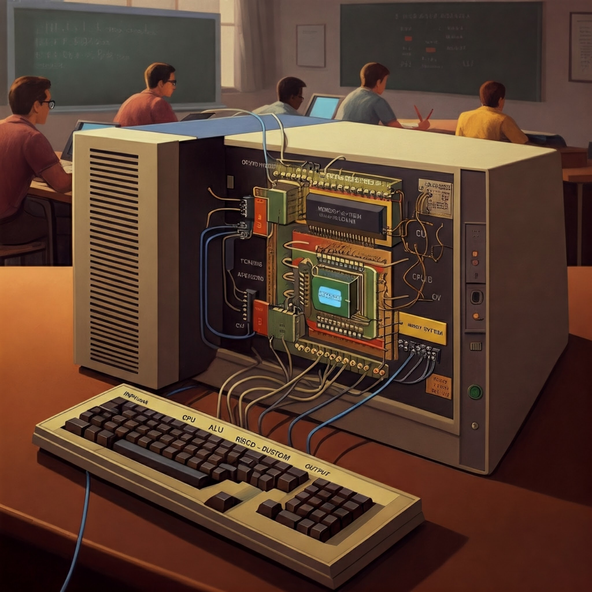

#  ECE 251 - Computer Architecture (Spring 2025)

 

## General Course Information

**Professor:** Prof. Rob Marano  
**Email:** rob@cooper.edu  
**Semester:** Spring 2025

- **Times**: Tuesdays, 6:00 to 8:50pm ET
- **Dates**: This class meets in person for **15 sessions**,   i.e., 1/21, 1/28, 2/4, 2/11, 2/18, 2/25, 3/4, 3/11, 3/18, 3/25, 4/1, 4/22, 4/29, 4/6, and 5/13,   **no classes 4/8 and 4/15**
- **Room**: 106 in NAB (41 Cooper Square)

[Weekly course notes](./ece251-notes.md)

## Course Description

Introduction to the internal design of computers and computer systems, using Verilog, a hardware description language. Topics include: integer and floating-point representations and operations: ALU design; von Neumann and Harvard architectures; accumulator, general purpose register and stack-based processor design; RISC and CISC architectures; addressing modes; vector operations; microprogrammed and hard-wired controllers; machine language and assembly language programming; static and dynamics memory operation, timing and interfacing; cache; virtual memory; I/O systems: bus design and data transfer, DMA; interrupts and interrupt handling, polling; disk operation and organization; pipelined processor design. The course requires a substantial project component that includes assembly language programming and the design and construction of systems that contain microcontrollers, programmable logic, and a variety of I/O devices.

3 credits. 3 hours per week (45 total hours). Link to [course catalog](https://cooper.edu/engineering/courses/electrical-and-computer-engineering-undergraduate/ece-251)

## Course Prerequisites

ECE 150 &mdash; [Digital Logic Design](https://cooper.edu/engineering/courses/electrical-and-computer-engineering-undergraduate/ece-150)  
Most specifically combinational and sequential logic theory and implementation.

### Course Structure/Method

**Lectures and SW-based Labs:** The class meets in person from 6:00-8:50pm on class days, for a total of 15 sessions. Office hours are held Tuesdays 5:00-6:00pm in the Engineering Adjunct's Office on the 2nd floor of the NAB at 41 Cooper Square. Appointments held remotely will be scheduled upon request in increments of 20 minutes. Please contact me on Microsoft Teams chat via `rob.marano@cooper.edu`. Once scheduled, you will receive a meeting invite that you must accept to confirm the appointment. I can meet any day, including weekends, should that work for us both.

The course will use expand your knowledge of digital logic design to understand the design of computers systems down to the fundamental internals of a processor, that is, a central processing unit (CPU), and its associated memory systems.

The following topic areas will be covered:

1. Logic, Computer Abstraction, and Hardware Modeling with Software (Verilog HDL)  (aka Bits, Gates, and Clocks &mdash; The Alphabet of Computers)
2. Instructions &mdash;The Language & Grammar of Computers
3. Assembly Language Programming &mdash; We use the MIPS processor
4. Arithmetic for Computers &mdash; Adders on Up
5. The Processor &mdash; Data Path and Control Unit
6. Interrupts; Memory Hierarchies &mdash; Registers, Caches, and beyond

## Schedule

|      Class | Topic                                                   |
| ---------: | :------------------------------------------------------ |
|       1, 2 | Hardware Modeling with Software (Verilog HDL)           |
|          3 | Computer Abstraction & Stored Program Concept           |
|       4, 5 | Instructions &mdash;The Language & Grammar of Computers |
|       6, 7 | Assembly Language Programming &mdash; MIPS CPU          |
|          8 | Arithmetic for Computers; **Midterm Exam**              |
|          9 | Floating Point Numbers & Arithmetic                     |
| 10, 11, 12 | The Processor &mdash; Data Path & Control               |
| 12, 13, 14 | Interrupts; Memory Hierarchies (Caching)                |
|         15 | **Final Exam**; Group **Final Project** due at 5pm ET   |

Optional weekend lab sessions will be offered throughout the semester to work on your final project designs or for review sessions.

## Course Learning Outcomes

Upon successful completion of this course, each student will be able to:

1. Design basic and intermediate RISC pipelines, including the instruction set, data paths, control units and mechanisms to resolve pipeline hazards;
2. Understand memory hierarchy design, memory access time formula, performance improvement techniques, and trade-offs;
3. Design a functioning RISC-based, MIPS-like CPU with a capable instruction set architecture using Verilog to emulate the design using the gate and the behaviorial models;
4. Write a simple assembler using a programming language of their choice (preferably Python for coding ease) to translate the ISA-based assembly code into machine code for the designed RISC-based processor;
5. By understanding the key interactions and dependencies between the processor and the hierarchy of memory, one would be able to include this knowledge to designing and implementing software code that demonstrates improved performance on the platform for which it's written.

## Compliance with ABET Student Outcomes:

This course supports student achievement of outcomes 1, 5, and 7:

- (1) an ability to identify, formulate, and solve complex engineering problems by applying
  principles of engineering, science, and mathematics
- (5) an ability to function effectively on a team whose members together provide leadership, create a collaborative and inclusive environment, establish goals, plan tasks, and meet objectives.
- (7) an ability to acquire and apply new knowledge as needed, using appropriate learning strategies

Also, this course supports ABET's Criteria for Accrediting Computing Programs, 2021 – 2022, specifically items 3, 4, and 5:

- (3) Exposure to computer architecture and organization, information management, networking and communication, operating systems, and parallel and distributed computing.
- (4) The study of computing-based systems at varying levels of abstraction.
- (5) A major project that requires integration and application of knowledge and skills acquired in earlier course work.­

## Communication Policy

The best way to contact me is via chat on Microsoft Teams then email. I will do my best to respond within 24 hours. Communication and participation in class is not only encouraged, but required. I seek to understand your individual understanding of the material each class. Advocate for yourself, early and often. Make time to meet with me should you need more explanation and assistance.

## Course Expectations

### Class Preparation

Depending upon the week's topic, each session will consist of two components: class discussion and hands-on lab, using your computers. Come prepared with your laptop and a Linux environment. Ensure you have access to the ICE Lab computers should you need it; check with `jacob.koziej@cooper.edu` or `james.ryan@cooper.edu`.

Each class discussion consists of a mix of lectures, programming/simulations, and question-driven group analysis of one or more large programming problems. SW-based lab work will consist of either group or individual work on exercises or projects. Questions arising during lab time in class may be used to prompt additional discussion as time permits.

### Attendance

Success as a student begins with attendance. Class time serves not only for learning new concepts and skills but also for practicing what you have learned with active feedback. Some assignments and demos may be completed in class, but practice and study are required outside of class. Students are expected to attend classes regularly, arrive on time, and participate. I take attendance during every session, and it forms part of your grade. Students are encouraged to e-mail me when they are absent. Students are responsible for all academic work missed as a result of absences. It is at my discretion to work with students outside of class time in order to make-up any missed work.

## Materials

We will be using my notes and handouts curated from the following textbooks and resources. I will post the handouts by the respective week's lecture on the topic as we progress through the semester.

- [The Elements of Computing Systems Building a Modern Computer from First Principles, 2nd Edition](https://mitpress.mit.edu/9780262539807/the-elements-of-computing-systems/) by Noam Nisan and Shimon Schocken, ISBN 9780262539807

- [Digital Design and Computer Architecture](https://shop.elsevier.com/books/digital-design-and-computer-architecture/harris/978-0-12-394424-5) by David Harris and Sarah Harris, paperback ISBN 9780123944245, eBook ISBN 9780123978165

- [Computer Organization and Embedded Systems, 6th Edition](https://www.mheducation.com/highered/product/Computer-Organization-and-Embedded-Systems-Hamacher.html) by Carl Hamacher, Zvonko Vranesic, Safwat Zaky, and Maraig Manjikian, ISBN 9780073380650

- [Computer Organization and Design &mdash; The Hardware/Software Interface MIPS, 6th Edition](https://www.elsevier.com/books/computer-organization-and-design-mips-edition/patterson/978-0-12-820109-1) by David Patterson & John Hennessy, ISBN 9780128201091

- [Designing Video Game Hardware in Verilog](https://www.amazon.com/Designing-Video-Game-Hardware-Verilog/dp/B0B6XRPZ3S) by Steven Hugg, ISBN 9781728619446

### Required Software

We will be using various tools during our class, including but not limited to:

- Icarus Verilog (design and emulation of combinational and sequential logic)
- MIPS emulator (assembly programming)
- Python 3 (to write your CPU's assembler with template code provided)

We will detail access and usage in class during the semester. Become familiar with working with your computer's shell, e.g., Windows PowerShell or Bash on a Mac or Linux desktop.

## Assessment Strategy and Grading Policy

All assignments must be completed by the end of this course in order to receive at least a passing grade. _Individual_ homework assignments and the final project will be handed-in electronically via GitHub Classroom. Also, please hand in the URL for each assignment's repository via Microsoft Teams Assignments for this course. On exam days, offices hours will be canceled unless otherwise noted. Final group-based projects will be handed-in via your team's GitHub respository per project. We will discuss in class how to create each repository.

### Homework Pointing Scheme

| Total points | Explanation                                                                                                                                                                       |
| -----------: | :-------------------------------------------------------------------------------------------------------------------------------------------------------------------------------- |
|            0 | Not handed in                                                                                                                                                                     |
|            1 | Handed in late                                                                                                                                                                    |
|            2 | Handed in on time, not every problem fully worked through and clearly identifying the solution                                                                                    |
|            3 | Handed in on time, each problem answered a boxed answer, each problems answered with a clearly worked through solution, and **less than majority** of problems answered correctly |
|            4 | Handed in on time, **majority** of problems answered correctly, each solution boxed clearly, and each problem fully worked through                                                |
|            5 | Handed in on time, every problem answered correctly, every solution boxed clearly, and every problem fully worked through.                                                        |

### Assignments Schedule

| Assignment | Title                           | Points | Given On | Due Date _(by time class begins)_        |
| ---------: | :------------------------------ | :----: | :------- | :--------------------------------------- |
|          1 | [HW 1](./assignments/hw-01.md)  |   5    | 1/21     | 1/28                                     |
|          2 | [HW 2](./assignments/hw-02.md)  |   5    | 1/28     | 2/4                                      |
|          3 | [HW 3](./assignments/hw-03.md)  |   5    | 2/4      | 2/11                                     |
|          4 | [HW 4](./assignments/hw-04.md)  |   5    | 2/11     | 2/18                                     |
|          5 | [HW 5](./assignments/hw-05.md)  |   5    | 2/18     | 2/25                                     |
|          6 | [HW 6](./assignments/hw-06.md)  |   5    | 2/25     | 3/4                                      |
|          7 | [HW 7](./assignments/hw-07.md)  |   5    | 3/4      | 3/11                                     |
|          8 | **Midterm Exam**                |  100   | 3/11     | [Study Guide](./mid_term_study_guide.md) |
|          9 | [HW 8](./assignments/hw-08.md)  |   5    | 3/18     | 3/18                                     |
|         10 | [HW 9](./assignments/hw-09.md)  |   5    | 3/25     | 3/25                                     |
|         11 | [HW 10](./assignments/hw-10.md) |   5    | 4/1      | 4/22                                     |
|         12 | [HW 11](./assignments/hw-11.md) |   5    | 4/22     | 4/29                                     |
|         13 | [HW 12](./assignments/hw-12.md) |   5    | 4/29     | 5/6                                      |
|         14 | [HW 13](./assignments/hw-13.md) |   5    | 5/6      | 5/13                                     |
|         15 | **Final Exam**                  |  100   | 5/13     | [Study Guide](./study_guide_final.md)    |
|         15 | Final Group Project             |  200   | 3/4      | 5/16, due no later than 5pm ET           |

**Note**: From time to time I may offer optinoal, extra credit homework assignments. Any points earned from these assignments will be added to the total points under the homework category. Also, I highly recommend that you focus on your final project during the two weeks we have no class from 4/2 through 4/21.

### Grading Distribution

This course follows the rubric of **criterion-referenced grading**. You have the opportunity to earn 500 total points for this class. The final letter grade (no +/-) will be based upon applying the normal distribution to the following assessment categories. Note the weighting of each type. The variance to your calculations of your points earned throught the semester may vary by 7% for points given for class participation.

| **Assessment Type** | **Points** | **% of Final Grade** |
| ------------------: | :--------: | :------------------: |
|           Homeworks |     65     |         13%          |
|        Midterm Exam |    100     |         20%          |
|          Final Exam |    100     |         20%          |
|       Final Project |    200     |         40%          |
| Class Participation |     35     |          7%          |

The grading for the **final project** follows this rubric:

|   **Project Assessment Category** | **Points** |
| --------------------------------: | :--------- |
|                        ISA Design | 34         |
|    Memory Design & Implementation | 16         |
| Processor Design & Implementation | 120        |
|    Project & Design Documentation | 30         |
|                      Extra Credit | 70         |

The full rubric can be found [at this link](./assignments/grading_rubric_final_project.md).

## Final Projects as Minimal Viable Product (MVP)

(aka at Amazon Web Services, _Minimum Lovable Product (MLP)_)

You will choose a partner with whom to you will jointly design and implement, using SystemVerilog, a central processing unit (CPU) and simple memory system that work together to execute programs. These programs will be written in assembly language using your newly designed instruction set architecture (ISA) for your project's CPU. You will also write a simple assembler that will convert the assembly code to your CPU's machine code. Your computer (CPU plus memory) will only run one program at a time. Hence, since you do not have an operating system, you will not need to link your code.

- Collaborate on teams of 2 people, not less, not more, unless there are an odd number of students.
- Source code to be maintained in a GitHub repository per team.
- Design files and documentation files (in markdown) will be stored in the repo; include images and photos, link them to your markdown documentation.
- Breakdown the MLP design in manageable sets of tasks and track these tasks &mdash; who does what by when, how long did it take.
- Demonstrate the MLP as part of your team's final presentation that you will record and post to YouTube. Your README.md file MUST include the link to the YouTube presentation, which will not be more than 5 minutes.

# Attending Class

Occassionally, class may be held virtualy for a variety of unforeseen reaons, including, if required by the School or to deliver course material by a more effective delivery method, for example certain video presentations or certain online interaction. If announced in advance, class will meet virtually at the assigned times via the class MS Teams portal or via a Zoom meeting. If a class meeting is to be held via Microsoft Teams, a calendar invitation from Microsoft Teams will be sent to students via email in advance of the class. Students are expected to maintain appropriate technology (microphone, camera, speakers) to support online class delivery, should it be announced.

It is understood that having a class meeting entirely via a virtual environment may be challenging, especially to those not accustomed to virtual collaboration and learning. Reasonable efforts may be made to adjust to these circumstances. Students are to log on using identifiable names. It is the student’s responsibility to log on and remain online, engaged, and actively participating for the duration of the class. Come on camera.

# Class Policies

1. Course policies are developed to support fair and equitable treatment in the classroom and to set high performance standards. If you are having any issues related to me, the course, or your fellow students, please make an appointment to speak with me for discussion toward resolution. The ealier any issue or concern is brought to my attention, the better the opportunity for successful resolution.
2. Students are expected to be present in class for the entire scheduled meeting time. Attendance in class is important for student success and for the classroom environment.
3. For any virtual class meeting, students are expected to sign on and remain online and engaged with the class for the entire scheduled meeting time. Students are requested to keep their video on during class times, and their audio muted unless participating in class discussion.
4. Class lectures may not not always be recorded, and lecture aides, slides and/or materials supplementary to the textbook may not always be be available following the conclusion of each class session. Students are expected to take appropriate notes and pose relevant questions during class sessions. Lecture material can be discussed during an office consultation.
5. All Health protocols of The Cooper Union shall be followed at all times.
6. All School policies shall be followed at all times.
7. Students are expected to be prepared for each class prior to beginning the class session. Preparation should include prior review of the text sections planned for discussion. All asignments must be completed on time to maintain preparation for subsequent discussions.
8. Students are expected to check their Cooper Union email **and** their Microsoft Teams Chat daily for any announcements or other relevant course communications. Any changes to the planned course outline, course schedule, or other course components will be announced via the School email. Updates may subsequently be posted to Microsoft Teams, depending on the magnitude of the change.
9. Microsoft Teams will be used for course communications and assignments. Documents relevant to the course will be posted to Microsoft Teams and/or to the course syllabus [online here](https://robmarano.github.io/courses/ece251/2024/ece251-syllabus-spring-2024.md).
10. Assignments are due according to the dates in the Course Outline, and at the time of the scheduled beginning of the class session. Once class starts, any assignments due that day will be considered late. Late assignments are not guaranteed to be accepted and may be automatically assigned a zero grade. Any accepted late assignment will be subject to a reduction in grade for lateness. Any assignment not received prior to beginning the associated exam review according to the Course Outline will be recorded as zero credit. There will be no make-up or extra credit work associated with this class.
11. Any issue concerning a deadline is to be brought to the attention of the Professor at least 48 hours prior to the due date and time, for potential discussion or review. However, as the course progression is already determined, there may not be any opportunity for flexibility. Students are encouraged to plan accordingly.
12. Homework, assignments, and any Project material for submission must be turned in individually via the class Microsoft Teams Assignments portal for this course and must be complete and fully legible to receive credit. Paper or hard-copy submissions will not be accepted.
13. It is recommended to include the student’s name and the assignment number within the filename of the assignment being turned in for proper credit allocation. Students are encouraged to review their uploaded files for legibility. Accepted formats of electronic files submissions are Microsoft Word (preferred) or PDF, only. Other file formats will not be accepted.
14. Make-up Exams are not planned or given. In the event of extreme extenuating circumstances, and only with prior notification and agreement, an alternate plan may be discussed; however, there may not be an opportunity to obtain full credit. Once an Exam is given, unless the student is present to take the Exam, any opportunity to obtain credit for that Exam shall expire. Please plan accordingly.
15. Exams are taken individually and graded out of 20 points, each, and the raw point score earned will count toward the final class grade according to the distribution, above. The raw point score total for the class will be used for assignment of the final class letter grade. Typically, a minimum class score of 90 is necessary for an A, a minimum class score of an 80 is necessary for a B, a minimum class score of a 70 is necessary for a C, and a minimum class score of a 60 is necessary for a D, with any lower score assigned an F. Borderline grades may be rounded up, for example when a student has demonstrated substantial effort by completing fully all assignments and submitting all of them on time.
16. There is no extra-credit work associated with this class.
17. During class sessions background noise should be eliminated to avoid disrupting the class.
18. Electronic devices for note taking are permitted during class. Photographic or video recording of lectures in whole or in part is prohibited. Use of headphones, mobile phones, tablets, laptop computers or any other devices posessing communication capability are prohibited during exams, and any such use will result in a zero grade being assigned for that exam. Electronic calculators or calculation devices are permitted during exams, provided the device doeas not posess any communication capability. Students are expected to come to class and to exams fully prepared and with all materials for that class or exam.
19. Any special needs or special accomodations requirements are to be reported to the School according to School policy, and students with disabilities or who need special accommodations for this class are required to notify the Dean of Students and meet with the Professor, in person or virtually, so that arrangements can be made. The Cooper Union has limited resources and extra lead time is required for such arrangements to be feasible. In order to receive accommodations for an exam, you must notify the Professor yourself in writing at least two weeks before the accommodations are needed for each event and you must also be registered with the Dean of Students. Students will not be afforded any special accommodations retroactively, e.g., for academic work completed prior to disclosure to the Professor.
20. [The Cooper Union School of Engineering Policy on Academic Integrity](https://cooper.edu/engineering/curriculum/academic-standards-regulations) will always be followed. Be yourself and show what you can do. This is about learning, and advancing your knowledge (and interest).

# Special Notes

It is a goal of Cooper Union that learning experiences be as accessible as possible. If you anticipate or experience physical or academic barriers based on disability, please let me know immediately so that we can discuss options. Students with disabilities are to contact the Director of Student Care and Support to formally establish accommodations. Students with accommodation letters must provide me with a copy of your letter and make an appointment to meet with me as soon as possible to discuss your needs.

While I want you to feel comfortable coming to me with issues you may be struggling with or concerns you have, please be aware that I have reporting requirements that are part of my responsibilities as a member of the faculty. If you inform me of an issue of sexual harassment, sexual assault, or discrimination, I will keep the information as private as I can, but I am required to report the basic facts of the incident to Cooper’s Title IX Coordinator.
Counseling Services at The Cooper Union are coordinated through the Office of Student Affairs.

# Your Comp Arch Portfolio

Before you leave for break, ensure that you clean up your personal GitHub respository so that you can showcase the work you have developed. Like an artist, you know have a portfolio of software you have designed and implemented. No matter what you decide in your career, work and life is better through coding!

## Research, tinker, automate so you have more time for the fun stuff in life!

Enjoy the course.  

/prof.marano
