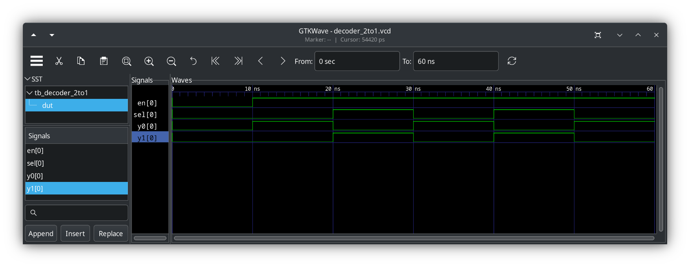

# Notes for Week 2

## Topics

1. Built-in primitives
1. User-defined primitives
1. Dataflow modeling

## Topics Deep Dive

### Behavioral Modeling

**Introduction to behavioral modeling:**

- `always` blocks for sequential and combinational logic.
- Blocking vs. non-blocking assignments (`=` vs. `<=`).
- Conditional statements (`if`, `else`, `case`).
- Looping statements (`for`, `while`).
- Hands-on lab
  - Implement a simple combinational circuit using behavioral modeling. [example](./catalog/)

**Advanced behavioral modeling:**

- Functions and tasks for code reusability.
- Introduction to arrays and memories.
- Modeling finite state machines (FSMs) using behavioral constructs.
- Hands-on lab: Implement a simple FSM using behavioral modeling.

**Introduction to advanced verification concepts:**

- Assertions for design verification.
- Functional coverage groups.
- Basic concepts of constrained random verification.
- Hands-on lab: Write simple assertions to verify a design.

## Create a `2 to 1 decoder` with behavioral model
### Compiling, simulating, displaying
Use [Makefile](./catalog/decoder_2to1/Makefile) for Unix building <br>
Use [makefile.ps1](./catalog/decoder_2to1/makefile.ps1) for Windows building. <br>
### The `2 to 1 decoder` model
See [decoder_2to1.sv](./catalog/decoder_2to1/decoder_2to1.sv) <br>
Notes on this circuit:
1. Uses always_comb for combinational logic, which is more efficient than always @* in modern SystemVerilog.
2. Includes an enable signal (en). This is crucial for practical decoders. When en is 0, both outputs are 0.
3. Uses a nested if statement to check the sel value only when en is high. This makes the code cleaner.

The SystemVerilog code:
```verilog
//////////////////////////////////////////////////////////////////////////////
//
// Module: decoder_2to1
//
// 2-to-1 decoder
//
// module: decoder_2to1
// hdl: SystemVerilog
// modeling: Behavioral Modeling
//
// author: Prof. Rob Marano <rob@cooper.edu>
//
///////////////////////////////////////////////////////////////////////////////
`ifndef decoder_2to1
`define decoder_2to1

module decoder_2to1 (
    //
    // ---------------- DECLARATIONS OF PORT IN/OUT & DATA TYPES ----------------
    //
    input logic sel,
    input logic en,
    output logic y0,
    output logic y1
);
    //
    // ---------------- MODULE DESIGN IMPLEMENTATION ----------------
    //
    always_comb begin
        if (en) begin
            if (sel == 0) begin
                y0 = 1;
                y1 = 0;
            end else begin
                y0 = 0;
                y1 = 1;
            end
        end else begin
            y0 = 0;
            y1 = 0;
        end
    end
endmodule
`endif // decoder_2to1
```
### The `2 to 1 decoder` test bench
See [tb_decoder_2to1.sv](./catalog/decoder_2to1/tb_decoder_2to1.sv) <br>
```verilog
///////////////////////////////////////////////////////////////////////////////
//
// Module: Testbench for module decoder_2to1
//
// Testbench for decoder_2to1
//
// module: tb_decoder_2to1
// hdl: SystemVerilog
//
// author: Prof. Rob Marano <rob@cooper.edu>
//
///////////////////////////////////////////////////////////////////////////////
`timescale 1ns/100ps

`include "decoder_2to1.sv"

module tb_decoder_2to1;
    //
    // ---------------- DECLARATIONS OF DATA TYPES ----------------
    //
    //inputs are reg for test bench - or use logic
    //outputs are wire for test bench - or use logic
    logic sel;
    logic en;
    logic y0;
    logic y1;

    //
    // ---------------- INSTANTIATE DEVICE UNDER TEST (DUT) ----------------
    //
    decoder_2to1 dut (
        .sel(sel),
        .en(en),
        .y0(y0),
        .y1(y1)
    );

    //
    // ---------------- INITIALIZE TEST BENCH ----------------
    //
    initial begin : initialize_variables
        en = 0;
        sel = 0;
    end

    initial begin
        //$monitor ($time,"ns, select:s=%b, inputs:d=%b, output:z1=%b", S, D, Z1);
    end

    initial begin : dump_variables
        $dumpfile("decoder_2to1.vcd"); // for Makefile, make dump file same as module name
        $dumpvars(2, dut);
    end

    /*
    * display variables
    */
    initial begin: display_variables
        // note: currently only simple signals or constant expressions may be passed to $monitor.
        // $monitor ("X1-X2-X4-X4 = %b, Z1 = %b", {X1,X2,X3,X4}, Z1);
    end

    //
    // ---------------- APPLY INPUT VECTORS ----------------
    //
    // note: following the keyword begin is the name of the block: apply_stimulus
    initial begin : apply_stimuli
        #10;  // Wait for a short period after start

        //
        // Test case 1: en = 0, sel = 0
        if (y0 !== 0 || y1 !== 0) begin
        $error("Test case 1 failed: Output should be 0 when en is 0");
        end
        $display("Test Case 1: en=0, sel=0, y0=%b, y1=%b (PASS)", y0, y1);

        //
        // Test case 2: en = 1, sel = 0
        //
        en = 1;
        sel = 0;
        #10;
        if (y0 !== 1 || y1 !== 0) begin
        $error("Test case 2 failed: y0 should be 1 and y1 should be 0");
        end
        $display("Test Case 2: en=1, sel=0, y0=%b, y1=%b (PASS)", y0, y1);

        //
        // Test case 3: en = 1, sel = 1
        //
        en = 1;
        sel = 1;
        #10;
        if (y0 !== 0 || y1 !== 1) begin
        $error("Test case 3 failed: y0 should be 0 and y1 should be 1");
        end
        $display("Test Case 3: en=1, sel=1, y0=%b, y1=%b (PASS)", y0, y1);

        //
        // Test case 4: en = 1, sel changing
        //
        en = 1;
        sel = 0;
        #10;
        sel = 1;
        #10;
        sel = 0;
        #10;
        $display("Test Case 4: en=1, sel changing, y0=%b, y1=%b", y0, y1); // Just display, more complex checking could be added.

        //
        // End the simulation
        //
        $finish;
    end
endmodule
```
### Test Bench Output
```
make COMPONENT=decoder_2to1 clean compile simulate display

/bin/rm -f decoder_2to1 decoder_2to1.vvp decoder_2to1.vcd *.vcd a.out compiler.out
Compiling component: decoder_2to1
iverilog -g2012  -o decoder_2to1.vvp decoder_2to1.sv tb_decoder_2to1.sv
Simulating component: decoder_2to1
vvp -M .  decoder_2to1.vvp -lxt2
LXT2 info: dumpfile decoder_2to1.vcd opened for output.
Test Case 1: en=0, sel=0, y0=0, y1=0 (PASS)
Test Case 2: en=1, sel=0, y0=1, y1=0 (PASS)
Test Case 3: en=1, sel=1, y0=0, y1=1 (PASS)
Test Case 4: en=1, sel changing, y0=1, y1=0
tb_decoder_2to1.sv:114: $finish called at 600 (100ps)
Opening GTKwave for component: decoder_2to1
```

