# Notes for Week 10 &mdash; The Processor &mdash; Datapath & Control (Part 1 of 3)

[ &larr; back to syllabus](/courses/ece251/2025/ece251-syllabus-spring-2025.html) [ &larr; back to notes](/courses/ece251/2025/ece251-notes.html)

# Reading Assignment for these topics

1.Read sections 4.1, 4.2, 4.3, and 4.4 from [CODmips textbook's Chapter 4](./textbook_CODmips_Chapter_4%20-%20The%20Processor.pdf). In Section 4.4 read until "A Multicycle Implementation."

These topics are covered in our [CODmips textbook's Chapter 4 presentation deck](./Patterson6e_MIPS_Ch04_PPT.ppt)

# Topics

1. How to create the digital architecture from ISA instructions, component by component
2. High level, abstract view of the processor
3. Review of logic design conventions
4. Building a datapath
5. A simple implementation scheme for a subset of MIPS instructions

# Topic Deep Dive

## Introduction to high-level abstracted overview of The Processor

Section 4.1 of the CODmips textbook serves as the **introduction to the chapter on the processor**. This section provides a **high-level and abstract overview** of the principles and techniques used in implementing a processor. It sets the context for the more detailed discussions in the subsequent sections of the chapter.

Key points from Section 4.1 include:

Starting with a **highly abstract and simplified overview**, we will explain the principles and techniques used in implementing a processor. This initial overview follows building a **datapath** and construct a simple version of a processor capable of implementing an instruction set like MIPS.

Figure 4.1 shows a **high-level view of a MIPS implementation**, focusing on functional units and their interconnections. However, this figure omits the selection (control) logic for multiple data sources (multiplexors) and the control signals needed for different instruction types.

 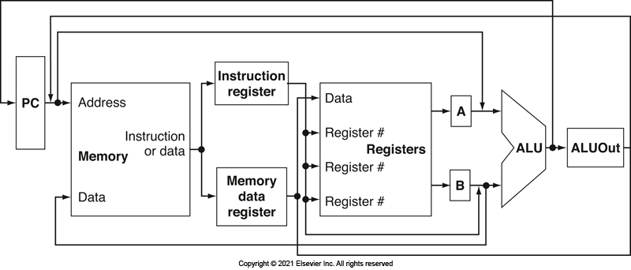

An abstract view of the implementation of the MIPS subset showing the major functional units and the major connections between them. All instructions start by using the program counter to supply the instruction address to the instruction memory. After the instruction is fetched, the register operands used by an instruction are specified by fields of that instruction. Once the register operands have been fetched, they can be operated on to compute a memory address (for a load or store), to compute an arithmetic result (for an integer arithmetic-logical instruction), or a compare (for a branch). If the instruction is an arithmetic-logical instruction, the result from the ALU must be written to a register. If the operation is a load or store, the ALU result is used as an address to either load a value from memory into the registers or store a value from the registers. The result from the ALU or memory is written back into the register file. Branches require the use of the ALU output to determine the next instruction address, which comes either from the ALU (where the PC and branch offset are summed) or from an adder that increments the current PC by 4. The thick lines interconnecting the functional units represent buses, which consist of multiple signals. The arrows are used to guide the reader in knowing how information flows. Since signal lines may cross, we explicitly show when crossing lines are connected by the presence of a dot where the lines cross.

In essence, Section 4.1 lays the groundwork for the chapter by outlining the topics that will be covered, ranging from basic datapath construction to advanced pipelining techniques and considerations for complex instruction sets. It also indicates different levels of detail that readers can focus on based on their interests.

## (review of) Logic Design Conventions

Section 4.2 of the CODmips textbook focuses on **logic design conventions** and how the hardware logic implementing a computer operates and is clocked. This section reviews key ideas in digital logic that are essential for understanding the rest of the chapter on the processor.

1. **Digital Logic**: The section likely assumes the reader has some basic understanding of digital logic. It mentions that logic components can be **combinational** or **sequential**.
1. **Combinational logic** elements operate on input values to produce outputs based on a logical function. Their outputs depend only on their current inputs.
1. **Sequential logic** elements contain state, meaning their outputs depend not only on the current inputs but also on the history of inputs and the contents of their internal state. An example given is the functional unit representing registers. Appendix B is mentioned as providing more detail on both combinational and sequential elements.
1. **Clocking Methodology**: A **clocking methodology** defines when signals can be read and when they can be written. This is crucial for predictable hardware operation, as reading and writing a signal simultaneously can lead to indeterminate values. The purpose of a clocking methodology is to ensure hardware predictability.
1. **Edge-Triggered Clocking**: The book relies on an **edge-triggered timing methodology**. This approach allows a state element (like a register) to be read and written in the same clock cycle without creating a race condition that could lead to indeterminate data values. The clock cycle must be long enough for the input values to be stable when the active clock edge occurs. Feedback within one clock cycle is not possible with edge-triggered updates, which is important for the proper functioning of the designs in this and the next chapter. Figure 4.4 illustrates this concept.

In summary, Section 4.2 lays the groundwork for understanding the processor's design by introducing the fundamental concepts of combinational and sequential logic and emphasizing the importance of a predictable clocking methodology, specifically the edge-triggered approach used throughout the chapter.

## Building a datapath

Section 4.3 of the CODmips textbook is titled "Building a Datapath" and it details the construction of the essential hardware elements and their interconnections needed to execute instructions in a processor. This section focuses on laying the groundwork for a basic implementation before moving on to more complex pipelined designs.

### Datapath Elements

The section introduces the fundamental datapath elements that are required in a MIPS implementation. These elements are responsible for operating on or holding data within the processor. The key datapath elements discussed include:

1. **Instruction Memory:** This unit stores the instructions of a program and provides an instruction given an address. It is treated as combinational logic since the datapath only reads instructions.
2. **Program Counter (PC):** This is a 32-bit register that holds the address of the current instruction being executed. It is written at the end of every clock cycle.
3. **Adder:** A combinational logic unit (likely built from an ALU configured for addition) used to increment the PC to the address of the next sequential instruction (PC + 4). This adder is permanently configured to perform addition.
4. **Register File:** This component contains all the registers in the processor and has multiple read ports and at least one write port. It can simultaneously output the contents of registers specified by the read register inputs. Writes to the register file are explicitly controlled by a write control signal and are edge-triggered.
5. **Arithmetic Logic Unit (ALU):** This unit performs arithmetic and logical operations on two 32-bit inputs and produces a 32-bit result, along with a 1-bit zero detection signal. The operation performed by the ALU is determined by an ALU control signal.
6. **Data Memory:** This unit stores data and has inputs for address and write data, and an output for read data. It has separate read and write control signals, although only one can be active at a time. It is also assumed to be edge-triggered for writes.
7. **Sign Extension Unit:** This unit takes a 16-bit input (typically from the immediate field of an instruction) and extends it to a 32-bit value by replicating the most significant bit (the sign bit)

### Instruction Fetch Datapath

The section describes how the instruction memory, PC, and adder are combined to form the initial part of the datapath responsible for fetching instructions and incrementing the PC. Figure 4.6 illustrates this portion.

 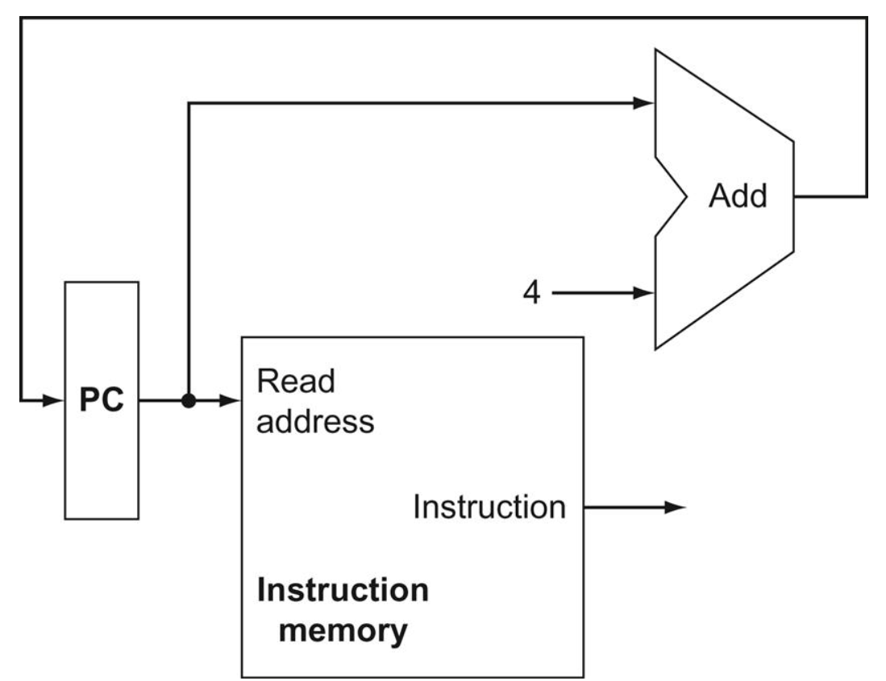

### R-type Instruction Datapath

It explains the datapath elements needed for R-format ALU operations (like add, subtract, AND, OR, slt), which primarily involve the register file and the ALU. Figure 4.7 shows these elements.

 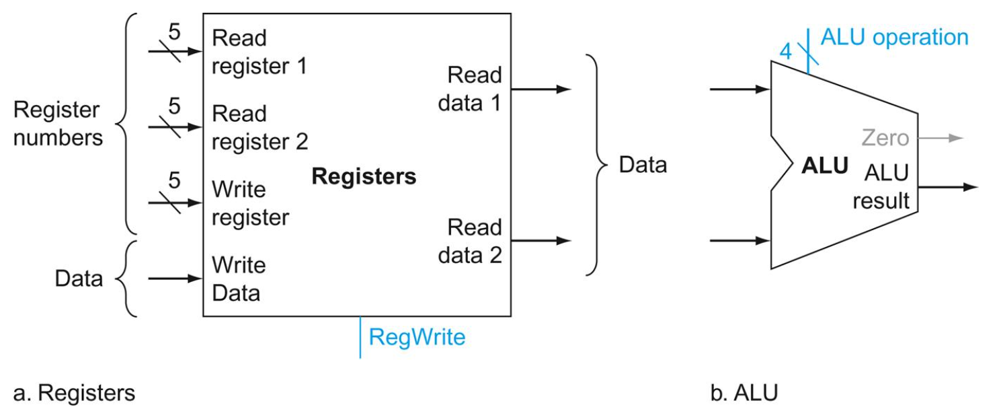

### Load and Store Instruction Datapath

The section outlines the additional units required for load (`lw`) and store (`sw`) instructions, which include the data memory and the sign extension unit, in addition to the register file and ALU. Figure 4.8 depicts these elements.

 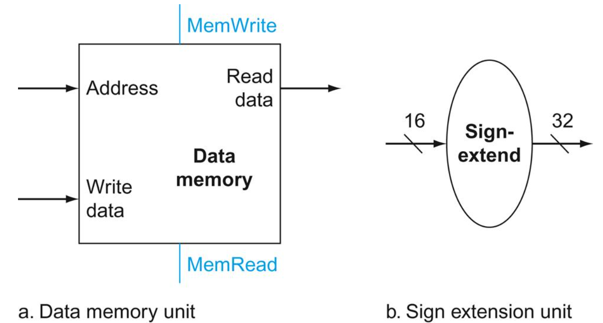

### Branch Instruction Datapath

It discusses the elements needed for branch equal (beq) instructions, which involve comparing two registers for equality using the ALU and calculating the branch target address by adding the sign-extended offset to the PC. Figure 4.9 depicts these elements.

 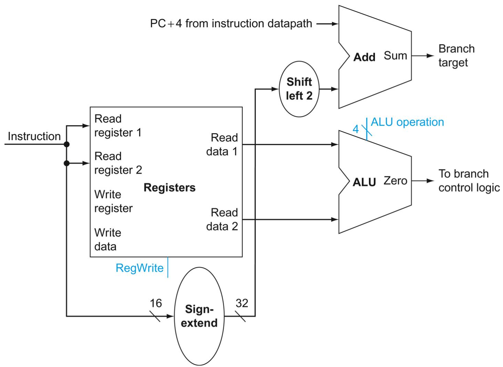

### Single Datapath

The section then shows how these individual datapath components are integrated into a single, unified datapath capable of executing the basic instruction classes (load-store word, ALU operations, and branches) in a single clock cycle. This integrated datapath requires the addition of multiplexors to select the appropriate data sources for different instructions. Figure 4.11 illustrates this combined datapath.

 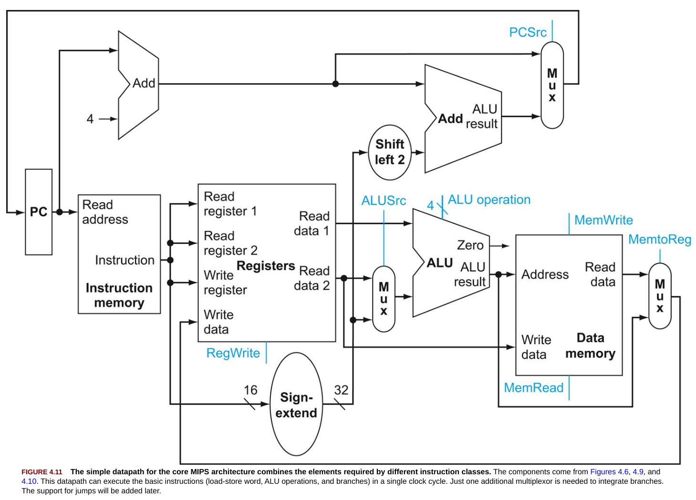

### Conclusion

In essence, Section 4.3 walks through the process of identifying the necessary hardware components for different types of instructions and then combines them into a basic datapath architecture. This datapath serves as the foundation for the more detailed processor implementations discussed in the subsequent sections of the chapter.

## A simple implementation scheme for a subset of MIPS instructions

Section 4.4 of CODmips textbook is titled "A Simple Implementation Scheme" and it describes how to implement a basic version of the MIPS processor datapath that was built in Section 4.3. This implementation is characterized by using a single long clock cycle for every instruction.

### Single Clock Cycle Implementation

The fundamental characteristic of this implementation is that each instruction begins execution on one clock edge and completes its execution on the next clock edge. This means that the **clock cycle must be long enough to accommodate the longest instruction in the instruction set**.

### Control Unit

With the datapath constructed, the section moves on to discuss the control unit. The control unit is responsible for generating the control signals that dictate the operation of the datapath components (register file writes, memory reads/writes, ALU operations, and multiplexor selections) based on the instruction being executed.

### Instruction Formats and Control Signals

To design the control unit, it's necessary to understand the formats of the different instruction classes (R-type, load-store, and branch) and the control lines needed for the datapath. Figure 4.14 shows these instruction formats.

 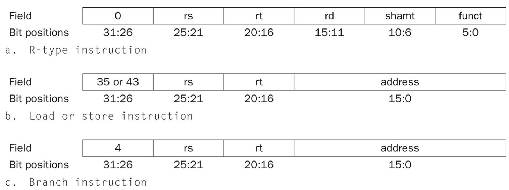

Figure 4.15 illustrates the simple datapath with all necessary multiplexors and identified control lines.

 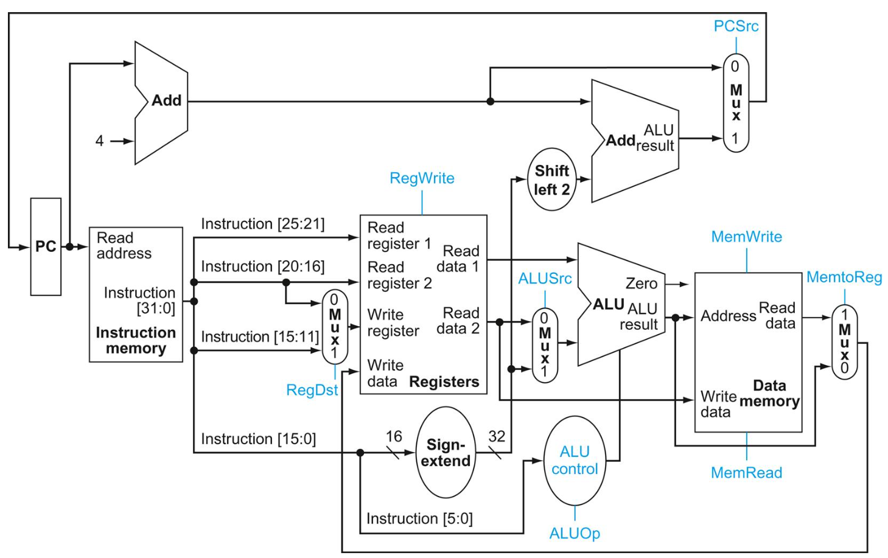

### ALU Control

The design of the ALU control is addressed first. The ALU control unit takes as input the ALU operation (ALUOp) control signals from the main control unit and the function code (funct field) from R-type instructions to determine the specific operation the ALU should perform. Figure 4.12 (referenced in Figure 4.47) shows how the ALU control bits are set based on ALUOp and the function code.

 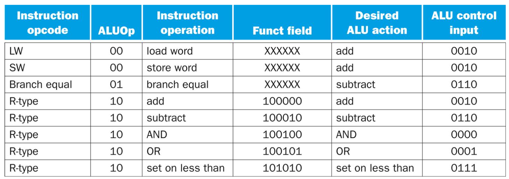

### Main Control Unit

The section then explains how to design the main control unit which generates the other control signals based on the opcode field of the instruction.

Figure 4.16 describes the function of the seven main control lines (RegDst, ALUSrc, MemtoReg, RegWrite, MemRead, MemWrite, Branch).

 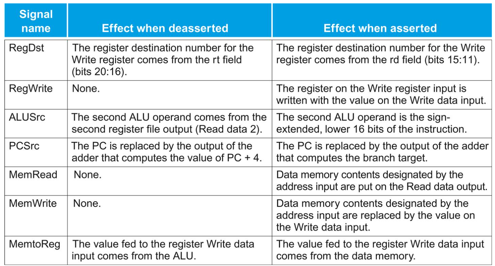

Figure 4.17 shows the datapath with the control unit and its input (opcode) and outputs (control signals).

 

### Instruction Execution Flow

The section likely walks through the execution of different instruction types (like load, R-type, and branch) on the designed datapath, highlighting the active control signals and data flow for each step within the single clock cycle.

Figure 4.20 illustrates the datapath in operation for a load instruction.

 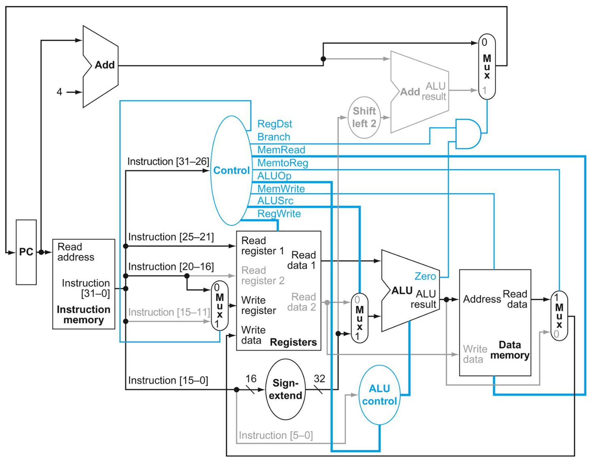

### Control Logic Implementation

The control function can be precisely defined using a truth table that maps the opcode to the required control signal settings.

Figure 4.22 shows such a truth table for the simple single-cycle implementation. This truth table can then be implemented using logic gates.

 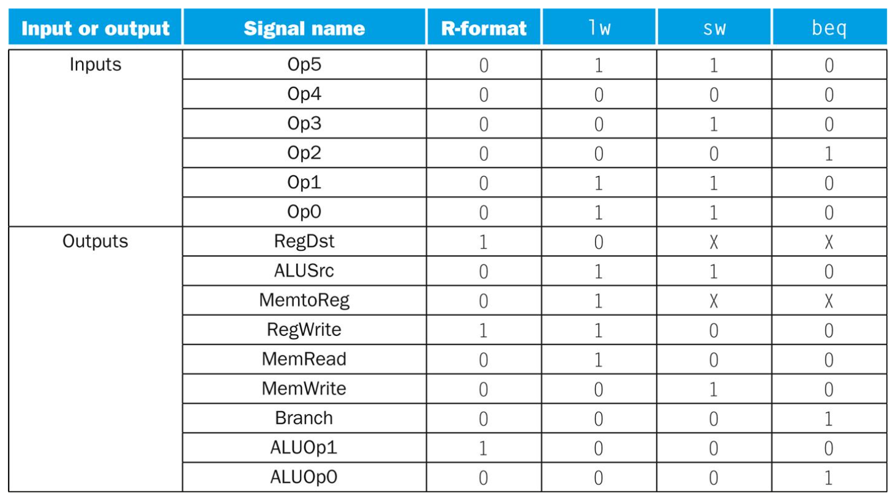

### Limitations

While this single-cycle implementation is conceptually simple, the section likely points out that it is not practical for high performance because the clock cycle time is limited by the slowest instruction, leading to inefficiencies for faster instructions.

### Conclusion

Section 4.4 details the implementation of a basic MIPS processor where each instruction takes one full clock cycle to execute. It covers the design of the control unit, including the ALU control and the main control logic, and how the control signals are generated based on the instruction's opcode and function code. The section likely illustrates the execution flow of different instruction types on this single-cycle datapath, while also hinting at the performance limitations of this approach.

[ &larr; back to syllabus](/courses/ece251/2025/ece251-syllabus-spring-2025.html) [ &larr; back to notes](/courses/ece251/2025/ece251-notes.html)
