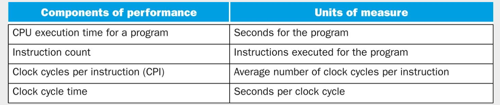

# Notes for Week 11 &mdash; The Processor &mdash; Data Path & Control (Part 2 of 3)

[ &larr; back to syllabus](/courses/ece251/2025/ece251-syllabus-spring-2025.html) [ &larr; back to notes](/courses/ece251/2025/ece251-notes.html)

# Reading Assignment for these topics

These topics are covered in our [CODmips textbook's Chapter 4 presentation deck](./Patterson6e_MIPS_Ch04_PPT.ppt)

# Topics

1. Kickstarting your processor design
2. A basic test bench for a Verilog implementation of a simple MIPS 32-bit processor
3. Computer performance
4. Multicycle processor implementation
5. Introducing pipelining to accelerate processing

# Topic Deep Dive

## Kickstarting your processor design

Refer to [Notes on Designing a von Neuman computer](./ECE%20251%20-%20Prof%20Marano's%20Notes%20on%20Designing%20a%20von%20Neumann%20Computer.pdf)

The first steps in designing a processor and its instruction set architecture (ISA) involve a comprehensive understanding of the requirements and goals for the new computer. This includes considering the following aspects:

### Determining Functional Requirements

Architects often need to define what the computer will do. These requirements can be inspired by market demands or driven by the needs of application software. If a large amount of software exists for a particular ISA, the architect might choose to implement an existing instruction set. Understanding the intended applications is crucial as it influences the necessary features and capabilities of the processor.

### Defining the Instruction Set Architecture (ISA)

The ISA is the foundation of the processor design, acting as the interface between hardware and software. It defines what is visible to the programmer or compiler writer, and includes:

1. **Instruction formats, or types:** How instructions are encoded.
2. **Instruction opcodes:** The operations that the processor can perform.
3. **Registers:** The number and types of registers available. The choice of internal storage (stack, accumulator, or registers) is a basic differentiation. Modern ISAs commonly use general-purpose registers (GPRs).
4. **Instruction and data memory:** How memory is organized, layed out, and accessed.
5. **Addressing modes:** How the addresses of operands are specified.
6. **Effect of executed instructions:** How instructions affect registers and memory.
7. **Algorithm for controlling instruction execution:** This refers to the detailed process by which a processor fetches, decodes, and executes instructions from a program in the correct sequence. This involves a coordinated interplay of hardware components and control logic. Here's a more detailed breakdown of the key aspects, drawing from the sources:
8. **Instruction Fetch:**

   - The processor uses a program counter (PC) to hold the address of the next instruction to be fetched from memory.
   - At the beginning of each instruction cycle, the instruction at the address in the PC is fetched.
   - Unless it's a branch instruction or a call, the PC is typically incremented to point to the next instruction in memory.
   - In pipelined processors, the instruction fetch unit is responsible for fetching instructions, potentially fetching multiple instructions at once or prefetching instructions to keep the pipeline busy. Fetched instructions are often placed in an instruction queue.

9. **Instruction Decode:**

   - Once an instruction is fetched, it needs to be decoded to determine the operation to be performed and the operands involved.
   - The opcode field of the instruction specifies the operation.
   - The decode stage also identifies the source and destination registers or memory locations for the operands.
   - In processors with variable-length instructions (like x86), the decode unit also determines instruction boundaries.
   - Complex instructions in CISC architectures might be translated into simpler micro-operations (micro-ops) for easier management by the execution units.

10. **Instruction Issue:**

    - In simple pipelines, an instruction is issued (moves from decode to the execution stage) if there are no data dependencies that cannot be resolved by forwarding or bypassing. If a data hazard exists, the instruction might be stalled.
    - In dynamically scheduled pipelines, instructions are typically issued in order to a set of buffers called reservation stations. The issue logic checks for available reservation stations and potential structural hazards.
    - Register renaming can occur during the issue stage to eliminate WAR and WAW hazards. The destination register is assigned a temporary or physical register, and subsequent instructions refer to this new register.

11. **Operand Fetch/Read Operands:**

    - Once an instruction is issued to a reservation station (in dynamically scheduled processors), the operands are fetched. If an operand is available in a register, it is read.
    - If an operand is not yet available (being produced by an instruction still in execution), the reservation station keeps track of the functional unit or another reservation station that will produce the value. This is often done using tags or identifiers. In Tomasulo's algorithm, source operands can point to either the register file or to other reservation stations.

12. **Execute:**

    - Instructions wait in the reservation stations until all their operands are available.
    - When an instruction is ready and a functional unit of the required type (e.g., ALU, floating-point unit, load/store unit) is available, the instruction is sent for execution.
    - In dynamically scheduled pipelines, multiple functional units can operate in parallel, leading to out-of-order execution.
    - The ALU performs arithmetic and logical operations. Load and store instructions calculate memory addresses in this stage. Branch instructions perform comparisons to determine the branch outcome.

13. **Write Result:**

    - Once an instruction finishes execution, the result is produced. In Tomasulo's algorithm, the result is buffered in the reservation station.
    - The result is then written back to the destination register in the register file or to memory (for store instructions).
    - In dynamically scheduled processors, results are often broadcast on a common data bus (CDB), which allows waiting reservation stations and registers to receive the result simultaneously.
    - For load instructions, there might be a second execution step to access memory before writing the result. Store instructions might wait for the value to be stored in this stage.

14. **Instruction Commitment (Retire):**

    - In dynamically scheduled processors with speculation, instructions might complete execution out of order, but they must be committed (retired) in the original program order to maintain correct architectural state and handle exceptions properly.
    - A reorder buffer (ROB) is used to track the program order of instructions that have been issued but not yet committed.
    - Once an instruction reaches the head of the ROB and has completed execution, its result is written to the permanent registers or memory, and the ROB entry is reclaimed

**Control Unit's Role:**

- The entire process is managed by the control unit, which generates the necessary control signals to orchestrate the actions of the datapath components (registers, ALU, memory) at each step.
- The control unit determines the sequence of micro-operations required for each instruction.
- The control unit can be implemented using hardwired logic or microprogramming.
- It also handles events like interrupts and exceptions.

### Considering Design Constraints

Alongside functional requirements, architects must consider constraints such as price, power consumption, performance targets, and availability goals. These constraints will influence design decisions at all levels, from the ISA to the physical implementation.

### Understanding Compiler Technology

As most programs are written in high-level languages and compiled, the ISA must be a suitable target for compilers. Therefore, understanding compiler technology is critical for efficient ISA design and implementation. Architects may even collaborate with compiler writers to determine desired features.

### Making Fundamental Design Choices

Early design steps involve deciding on basic architectural principles, such as whether to aim for a Complex Instruction Set Computer (CISC) or a Reduced Instruction Set Computer (RISC) architecture. The choice affects the complexity of the instruction set and the processor implementation. Other fundamental choices include the number of addresses in instructions, data types supported, and the overall philosophy of the architecture (e.g., load-store vs. register-memory).

### Conclusion

In essence, the initial stages of processor and ISA design are about defining what the processor needs to do and how programmers and compilers will interact with it, all while respecting the practical limitations of cost, power, and performance. The ISA forms the blueprint that guides the subsequent steps of processor organization (microarchitecture) and hardware implementation

## A basic test bench for a Verilog implementation of a simple MIPS 32-bit processor

A basic testbench for a Verilog implementation of a simple MIPS 32-bit processor serves to verify the functionality of the designed processor by providing inputs and checking the outputs. Here's a breakdown of the essential components and concepts for such a testbench, drawing from the sources:

### (1) Testbench Module Definition

A testbench is itself a Verilog module that typically has no inputs or outputs. It instantiates the device under test (DUT), which in this case is the MIPS processor module. A MIPS processor module might have these kinds of ports to interact with memory and control signals.

```verilog
module tb_computer();
  // Signals to interact with the DUT
  logic clk;
  logic reset;
  logic [31:0] pc;        // Program Counter (output from DUT)
  logic [31:0] instr;     // Instruction (input to DUT - from instruction memory)
  logic memwrite;       // Memory write signal (output from DUT)
  logic [31:0] aluout;    // ALU output (output from DUT)
  logic [31:0] writedata; // Data to be written to memory (output from DUT)
  logic [31:0] readdata; // Data read from memory (input to DUT)

  // Instantiate the MIPS processor (DUT)
  mips dut (
    .clk(clk),
    .reset(reset),
    .pc(pc),
    .instr(instr),
    .memwrite(memwrite),
    .aluout(aluout),
    .writedata(writedata),
    .readdata(readdata)
  );

  // ... (Clock generation, reset sequence, stimulus generation, and result checking)

endmodule
```

### (2) Clock Generation

Most digital systems, including processors, are synchronous and rely on a clock signal. The testbench needs to provide this clock signal to the DUT. A common way to generate a clock in a testbench is using an always block with a delay.

```verilog
  // Generate clock
  always begin
    clk = 1;
    #5; // Wait for 5 time units (adjust as needed)
    clk = 0;
    #5;
  end
```

### (3) Reset Signal Generation

A reset signal is crucial to initialize the processor to a known state. The testbench should assert the reset signal for a certain duration at the beginning of the simulation.

```verilog
  // Generate reset
  initial begin
    reset = 1;
    #22; // Assert reset for 22 time units (adjust as needed)
    reset = 0;
  end
```

### (4) Stimulus Generation (Providing Instructions and Data)

To test the processor, the testbench needs to provide a sequence of instructions and any necessary data to the processor's memory interface. This often involves simulating instruction and data memories within the testbench or connecting to external memory models.

1. **Instruction Memory Model:** You can create a Verilog module that acts as the instruction memory. This module would receive an address (from the processor's PC) and output the corresponding instruction. The instructions can be loaded from a file or defined directly in the testbench.
2. **Data Memory Model:** Similarly, a data memory model can be created to handle read and write requests from the processor.

### (5) Result Checking

A crucial part of the testbench is to verify if the processor is behaving correctly. This involves monitoring the output signals from the DUT (e.g., register values, memory writes) and comparing them against expected values.

1. **Monitoring Signals:** Use `always @(posedge clk)` or `always @(negedge clk)` blocks to observe the processor's state at specific clock edges
2. **Assertions and Comparisons:** Use if statements or assertion statements to check if the actual outputs match the expected outputs. The `$display` system task can be used to print messages indicating success or failure.

For example, a test program can write the value 7 to memory address 84, and the test bench would check with an `assert` if the program wrote the correct, expected result at the memory address.

### (6) Simulation Control

The testbench needs to control the simulation duration. You can use the ``$finish system task to end the simulation once the tests are complete or if an error is detected.

### Conclusion

Key Considerations for a Basic Testbench:

- **Simplicity:** Start with a small set of instructions to test fundamental aspects of the processor (e.g., ALU operations, load/store).
- **Observability:** Ensure that the testbench allows you to observe the key internal signals of the processor, either directly or through output ports.
- **Controllability:** The testbench should provide sufficient control over the inputs to the processor to thoroughly exercise its functionality.
- **Test Vectors:** For more complex testing, you might use test vector files to provide a sequence of inputs and expected outputs.
- **Self-Checking:** Ideally, the testbench should be self-checking, meaning it automatically verifies the results without manual inspection.

A basic testbench for a simple MIPS 32-bit processor will instantiate the processor, provide a clock and reset signal, supply instructions (possibly through a simplified memory model), and include some mechanism to check if the processor executes these instructions correctly. As the complexity of the processor implementation grows, the testbench will also need to become more sophisticated to cover all aspects of its behavior.

## Computer performance

Section 1.6 of CODmips textbook, titled "Performance", discusses the crucial aspects of evaluating and comparing the speed and efficiency of computers. It highlights the challenges in performance assessment due to the complexity of modern software and hardware.

### Defining Performance

The section begins by emphasizing that when we say one computer has better performance than another, the definition can be subtle. Using the analogy of passenger airplanes, it illustrates that "performance" can have different meanings depending on the criteria (e.g., speed for a single passenger vs. capacity for many). Similarly, computer performance can be defined in different ways based on the user's or manager's perspective.

### Response Time vs. Throughput:

The section distinguishes between two primary measures of performance:

1. **Response time** (or execution time) is the total time required for a computer to complete a task, which is most important to individual users. To maximize performance from this perspective, we aim to minimize response time.
2. **Throughput** (or bandwidth) is the total amount of work done in a given time, which is often of interest to datacenter managers.

### Relative Performance

The section explains how to quantitatively compare the performance of two computers. If computer X is n times faster than computer Y, it means that the execution time on Y is n times longer than on X. The performance ratio is calculated as (Performance of X) / (Performance of Y) = (Execution time of Y) / (Execution time of X).

### Measuring Performance

Time is presented as the ultimate and most reliable measure of computer performance; the computer that completes the same work in less time is faster.

Different ways of measuring time are discussed:

1. **Wall clock time** (response time, elapsed time) includes everything: disk accesses, memory accesses, I/O activities, operating system overhead, and CPU execution time.
2. **CPU execution time** (CPU time) is the actual time the CPU spends computing for a specific task. It can be further divided into user CPU time (time spent in the program itself) and system CPU time (time spent in the operating system on behalf of the program). For initial discussions, the focus is often on CPU performance.

### Clock Cycles

Computer designers often think about performance in terms of clock cycles, which are discrete time intervals determined by the computer's clock. The length of a clock cycle is the clock cycle time (e.g., in picoseconds), and its inverse is the clock rate (e.g., in gigahertz).

### The Basic Performance Equation

The section introduces the fundamental equation that relates CPU execution time to key hardware characteristics:

This equation shows that performance is affected by the number of instructions in a program, the average number of clock cycles required for each instruction (CPI), and the duration of each clock cycle. Figure 1.15 summarizes these basic components of performance.

<center>
 
</center>

### Factors Affecting Performance Equation

The section elaborates on the factors that influence each component of the performance equation:

1. **Instruction Count:** Determined by the algorithm, the programming language, and the compiler.
2. **CPI (Clock Cycles Per Instruction):** Influenced by the instruction set architecture and the processor implementation (including the memory system and processor structure). CPI can vary significantly between different instructions and applications. Some processors can even execute multiple instructions per clock cycle, leading to a CPI of less than 1 (or an IPC - instructions per clock cycle - greater than 1).
3. **Clock Cycle Time:** Determined by the hardware technology and the processor design. Modern processors can even vary their clock rates dynamically (e.g., Intel's Turbo mode).

### Instruction Mix

The dynamic frequency of different instruction types in a program (instruction mix) also plays a crucial role in overall performance as different instructions may have different CPI values.

### Importance of Complete Measurement

The section cautions against using only a subset of the performance equation (like clock rate) to compare computers, as this can be misleading. The only complete and reliable measure of computer performance is time.

### Understanding Program Performance

The performance of a program depends on the algorithm, the language, the compiler, the architecture, and the actual hardware. The following table summarizes how these components affect the factors in the CPU performance equation.

| Hardware or software component | Affects what?                      | How?                                                                                                                                                                                                                                                                                                                                                                                            |
| ------------------------------ | ---------------------------------- | ----------------------------------------------------------------------------------------------------------------------------------------------------------------------------------------------------------------------------------------------------------------------------------------------------------------------------------------------------------------------------------------------- |
| Algorithm                      | Instruction count, possibly CPI    | The algorithm determines the number of source program instructions executed and hence the number of processor instructions executed. The algorithm may also affect the CPI, by favoring slower or faster instructions. For example, if the algorithm uses more divides, it will tend to have a higher CPI.                                                                                      |
| Programming language           | Instruction count, CPI             | The programming language certainly affects the instruction count, since statements in the language are translated to processor instructions, which determine instruction count. The language may also affect the CPI because of its features; for example, a language with heavy support for data abstraction (e.g., Java) will require indirect calls, which will use higher CPI instructions. |
| Compiler                       | Instruction count, CPI             | The efficiency of the compiler affects both the instruction count and average cycles per instruction, since the compiler determines the translation of the source language instructions into computer instructions. The compiler’s role can be very complex and affect the CPI in complicated ways.                                                                                             |
| Instruction set architecture   | Instruction count, clock rate, CPI | The instruction set architecture affects all three aspects of CPU performance, since it affects the instructions needed for a function, the cost in cycles of each instruction, and the overall clock rate of the processor.                                                                                                                                                                    |

Although you might expect that the minimum CPI is 1.0, as we’ll see in Chapter 4, some processors fetch and execute multiple instructions per clock cycle. To reflect that approach, some designers invert CPI to talk about IPC, or instructions per clock cycle. If a processor executes on average 2 instructions per clock cycle, then it has an IPC of 2 and hence a CPI of 0.5.

Although clock cycle time has traditionally been fixed, to save energy or temporarily boost performance, today’s processors can vary their clock rates, so we would need to use the average clock rate for a program. For example, the Intel Core i7 will temporarily increase clock rate by about 10% until the chip gets too warm. Intel calls this Turbo mode.

### Conclusion

In summary, Section 1.6 lays the foundation for understanding computer performance by defining it from different perspectives, introducing key metrics like response time and throughput, explaining how to compare performance quantitatively, and presenting the fundamental performance equation that links execution time to instruction count, CPI, and clock cycle time. It emphasizes that achieving high performance requires considering all these factors and that time is the ultimate measure.

## Multicycle processor implementation

Section 4.5 covers multicycle processor implementation. We moved from basic concepts to a simple single-cycle implementation in Section 4.4

[ &larr; back to syllabus](/courses/ece251/2025/ece251-syllabus-spring-2025.html) [ &larr; back to notes](/courses/ece251/2025/ece251-notes.html)
