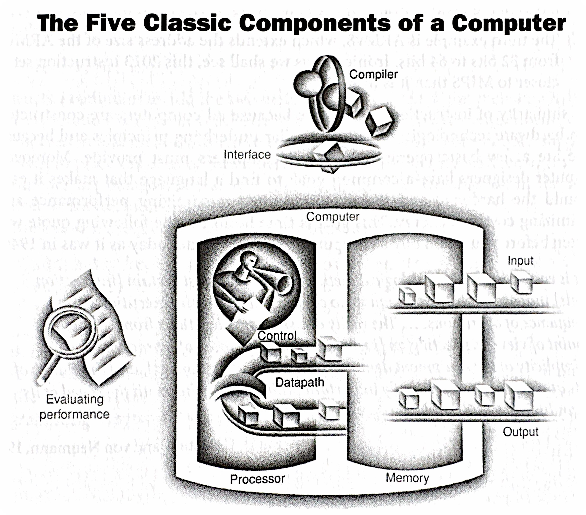
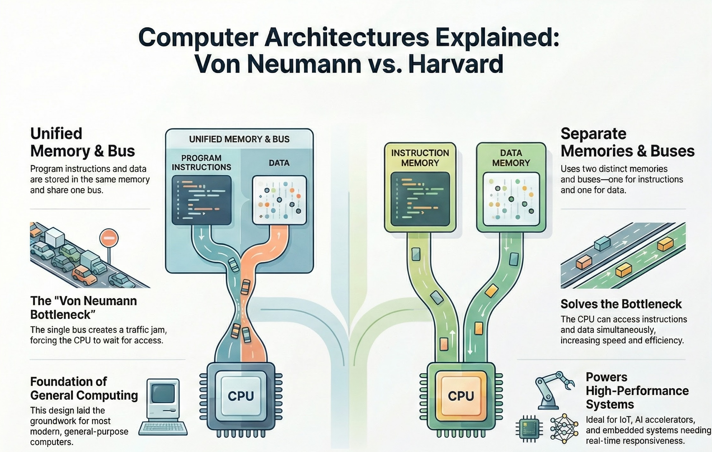
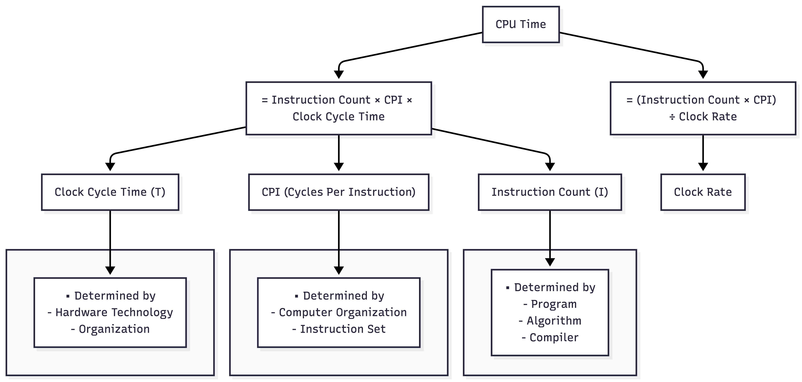

# Notes for Week 1
[ &larr; back to syllabus](/courses/ece251/2026/ece251-syllabus-spring-2026.html) [ &larr; back to notes](/courses/ece251/2026/ece251-notes.html)

[Slides for Class 01](https://cooperunion.sharepoint.com/:p:/s/Section_ECE-251-B-2026SP/IQBwKZo1hrldSql8eipiyQ8uARaOo3iqJQVQ1WOgeJ_0P_s?e=PJOBLj)

# Topics

1. Software eats the world: Computers, their abstraction, and why we study them -- [prologue](/courses/ece251/2026/textbook-notes.html)
2. Stored Program Concept and its processing
  1. The alphabet, vocabulary, grammar of computers
    1. `1`s and `0`s as the **alphabet**
    2. compute and memory **instructions** as the **vocabulary**
    3. **implementation** of compute and memory instructions as the **grammar**
  2. Introducing the **instructions** of a computer delivered by the architecture
    1. Operations of computer hardware
    2. Operands of computer hardware
    3. Signed and unsigned numbers
    4. Representing instructions in the computer
    5. Logical operations
  3. Performance of computer hardware, and how it is measured
    1. ALU
    2. Bus width
    3. Memory
    4. CPU
    5. Clock speed
    6. Multi-core (Ahmdal's Law)
    7. Threading
  4. Intro to the history of computer architecture and modern advancements

# Class 01 Lecture Summary

We had our inaugural lecture of the ECE 251 Computer Architecture course this Spring 2026 semester. I outlined the course logistics, the "arc of learning" for the semester, and introduces foundational concepts regarding the definition, history, and design principles of modern computers.

### **Course Structure and Philosophy**
I emphasized a supportive teaching environment, encouraging open communication via chat and direct contact. The course is co-taught with Professor Fontaine and is designed to teach the "art and science" behind modern computer construction, applicable to electrical engineers, computer scientists, and programmers alike.
*   **Assessment:** The course includes weekly homework, a midterm, a final exam, and a "pared back" final project where students will each design and model their own computer and potentially run programs on it.
*   **Curriculum Roadmap:** The semester progresses from computer abstractions to the Instruction Set Architecture (ISA), hardware modeling with Verilog, assembly language, the internal components (ALU, Memory, Control), and finally memory hierarchies.

### **Topics Covered**

**1. Definition of a Computer**
The lecture distinguishes between historical analog computers and modern digital general-purpose computers.
*   **Analog Origins:** I cited historical examples of computation, such as using knotted ropes to create right angles for the pyramids or analog circuits for WWII ballistics calculations.
*   **General Purpose:** A modern computer is defined by its ability to process algorithms across vast magnitudes, from astronomical units down to molecular scales, using floating-point numbers.
*   **The Five Components:** The classic components of a computer are identified as **Input, Output, Memory, Datapath, and Central Processing Unit (CPU)**.

**2. Instruction Set Architecture (ISA)**
The course focuses on **MIPS** because it is a pedagogically pure RISC (Reduced Instruction Set Computer) architecture, unlike the more complex x86.
*   **Hardware/Software Interface:** The ISA serves as the boundary between software (instructions) and hardware. Software is defined as a combination of instructions and data.
*   **Binary Representation:** I noted that the course will use the binary number system, referencing John von Neumann's influence, and that data (bits) can represent anything from numbers to instructions depending on context.

**3. The Seven Great Ideas in Computer Architecture**
I introduced seven enduring design principles found in our textbook:
*   **Abstraction:** Hiding lower-level details to simplify design models.
*   **Make the Common Case Fast:** Optimizing for frequent events rather than rare ones to enhance overall performance.
*   **Performance via Parallelism:** Doing multiple things at once, such as using multiple cores or networked computers.
*   **Performance via Pipelining:** Illustrated using a **laundry analogy** (washing, drying, and folding loads simultaneously), pipelining overlaps the execution of instructions to improve throughput.
*   **Performance via Prediction:** Guessing outcomes (like branch prediction) to proceed without waiting for confirmation.
*   **Hierarchy of Memories:** Using layers of memory with different speeds and sizes (e.g., SRAM, DRAM, Disk) because fast memory is expensive.
*   **Dependability via Redundancy:** Including redundant components (like in RAID storage or cloud infrastructure) to ensure systems survive failures.

**4. Performance Measurement**
Performance is defined by the time it takes to execute a program, not just clock speed.
*   **The CPU Equation:** Computer performance is determined by **Instruction Count** (from the program), **CPI** (Cycles Per Instruction, determined by hardware/ISA), and **Clock Cycle Time**.
*   **Benchmarking:** I introduced **SPEC** (System Performance Evaluation Cooperative) as a standard way to compare computer performance using real-world workloads.

**5. Computer Architectures**
Two primary memory architectures are distinguished:
*   **Von Neumann Architecture:** A single memory system for both instructions and data, used in general-purpose computing.
*   **Harvard Architecture:** Physically separate memories and buses for instructions and data, typically used in Digital Signal Processing (DSP) and vector processing.

**6. Current Revolutions**
We closed the lecture by contextualizing the course within current technological revolutions, specifically **Quantum Computing** and **Generative AI**. AI workloads (like matrix multiplication) rely heavily on specialized architectures like GPUs and NPUs (Neural Processing Units), requiring engineers to understand these underlying hardware principles.

# Topics Deep Dive

## What is Computer Architecture?

Welcome to Computer Architecture!  This course will delve into the fundamental principles governing how computers work at a hardware level.  It's not just about programming (though that's related!), nor is it solely about circuit design (though that plays a role). Computer architecture sits at the intersection of hardware and software, defining the interface between them.

Think of it as the blueprint of a building, like our New Academic Building.  Architects don't lay every brick, nor do they decide how the occupants will use each room.  Instead, they design the structure, layout, and systems (electrical, plumbing) that enable both construction and habitation.  Similarly, computer architects define the fundamental organization and behavior of a computer system, enabling both hardware implementation and software execution.

### Key Questions to Consider

* What exactly is a computer?
* How do we represent and manipulate information within a computer?
* How are instructions fetched, decoded, and executed?
* How is data moved and stored within the system?
* How do different components interact and communicate?
* How do we evaluate the **performance** of a computer system?
* What are the trade-offs in different architectural choices?

### Why Study Computer Architecture?

* **Performance:** Understanding architecture allows you to write more efficient software and design specialized hardware.
* **Innovation:**  You'll be able to contribute to the development of new computing paradigms and technologies.
* **Problem Solving:**  You'll gain a deep understanding of system-level issues and how to debug them.
* **Career Opportunities:**  Computer architecture skills are highly sought after in various fields, from embedded systems to cloud computing.

## The Five Classic Components of a Computer

Every computer, from your smartphone to a supercomputer, can be conceptually broken down into five main components:

1. **Input:**  Mechanisms for feeding data into the computer (keyboard, mouse, network interface, sensors, etc.).
2. **Output:**  Mechanisms for displaying or transmitting results (monitor, printer, network interface, actuators, etc.).
3. **Memory:**  Stores both instructions (the program) and data that the computer is actively using.  Think of it as the computer's workspace.  We'll explore different types of memory (RAM, cache, registers) in detail later.
4. **CPU:**  Performs the actual computations (arithmetic operations, logical comparisons) on the data.  This is the "brain" of the computer.
5. **Control Unit:**  Directs the operation of all other components.  It fetches instructions from memory, decodes them, and issues signals to the ALU, memory, and I/O devices to execute those instructions.  It's the "conductor" of the computer's orchestra.

These five components are interconnected by address buses, data buses, and control buses, which are sets of wires that carry data and control signals.

## The Stored Program Concept

One of the most crucial concepts in computer architecture is the *stored program concept*.  Before this, computers were often hardwired for specific tasks.  Changing the program required rewiring the machine—a tedious and error-prone process.

The stored program concept, attributed to John von Neumann, revolutionized computing by storing both the instructions (the program) and the data in the computer's memory.  This allows for:

* **Flexibility:**  Changing programs becomes as simple as loading a new set of instructions into memory.
* **Automation:**  The computer can fetch and execute instructions sequentially without human intervention.
* **Efficiency:**  Data and instructions can be accessed and manipulated quickly from memory.

This concept is fundamental to how all modern computers operate.

## von Neumann (Princeton) vs. Harvard Architectures

While the von Neumann architecture is dominant, it's important to understand its historical context and alternatives.

| Feature | Von Neumann (Princeton) Architecture | Harvard Architecture |
|---|---|---|
| Memory | Single memory space for both instructions and data | Separate memory spaces for instructions and data |
| Access | Instructions and data share the same memory bus | Instructions and data can be accessed simultaneously |
| Advantages | Simpler design, more efficient use of memory | Faster instruction fetch, avoids bottlenecks |
| Disadvantages | Potential bottleneck (von Neumann bottleneck) as both instructions and data compete for the same memory access | More complex design, requires separate memory modules |
| Applications | General-purpose computers, PCs, laptops | Embedded systems, digital signal processors (DSPs) |

The **von Neumann bottleneck** arises because both instructions and data must travel over the same bus to and from memory.  This can limit performance, especially when the CPU needs to fetch instructions and data frequently.  The Harvard architecture mitigates this by allowing parallel access to instruction and data memories.

**Architectural Comparison**

While modern general-purpose computers primarily use variations of the von Neumann architecture (often with caching and other techniques to reduce the bottleneck), the Harvard architecture is still relevant in specialized applications where performance and parallelism are critical.

Additional readings for these architecture types:
* [Von Neumann Architecture vs. Harvard Architecture: A Detailed Comparison](https://www.spiceworks.com/tech/tech-general/articles/von-neumann-architecture-vs-harvard-architecture/)

### History of the Stored Program Concept
The stored-program concept, a fundamental principle in computer architecture, was pioneered by John von Neumann in the mid-1940s. It revolutionized computing by allowing computers to store both data and instructions in the same memory location. This seemingly simple idea had profound implications, enabling computers to become much more flexible and powerful than their predecessors, which relied on fixed programs or manual reconfiguration.   

Before the stored-program concept, computers were often limited to specific tasks. These "Fixed Program Computers" had their functionality determined by their physical design and could not be easily reprogrammed.  For example, the ENIAC and Colossus had to be physically rewired or reconfigured with switches and cables to change their programs. This process was time-consuming and laborious, often taking weeks to set up and debug a single program. Imagine having to rewire your computer every time you wanted to switch from writing an email to browsing the internet!   

With the stored-program concept, instructions are encoded as binary numbers and stored in memory alongside the data they operate on. This means that the computer can access and execute instructions sequentially, just like it accesses data. This is achieved through a continuous cycle of fetching instructions from memory, decoding them, and then executing them, known as the fetch-decode-execute cycle. The control unit acts like the brain of the computer, fetching instructions from memory and interpreting them. It then instructs the ALU, which is responsible for performing calculations and logical operations, to carry out the tasks specified by the instructions.

### Relating through an Example
Think of a chef in a kitchen. In early computers, the chef would have to follow a single recipe written on a wall, with no way to change it, cooking one item, dish, or ingredient at a time. The chef **is** the computer system and the program. With the stored-program concept, the chef now has a cookbook where they can store and access different recipes (programs) as needed. The chef can then follow the instructions in the chosen recipe to prepare a dish (perform a computation).

A crucial aspect of this concept is that instructions are treated as data, that is, data and instructions are coded into binary representation and manipulated by the computer architecture to compute (and store) the results requested by the program and driven by the data. As a result, programs can not only be stored and executed, but they can also be manipulated and modified like any other data. This has profound implications, as it allows for the creation of programs that can write or modify other programs, leading to the development of assemblers, compilers, linkers, and other essential software tools. It also enables self-modifying code, where a program can alter its own instructions during execution, allowing for more complex and dynamic behavior.   

This ability to store and execute different programs from memory is what allows your computer to run various applications, from TikTok, SnapChat, and web browsers to games, video editing software, and Matlab, for example.   

### Key Advantages of the Stored-Program Concept:

1. **Programmability:** Computers can be easily reprogrammed to perform different tasks by simply loading a new set of instructions into memory.
2. **Flexibility:** A single computer can be used for a wide range of applications.
3. **Self-modifying code:** Programs can modify their own instructions during execution, enabling more complex and dynamic behavior. (Think how computer viruses work...)

### Limitations of the Von Neumann Architecture (aka Princeton Architecture)
While the Von Neumann architecture revolutionized computing, it also has limitations. One of the most significant is the "Von Neumann bottleneck." This bottleneck arises because the CPU fetches both data and instructions from the **same memory location** using a single bus. This means that the CPU cannot fetch data and instructions simultaneously, leading to a slowdown in processing speed, especially when dealing with large amounts of data.   

To mitigate this bottleneck, modern computer architectures employ various techniques, such as:

1. **Memory Hierarchy:** Two of the five main components of a modern, general purpose computer are CPU and memory. This general term memory represents all the addressable storage locations. The memory hierarchy begins with cache memory, closest to the CPU. These small, high-speed memory units store frequently accessed data and instructions, reducing the need to access the lower memory stages in the hierarchy, ultimately to the full extent of all the addressable storage locations, aka, main memory.
2. **Modified Harvard architecture:** Using separate caches or access paths for data and instructions.   
3. **Branch prediction:** Predicting the flow of program execution to pre-fetch instructions and reduce delays.   

These advancements help to improve the performance of modern computers, but the fundamental principle of the Von Neumann architecture remains a cornerstone of their design.

### In Conclusion
The stored-program concept, a brainchild of John von Neumann, revolutionized computing by allowing both data and instructions to reside in the same memory. This innovation enabled computers to become programmable, flexible, and capable of performing a wide range of tasks. By treating instructions as data, it paved the way for the development of software, operating systems, and ultimately, the digital world we have today. Modern computers, from smartphones to supercomputers, owe their versatility and power to this fundamental principle.

## Introducing Performance of a Computer

Background reading on performance
* [Performance of Computers](https://cooperunion.sharepoint.com/:b:/s/Section_ECE-251-A-2025SP/EStQunOF525KtLpMSMglQVQBd7C4dnb0vIQa0Q4x2pKSag?e=gy4MTK)

### Defining Performance in Computer Architecture

Performance in computer architecture is a multifaceted concept, and there isn't one single "best" metric. It's often a **balancing act between different factors**, and the "right" performance measure depends on the specific application and priorities. Here's a breakdown of key aspects:

**1. Execution Time:**

* **Definition:** The most direct measure of performance is how long it takes a computer to complete a task. Shorter execution time means better performance.
* **Units:** Seconds, milliseconds, microseconds, etc.
* **Factors:** Clock speed, instruction count, memory access times, I/O speed, and overall system organization all influence execution time.
* **Example:** Comparing the time it takes two different processors to run the same benchmark program. The processor with the lower execution time is considered faster.

**2. Throughput:**

* **Definition:** Measures how much work a computer can complete in a given period. Higher throughput means better performance.
* **Units:** Transactions per second, jobs per hour, instructions per second (IPS), floating-point operations per second (FLOPS), etc.
* **Factors:** Processor core count, memory bandwidth, I/O bandwidth, and system software efficiency influence throughput.
* **Example:** A web server that can handle more requests per second has higher throughput. A supercomputer that can perform more FLOPS has higher computational throughput.

**3. Latency:**

* **Definition:** The delay between initiating a request and receiving the result. Lower latency means better performance.
* **Units:** Seconds, milliseconds, microseconds, nanoseconds, etc.
* **Factors:** Memory access times, network latency, disk access times, and pipeline stalls influence latency.
* **Example:** The time it takes for a mouse click to register on the screen is a measure of latency. A lower latency is crucial for interactive applications and real-time systems.

**4. Resource Utilization:**

* **Definition:** How efficiently a computer uses its resources (CPU, memory, I/O). Higher utilization (without bottlenecks) can lead to better performance.
* **Units:** Percentage of CPU usage, memory usage, disk I/O, etc.
* **Factors:** Operating system scheduling, memory management, and application design influence resource utilization.
* **Example:** A system that can perform the same amount of work using less energy or fewer CPU cycles is considered more efficient.

**5. Power Consumption:**

* **Definition:** The amount of energy a computer consumes. Lower power consumption is often desirable, especially in mobile and embedded systems. Performance per watt is a common metric.
* **Units:** Watts, milliwatts, kilowatts, etc.
* **Factors:** Processor architecture, clock speed, voltage, memory technology, and cooling systems influence power consumption.
* **Example:** A laptop that can run for longer on a single battery charge has better power efficiency.
* Note, the reading above speaks about the "Power Wall." See below for additional notes on the power wall.

**6. Cost:**

* **Definition:** The price of the hardware and software. Performance per dollar is an important metric.
* **Units:** Dollars, etc.
* **Factors:** Processor cost, memory cost, storage cost

### Sidebar &mdash; The Power Wall in Computer Architecture

The "Power Wall" refers to the increasing difficulty and impracticality of continuing to increase processor clock speeds to achieve performance gains.  For many years, increasing clock speed was the primary driver of improved CPU performance.  However, this approach has run into **fundamental physical limitations**, leading to the "power wall."

**The Problem:**

As clock speeds increase, so does the power consumption of the processor.  This increased power consumption manifests as heat.  The relationship is roughly cubic:  doubling the clock speed can increase power consumption by a factor of eight.  This heat becomes increasingly difficult and expensive to dissipate.  Think of it like trying to cool a rapidly boiling pot of water; at some point, you can't add any more heat without it boiling over.

**Consequences of Excessive Heat:**

* **Reliability Issues:** High temperatures can damage components and reduce the lifespan of the processor.
* **Cooling Costs:**  More complex and expensive cooling solutions (e.g., liquid cooling) are required to manage the increased heat.  This adds to the overall system cost.
* **Power Consumption:**  Higher power consumption translates to higher energy bills and reduces battery life in mobile devices.  This has significant environmental implications as well.
* **Diminishing Returns:**  At a certain point, the performance gains from increasing clock speed are outweighed by the increased power consumption and cooling costs.  The extra heat generated becomes unmanageable, and further increases in clock speed provide only marginal performance improvements.

**The Relationship Between Clock Speed and Power**

* **Dynamic Power:** A significant portion of a processor's power consumption is dynamic power, which is the power used to switch transistors on and off. This is directly related to the clock speed. Note there is also "static power consumption," also known as the leakage current to power up transitors. We will deal here only with dynamic power, that is, the power created by switching between 0s and 1s.
* **The Equation:** Power is that generated when switching between 0 and 1 and the static power: $$P=P_{dynamic}+P_{static}$$ where $P_{dynamic} = C * V^2 * f$.   A simplified way to represent this is: $$Power ≈ C * V^2 * f$$

Where:
 * `C` is the capacitance of the circuit
 * `V` is the voltage
 * `f` is the frequency (clock speed)

* **The Cube Relationship:** Notice that the voltage (`V`) is squared in this equation. This is crucial. To increase clock speed, you often need to increase the voltage to maintain stability. This means that the power increases quadratically with voltage. Since voltage often needs to be increased proportionally with frequency, you end up with a cubic relationship overall.

**Why It's *Close* to a Factor of Eight**

1. **Linear Increase with Frequency:** If you *only* doubled the clock speed and kept the voltage the same, the power would increase linearly (doubling).
2. **Voltage Increase:** However, to reliably double the clock speed, you typically need to increase the voltage. This increase in voltage, when squared, has a much larger impact on power consumption.
3. **Combined Effect:** The combination of the linear increase from frequency and the quadratic increase from voltage results in a power increase that is close to a factor of eight when you double the clock speed.

**Important Caveats**

* **Technology Nodes:** As semiconductor technology advances, the relationship between clock speed and power becomes more complex. New techniques and materials can help mitigate the power increase.
* **Design Techniques:** Architects use various techniques (like clock gating, power gating, and voltage scaling) to manage power consumption and improve efficiency.
* **Leakage:** In modern processors, leakage current (current that flows even when a transistor is off) also contributes to power consumption, and this can become more significant at higher temperatures associated with higher clock speeds.

**In Summary**

While not an absolute rule, the "factor of eight" is a good rule of thumb to illustrate the significant power challenges associated with increasing clock speeds. It highlights the need for innovative design techniques and power management strategies in modern computer architecture.

**The Shift in Focus:**

The power wall has forced a fundamental shift in how computer architects design processors.  Instead of focusing solely on increasing clock speed, the emphasis has moved towards:

* **Multi-core Processors:**  Instead of one fast core, processors now have multiple slower cores that can work in parallel.  This allows for increased throughput without dramatically increasing power consumption.
* **Specialized Hardware:**  Adding specialized hardware units for specific tasks (e.g., graphics processing units (GPUs), digital signal processors (DSPs)) can improve performance without increasing the clock speed of the main processor.
* **Architectural Innovations:**  Developing new microarchitectural techniques, such as pipelining, caching, and branch prediction, can improve performance without relying solely on higher clock speeds.
* **Power-Efficient Designs:**  Designing processors with lower voltage and more efficient transistors can reduce power consumption.
* **Dark Silicon:**  The idea that not all transistors on a chip can be powered on at the same time due to thermal constraints.  This necessitates intelligent power management strategies.

**In summary:** The power wall is a critical challenge in computer architecture. It signifies the limitations of simply increasing clock speeds to achieve performance gains. The industry has responded by shifting its focus towards multi-core processors, specialized hardware, architectural innovations, and power-efficient designs.  Managing power consumption and heat dissipation has become a central concern for computer architects.

## Looking Ahead to next lecture &mdash; Instruction Set Architecture (ISA)

Today, we've laid the foundation for understanding the basic components and principles of computer architecture.  Our next lecture will delve into the *Instruction Set Architecture (ISA)*.

The ISA defines the set of instructions that a particular processor can understand and execute.  It's the interface between the hardware and the software.  We'll explore:

* **Instruction formats:** How instructions are encoded and represented in memory.
* **Addressing modes:** How the processor accesses data in memory.
* **Instruction types:** Arithmetic, logical, data transfer, control flow, etc.
* **ISA design considerations:**  How ISA choices impact performance, complexity, and programmability.

Understanding the ISA is crucial for writing efficient code, optimizing compiler design, and designing new processors.  It's the bridge between the high-level world of programming and the low-level world of hardware.

# Textbook Chapter 1 Summary Notes

## 1.1 Introduction
The computer revolution has been driven by rapid improvements in technology, leading to distinct classes of computing systems:
*   **Personal Mobile Devices (PMDs)**: Battery-operated, wireless, multimedia-centric (e.g., smartphones, tablets).
*   **Desktop Computers**: Price/performance driven, personal use.
*   **Servers**: High availability, scalability, high throughput. Used for file storage, web serving, and database applications.
*   **Clusters/Warehouse Scale Computers (WSCs)**: Thousands of servers connected via LAN/WAN; powering "Software as a Service" (SaaS) and Cloud Computing.
*   **Embedded Computers**: Hidden processors in other systems (cars, appliances), strict power/cost/performance constraints.

## 1.2 Seven Great Ideas in Computer Architecture
1.  **Use Abstraction to Simplify Design**: Hiding lower-level details to manage complexity (e.g., instruction set architecture).
2.  **Make the Common Case Fast**: Optimize the most frequently executed paths.
3.  **Performance via Parallelism**: Doing multiple things at once.
4.  **Performance via Pipelining**: Specific form of parallelism (like an assembly line).
5.  **Performance via Prediction**: Guessing the outcome to proceed sooner (e.g., branch prediction).
6.  **Hierarchy of Memories**: Combining small/fast memory (cache) with large/slow memory to give the illusion of large/fast memory.
7.  **Dependability via Redundancy**: Redundant components to handle failures (e.g., RAID).

## 1.3 Below Your Program
Software is organized in layers:
1.  **Applications**: High-level code.
2.  **System Software**:
    *   **Operating System (OS)**: Handles I/O, memory, and resource allocation.
    *   **Compiler**: Translates high-level language (C, Java) into assembly language.
3.  **Hardware**: Executes the machine code.

**Translation Hierarchy**:
*   High-Level Language $\rightarrow$ Assembly Language $\rightarrow$ Machine Language (Binary).
*   **Assembler**: Translates assembly to binary.

## 1.4 Under the Covers (The 5 Classic Components)
Every computer consists of 5 components:
1.  **Input**: Feeds data (keyboard, mouse, mic).
2.  **Output**: Conveys results (display, speaker).
3.  **Memory**: Stores data and programs (DRAM for main memory, SRAM for cache, Flash/Disk for secondary).
4.  **Datapath**: Performs arithmetic operations (brawn).
5.  **Control**: Commands the datapath, memory, and I/O (brain).

*   **Processor (CPU)** = Datapath + Control.

## 1.5 Technologies for Processors and Memory
*   **Integrated Circuits (ICs)**: Chips containing transistors (on/off switches).
*   **VLSI (Very Large Scale Integration)**: Millions/billions of transistors on a chip.
*   **Manufacturing**: Silicon Ingot $\rightarrow$ Wafers $\rightarrow$ Patterning $\rightarrow$ Dicing into Dies.
*   **Yield**: Percentage of good dies per wafer. Cost increases with die size.

## 1.6 Performance
Performance is defined by the user's needs:
*   **Response Time (Execution Time)**: Time to complete one task. (Primary focus for individual users).
*   **Throughput (Bandwidth)**: Total work done per unit time. (Primary focus for datacenters).

**Measuring Time**:
*   **Wall-clock time (Elapsed time)**: Total time including I/O, OS overhead, etc.
*   **CPU Time**: Time the CPU spends working on a specific task (User CPU time + System CPU time).

**The CPU Performance Equation**:
Execution time depends on the number of clock cycles and the clock cycle time.

$$ \text{CPU Time} = \text{Instruction Count} \times \text{CPI} \times \text{Clock Cycle Time} $$

Or equivalently:
$$ \text{CPU Time} = \frac{\text{Instruction Count} \times \text{CPI}}{\text{Clock Rate}} $$

*   **Instruction Count ($I$)**: Determined by the program, algorithm, and compiler.
*   **CPI (Cycles Per Instruction)**: Average number of cycles per instruction. Determined by computer organization and instruction set.
*   **Clock Cycle Time ($T$)**: Determined by hardware technology and organization.

### CPU Performance Equation

## 1.7 The Power Wall
For decades, clock rates increased rapidly, but this has slowed due to thermal limits.
*   **Power Equation**:
    $$ P_{\text{dynamic}} \propto \text{Capacitive Load} \times \text{Voltage}^2 \times \text{Frequency} $$
*   We cannot reduce voltage further without leakage issues, and we cannot remove heat fast enough to increase frequency significantly.
*   **Result**: The "Power Wall" forces a shift in design strategy.

## 1.8 The Sea Change: Multicore
To improve performance without increasing clock rate, manufacturers switched to **Multicore Processors** (multiple processors per chip).
*   **Impact**: Programmers must now write **parallel** programs to get performance benefits.
*   **Challenges**: Scheduling, load balancing, synchronization, and communication overhead.
Read [The Free Lunch is Over - A Fundamental Turn Toward Concurrency in Software](./The%20Free%20Lunch%20is%20Over%20-%20A%20Fundamental%20Turn%20Toward%20Concurreny%20in%20Software.pdf)

## 1.11 Fallacies and Pitfalls
### **1. The Amdahl’s Law Pitfall**
**Pitfall:** Expecting the improvement of one aspect of a computer to increase overall performance by an amount proportional to the size of the improvement.

*   **Concept:** This pitfall ignores the "law of diminishing returns" known as **Amdahl’s Law**. The total speedup of a system is strictly limited by the fraction of the workload that *cannot* be improved (the sequential or unaffected part). No matter how much you optimize a specific feature, the execution time can never drop below the time required for the unaffected portion.
*   **Workable Example:**
    *   **Scenario:** A program takes **100 seconds** to execute. **80 seconds** of this time is spent on multiplication operations, and **20 seconds** is spent on other tasks.
    *   **Attempt:** A designer improves the multiplication hardware to be infinitely fast (0 seconds).
    *   **Result:** The program still takes **20 seconds** to run (the unaffected portion). Despite improving the multiplication hardware by 100%, the overall system performance only improves by a factor of 5, not infinity. This proves that the opportunity for improvement is limited by how much the specific feature is actually used.

### **2. The Low Utilization Fallacy**
**Fallacy:** Computers at low utilization use little power.

*   **Concept:** It is a common misconception that if a computer is doing very little work (low load), it consumes a proportionally small amount of energy. In reality, processors often remain inefficient at low loads due to static power (leakage) and peripheral components.
*   **Workable Example:**
    *   **Scenario:** A server in a warehouse-scale computer (like Google's) is running at only **10% utilization** (a light workload).
    *   **Expectation:** One might assume it uses ~10% of its peak power.
    *   **Reality:** The server actually consumes roughly **33% of its peak power**. This inefficiency is problematic because servers spend most of their time (10% to 50%) in these lower utilization states, wasting significant energy.

### **3. The Performance Metric Pitfall**
**Pitfall:** Using a subset of the performance equation as a performance metric.

*   **Concept:** Relying on a single metric—such as clock rate, instruction count, or MIPS (Million Instructions Per Second)—can be misleading because these metrics do not account for the total time required to execute a program. Time is the only reliable measure of performance.
*   **Workable Example:**
    *   **Scenario:** You are comparing **Computer A** (Clock rate: 4 GHz, CPI: 1.0) and **Computer B** (Clock rate: 4 GHz, CPI: 1.1) running different programs.
    *   **The Metric (MIPS):** MIPS is calculated as $\frac{\text{Instruction Count}}{\text{Execution Time} \times 10^6}$. Because MIPS does not account for instruction capability, a computer with simple instructions might execute more of them per second (high MIPS) but take longer to complete the actual task.
    *   **Result:** If a new program is written using more instructions that are individually faster to execute, the MIPS rating might go up, but the actual performance (execution time) could go down. Thus, a higher MIPS rating does not automatically mean a faster computer when comparing different instruction sets.

---
[ &larr; back to syllabus](/courses/ece251/2026/ece251-syllabus-spring-2026.html) [ &larr; back to notes](/courses/ece251/2026/ece251-notes.html)
