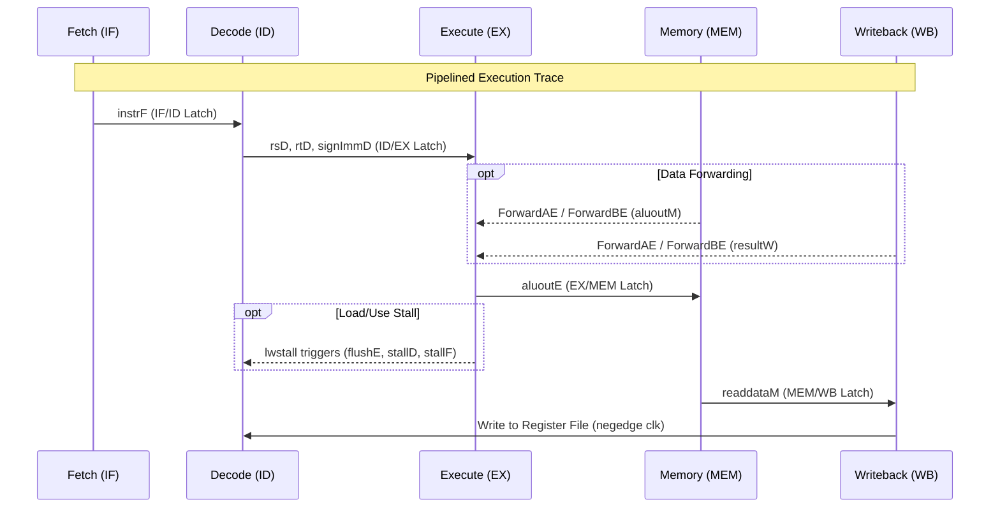

# Pipelined MIPS32 Processor

## Architecture Overview
This directory contains the SystemVerilog implementation of the 5-stage MIPS32 Pipelined Processor derived from Chapter 4 of Patterson & Hennessy (6th Ed).

### Pipeline Stages
1. **Instruction Fetch (IF)**: Fetches the instruction from `imem` and increments the PC.
2. **Instruction Decode (ID)**: Reads the `regfile`, resolves Branches locally using an internal `eqcmp` comparator, evaluates Control unit logic natively, and halts structural paths via `hazard.sv`.
3. **Execute (EX)**: Performs ALU computations and memory address synthesis, receiving Forwarded variables bypassed via Multiplexers.
4. **Memory (MEM)**: Reads or Writes physical states to `dmem`.
5. **Writeback (WB)**: Writes native ALU or Memory data back to the `regfile` on the negative clock edge.

## Component Sequence Diagram



## Running the Simulation

Use the native Makefile which transparently executes the assembler payload and synthesizes the digital signals.

```bash
make clean all
```

### Debugging
The `tb_computer.sv` invokes a comprehensive sequence monitoring `$monitor` block that traces PC routes natively alongside local forwarding parameters (e.g. `aluM`, `fwa`, `fwb`).
