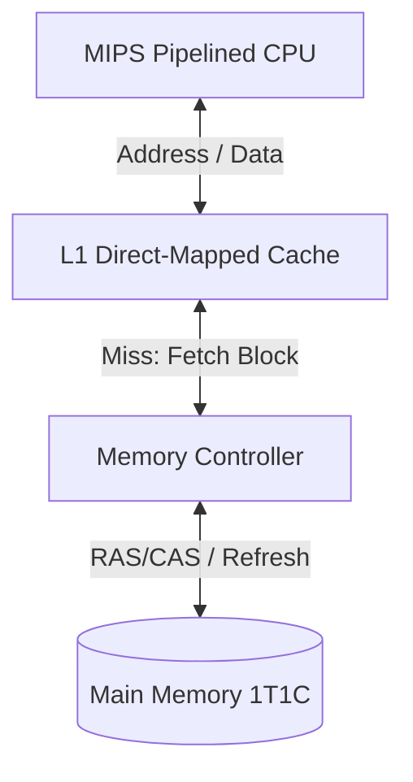
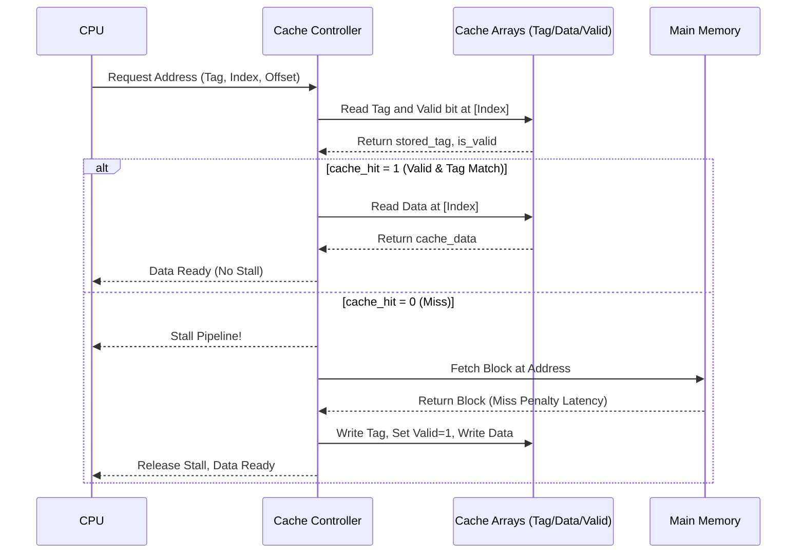
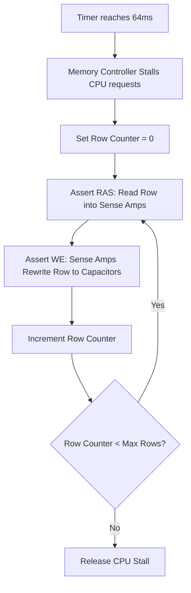

# Memory System Technical Architecture

This document maps out the logical and temporal architecture of the memory subsystems introduced in Week 13.

## 1. System Architecture (Block Diagram)

## 2. Direct-Mapped Hit/Miss Logic (Sequence Diagram)

This diagram maps the SystemVerilog `cache_controller` module's execution sequence.

## 3. DRAM Refresh Cycle (Flowchart)

Because of the volatile nature of the 1T1C capacitor, a hardware timer must periodically interrupt normal operations to execute a refresh.

