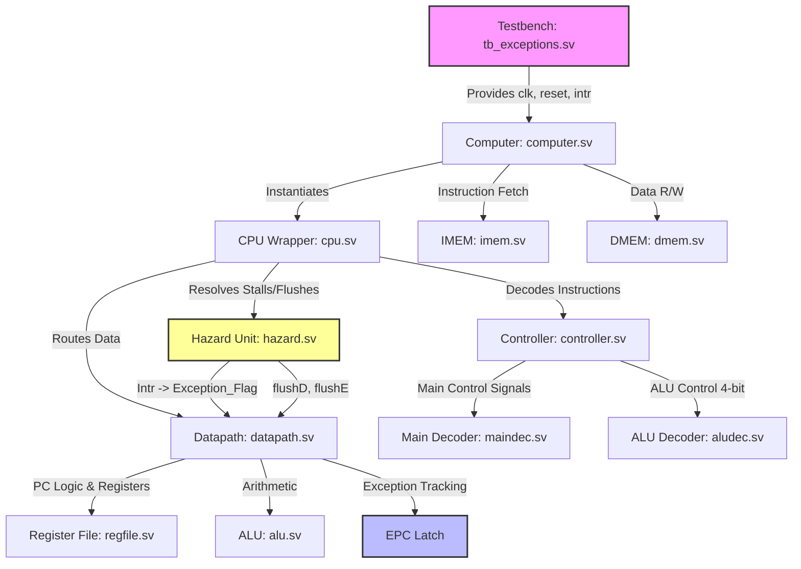
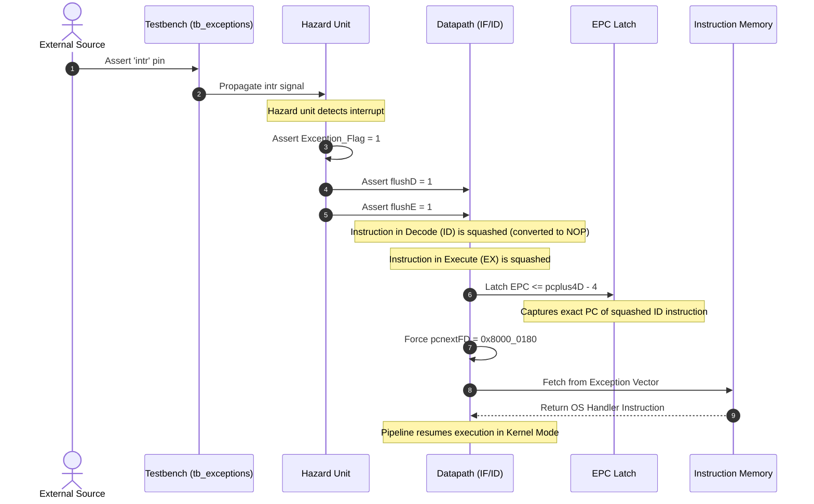
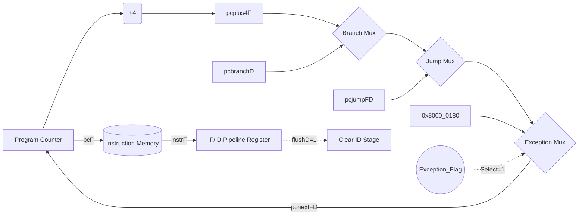

# MIPS32 Pipelined CPU Architecture & Exception Logic

This document details the software architecture, datapath components, and sequence diagrams corresponding to the MIPS32 pipelined processor, specifically highlighting the handling of asynchronous exceptions and external interrupts.

## Software Architecture: Hardware Component Interaction

The MIPS32 processor is modeled structurally in SystemVerilog. The diagram below illustrates the hierarchical instantiation of modules and how control signals, like `Exception_Flag`, propagate down to affect the pipeline logic.

## Exception Handling: Sequence Diagram

When an external interrupt pin (`intr`) is asserted high, the pipeline must be safely flushed to prevent the execution of in-flight instructions in the `ID` and `EX` stages while correctly capturing the `PC` to return to via `EPC`.

The sequence diagram below visualizes the cycle-by-cycle behavior during an asynchronous interrupt.

## Datapath Exception Redirection Logic

The `datapath.sv` module controls the flow of execution. Upon receiving `Exception_Flag`, the `Next PC` multiplexer is forced to target the pre-defined kernel exception address.

## ALU Control Signal Expansion

To resolve decoding collisions, the 3-bit `alucontrol` was natively expanded to a 4-bit bus. The updated operational mapping ensures isolated combinational logic.

| Operation | `alucontrol` (4-bit) | Logic Component Used | Note |
|---|---|---|---|
| AND | `0000` | Combinational | bitwise & |
| OR | `0001` | Combinational | bitwise \| |
| ADD | `0010` | Combinational | a + b |
| NOR | `0011` | Combinational | ~(a \| b) |
| MFLO | `0100` | Combinational | Read lower 32-bits of HiLo |
| MFHI | `0101` | Combinational | Read upper 32-bits of HiLo |
| SUB | `0110` | Combinational | a - b |
| SLT | `0111` | Combinational | Set if a < b |
| DIV | `1001` | Sequential | a / b & a % b (updates HiLo) |
| MULT | `1000` | Sequential | a * b (updates HiLo) |
