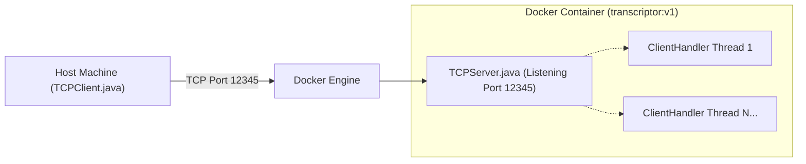
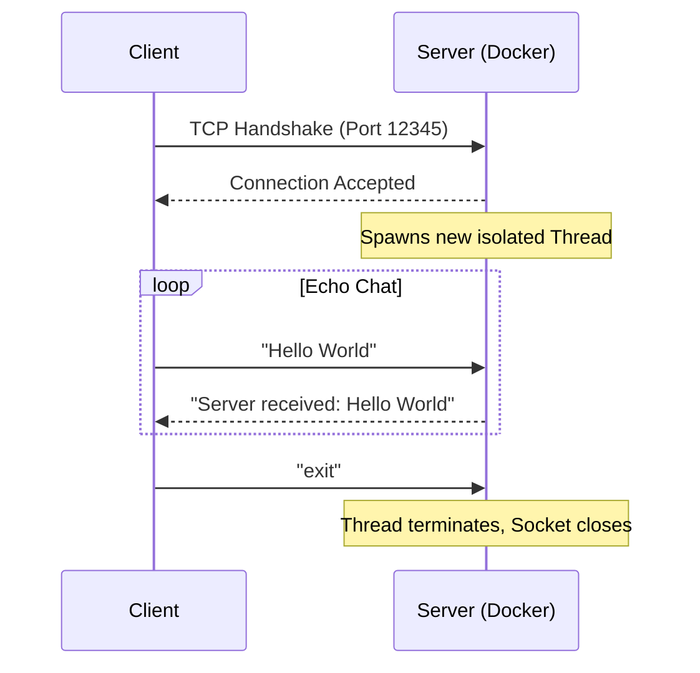
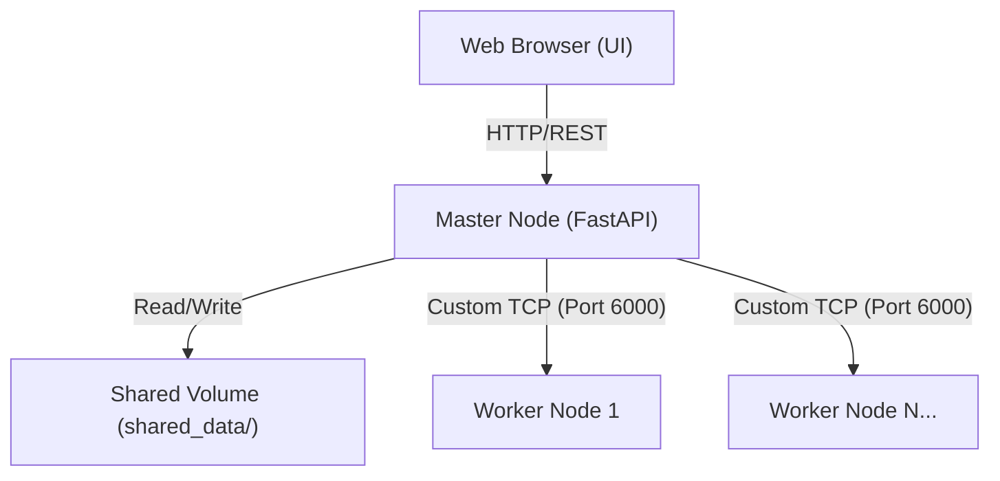
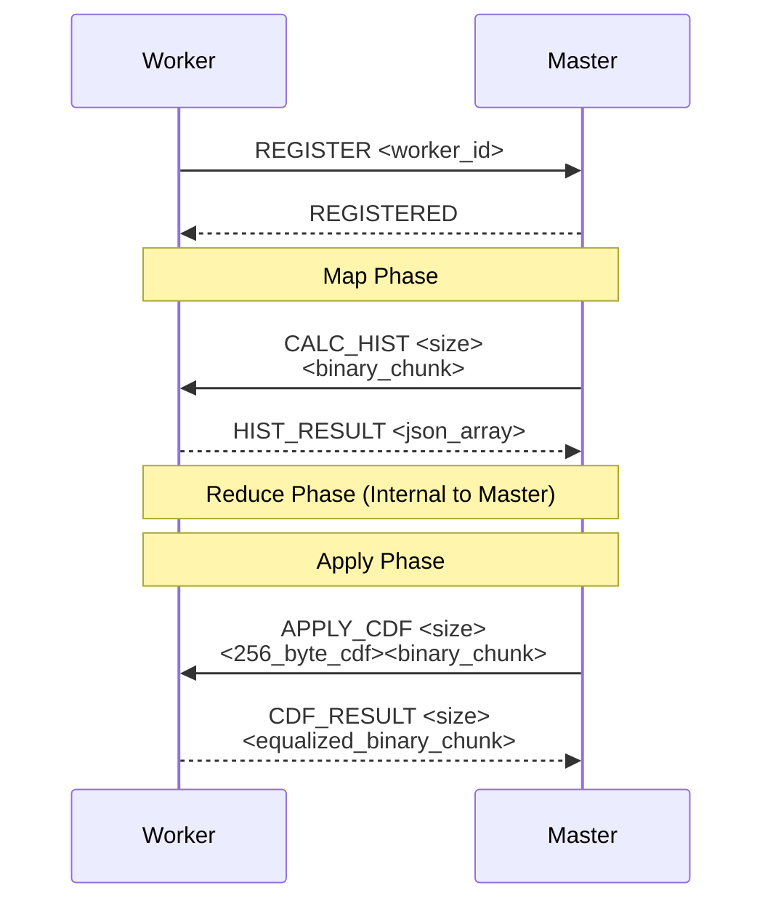
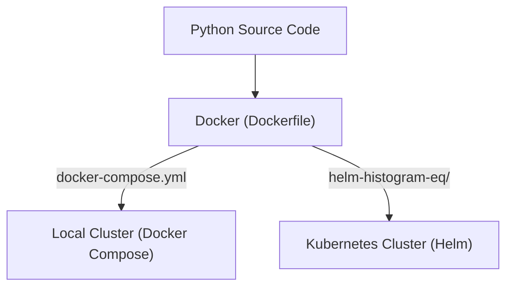

# Week 5: Containerization & Orchestration - From Bare Metal to Kubernetes

[<- back to syllabus](./ece465-ind-study-syllabus-spring-2026.html)

**Objective**: In this session, we will journey from understanding the fundamental components of a single computer to orchestrating a fleet of networked applications across a data center.

All programming examples use **Python 3** running on **Ubuntu**, orchestrated via **Bash** scripts and Docker toolchains. We will explore Inter-Process Communication (IPC), Multithreading, Network Sockets, Docker, Docker Compose, Kubernetes, and Helm.

---

## 1. The Anatomy of a Computer and the OS Abstraction

Before we can build distributed networks, we must understand what happens inside a single node. 

### What is a Computer?
At its core, a computer (a "node" or "bare metal" server) consists of three primary subsystems:
1.  **CPU (Central Processing Unit)**: The brain. It executes instructions (machine code). A single execution pipeline is a **uniprocessor**. Modern CPUs have multiple cores, allowing simultaneous execution.
2.  **Memory (RAM)**: Volatile, fast-access storage where the CPU reads instructions and data currently in use.
3.  **I/O (Input/Output)**: Disks, network interface cards (NICs), keyboards, etc.

### The Role of the Operating System
When you boot an Ubuntu server, the Linux **Kernel** takes control. The OS provides an abstraction layer over the raw hardware:
*   Instead of raw disk sectors, the OS provides **Files**.
*   Instead of raw RAM addresses, the OS provides **Virtual Memory**.
*   Instead of raw CPU time, the OS provides **Processes** and **Threads**.

### Programming a Uniprocessor: The Process
When you run a Python script, the OS creates a **Process**. A process is an isolated execution environment containing:
*   A Process ID (PID).
*   Its own private virtual memory space.
*   A list of open files (file descriptors).
*   At least one **Thread** of execution.

Because processes are strictly isolated by the OS for security and stability, Process A cannot directly read or write to the memory of Process B. If they need to cooperate to solve a problem, we must introduce **Inter-Process Communication (IPC)**.

---

## 2. Inter-Process Communication (IPC) using Pipes

Let's illustrate IPC using a classic synchronization problem: **The Dining Philosophers**.

Imagine 5 philosophers sitting around a circular table. Between each philosopher is a single fork (5 forks total). A philosopher must acquire *both* the fork to their left and the fork to their right to eat. If everyone grabs their left fork simultaneously, the system **deadlocks**.

If we model each philosopher as a separate, isolated OS **Process**, they cannot see who holds which forks. We must use an IPC mechanism like a **Pipe** to communicate with a central Coordinator.

### Python 3 Setup
Create a virtual environment for our Week 5 examples:
```bash
# Ubuntu setup
sudo apt update
sudo apt install python3 python3-venv

# Create and activate virtual environment
python3 -m venv venv
source venv/bin/activate

# Create requirements.txt
echo "requests==2.31.0" > requirements.txt
pip install -r requirements.txt
```

### Example: Dining Philosophers via Multiprocessing (Pipes)

In this model, the `Coordinator` process holds the state of the forks. The `Philosopher` processes send requests via an OS-level Pipe.

*Create `ipc_dining.py`:*

```python
import multiprocessing
import time
import random

def philosopher(pid, pipe_conn):
    """Philosopher runs as an independent OS process."""
    while True:
        print(f"[Philosopher {pid}] Thinking...")
        time.sleep(random.uniform(0.5, 1.5))
        
        # Ask coordinator for permission to eat
        print(f"[Philosopher {pid}] Requesting forks...")
        pipe_conn.send({"action": "REQUEST", "pid": pid})
        
        # Wait for approval
        response = pipe_conn.recv()
        if response == "APPROVED":
            print(f"[Philosopher {pid}] Eating!")
            time.sleep(random.uniform(0.5, 1.0))
            
            # Return forks
            print(f"[Philosopher {pid}] Returning forks...")
            pipe_conn.send({"action": "RETURN", "pid": pid})

def coordinator(pipes, num_philosophers):
    """Coordinator runs as the main process, managing fork state."""
    forks = [True] * num_philosophers
    
    while True:
        for pid, pipe in pipes.items():
            if pipe.poll(): # Check if this philosopher sent a message
                msg = pipe.recv()
                
                if msg["action"] == "REQUEST":
                    left_fork = pid
                    right_fork = (pid + 1) % num_philosophers
                    
                    if forks[left_fork] and forks[right_fork]:
                        forks[left_fork] = False
                        forks[right_fork] = False
                        pipe.send("APPROVED")
                    else:
                        pipe.send("DENIED") # Simplified: in a real system, queue them
                        
                elif msg["action"] == "RETURN":
                    left_fork = pid
                    right_fork = (pid + 1) % num_philosophers
                    forks[left_fork] = True
                    forks[right_fork] = True

if __name__ == '__main__':
    NUM_PHILOSOPHERS = 5
    pipes = {}
    processes = []
    
    print("Starting IPC Dining Philosophers...")
    
    # Create bidirectional pipes and spawn processes
    for i in range(NUM_PHILOSOPHERS):
        parent_conn, child_conn = multiprocessing.Pipe()
        pipes[i] = parent_conn
        
        p = multiprocessing.Process(target=philosopher, args=(i, child_conn))
        processes.append(p)
        p.start()
        
    try:
        coordinator(pipes, NUM_PHILOSOPHERS)
    except KeyboardInterrupt:
        for p in processes:
            p.terminate()
```

**To run:** `python3 ipc_dining.py`

**Takeaway**: Multiprocessing provides heavy isolation. IPC via Pipes provides a safe way to cross that OS isolation boundary, though it requires serialization (Pickling in Python) of the data being sent.

---

## 3. Multithreading & Synchronization

Creating a full OS process is "heavy" (high memory and CPU startup cost). What if we want to run multiple concurrent tasks *inside* a single process boundary so they can directly share memory? We use **Threads**.

A thread is a lightweight execution context within a process. Because threads share the same virtual memory space, Thread A can directly read a variable modified by Thread B.

**The Danger of Shared Memory:** While fast, shared memory introduces **Race Conditions**. If two threads try to modify the same "forks" array simultaneously, data corruption occurs. We mitigate this using synchronization primitives like **Locks (Mutexes)**.

### Example: Dining Philosophers via Threading & Locks

*Create `thread_dining.py`:*

```python
import threading
import time
import random

NUM_PHILOSOPHERS = 5
# Shared memory space: 5 mutex locks representing 5 forks
forks = [threading.Lock() for _ in range(NUM_PHILOSOPHERS)]

def philosopher_thread(pid):
    left_fork_id = pid
    right_fork_id = (pid + 1) % NUM_PHILOSOPHERS
    
    # To prevent deadlock, always acquire lower ID fork first
    first_fork, second_fork = sorted([left_fork_id, right_fork_id])
    
    while True:
        print(f"[Thread {pid}] Thinking...")
        time.sleep(random.uniform(0.5, 1.5))
        
        # Intra-thread communication via shared Locks
        with forks[first_fork]:
            with forks[second_fork]:
                print(f"[Thread {pid}] Eating!")
                time.sleep(random.uniform(0.5, 1.0))
        
        # Locks automatically release when exiting the 'with' block
        print(f"[Thread {pid}] Returning forks...")

if __name__ == '__main__':
    print("Starting Multithreaded Dining Philosophers...")
    threads = []
    
    for i in range(NUM_PHILOSOPHERS):
        t = threading.Thread(target=philosopher_thread, args=(i,), daemon=True)
        threads.append(t)
        t.start()
        
    try:
        # Keep main thread alive
        while True:
            time.sleep(1)
    except KeyboardInterrupt:
        print("Shutting down.")
```

**To run:** `python3 thread_dining.py`

### Example: Dining Philosophers via AsyncIO (Chopsticks)

Another powerful concurrency model in Python uses **AsyncIO** for cooperative multitasking. Instead of the OS preemptively pausing threads, the code explicitly yields control using the `await` keyword. In this version, we will use **Chopsticks** instead of forks to demonstrate another classic variation of the synchronization problem!

*Create `async_dining.py`:*

```python
import asyncio
import random

NUM_PHILOSOPHERS = 5
# Shared memory space: 5 asyncio locks representing 5 chopsticks
chopsticks = [asyncio.Lock() for _ in range(NUM_PHILOSOPHERS)]

async def philosopher_async(pid):
    left_chopstick_id = pid
    right_chopstick_id = (pid + 1) % NUM_PHILOSOPHERS
    
    # As always, acquire lower ID chopstick first to prevent deadlock
    first_chopstick, second_chopstick = sorted([left_chopstick_id, right_chopstick_id])
    
    while True:
        print(f"[Async Philosopher {pid}] Thinking...")
        await asyncio.sleep(random.uniform(0.5, 1.5))
        
        # Await the locks cooperatively
        async with chopsticks[first_chopstick]:
            async with chopsticks[second_chopstick]:
                print(f"[Async Philosopher {pid}] Eating with chopsticks!")
                await asyncio.sleep(random.uniform(0.5, 1.0))
        
        print(f"[Async Philosopher {pid}] Returning chopsticks...")

async def main():
    print("Starting AsyncIO Dining Philosophers with Chopsticks...")
    # Schedule all philosopher coroutines to run cooperatively
    tasks = [asyncio.create_task(philosopher_async(i)) for i in range(NUM_PHILOSOPHERS)]
    await asyncio.gather(*tasks)

if __name__ == '__main__':
    try:
        asyncio.run(main())
    except KeyboardInterrupt:
        print("Shutting down.")
```

**To run:** `python3 async_dining.py`

### Threading Model: Producer-Consumer

Another common multi-threading pattern is the **Producer-Consumer** queue. This is excellent for decoupling tasks, like a web server receiving a request (producer) and a background worker processing it (consumer).

Python provides thread-safe communication via `queue.Queue`.

*Create `prod_con.py`:*

```python
import threading
import queue
import time
import random

# A thread-safe queue for inter-thread communication
job_queue = queue.Queue(maxsize=10)

def producer():
    job_id = 1
    while True:
        time.sleep(random.uniform(0.5, 1.5))
        print(f"[Producer] Generating Job {job_id}")
        # Blocks if queue is full
        job_queue.put(f"Job {job_id}")
        job_id += 1

def consumer(cid):
    while True:
        # Blocks if queue is empty
        job = job_queue.get()
        print(f"[Consumer {cid}] Processing {job}")
        time.sleep(random.uniform(1.0, 2.0))
        job_queue.task_done()

if __name__ == '__main__':
    # Start 1 Producer thread
    threading.Thread(target=producer, daemon=True).start()
    
    # Start 3 Consumer Worker threads
    for i in range(3):
        threading.Thread(target=consumer, args=(i,), daemon=True).start()
        
    try:
        while True: time.sleep(1)
    except KeyboardInterrupt:
        pass
```

**Takeaway**: Threading allows high-performance, shared-memory processing within a single machine, but requires strict synchronization discipline to avoid data corruption.

---

## 4. Network Programming (TCP/IP)

What happens when our single Ubuntu bare-metal server runs out of CPU cores? We must scale *horizontally* by adding more computers (nodes) connected via a network.

We move from IPC (Pipes) and Inter-thread (Queues/Locks) to **Network Sockets** (TCP/UDP).

Let's restructure our application into a **Networked Client-Server Model**. 
- Node A runs a TCP Server (the Coordinator).
- Nodes B and C run TCP Clients (the Philosophers).

### Example: Networked Coordinator and Philosopher

*Create `net_server.py`:*
```python
import socket
import threading

def handle_client(conn, addr):
    print(f"[Server] Connected to {addr}")
    with conn:
        while True:
            data = conn.recv(1024)
            if not data: break
            
            msg = data.decode('utf-8').strip()
            print(f"[{addr}] says: {msg}")
            
            # Simple Echo Server logic acting as coordinator
            response = f"Acknowledged {msg}\n"
            conn.sendall(response.encode('utf-8'))

def start_server(host='0.0.0.0', port=5055):
    with socket.socket(socket.AF_INET, socket.SOCK_STREAM) as s:
        s.bind((host, port))
        s.listen()
        print(f"Coordinator Server listening on {host}:{port}...")
        
        while True:
            conn, addr = s.accept()
            # Spawn a thread to handle this network connection
            threading.Thread(target=handle_client, args=(conn, addr), daemon=True).start()

if __name__ == '__main__':
    start_server()
```

*Create `net_client.py`:*
```python
import socket
import time
import random

def start_client(host='127.0.0.1', port=5055, pid=0):
    with socket.socket(socket.AF_INET, socket.SOCK_STREAM) as s:
        s.connect((host, port))
        
        while True:
            print(f"[Client {pid}] Thinking...")
            time.sleep(random.uniform(1.0, 3.0))
            
            msg = f"Philosopher {pid} requesting to eat!"
            s.sendall(msg.encode('utf-8'))
            
            response = s.recv(1024)
            print(f"[Coordinator] replied: {response.decode('utf-8').strip()}")

if __name__ == '__main__':
    start_client(pid=random.randint(100, 999))
```

To run this locally, open multiple terminals. Run the server in one, and multiple clients in the others. You have just built a distributed system!

---

## 5. From Nodes to Containers

We have a working networked application (`net_server.py` and `net_client.py`). But to run it on a new Ubuntu server, you must:
1. Install Python 3.
2. Install Pip.
3. Install `requirements.txt`.
4. Run the code.

This manual process is error-prone. What if one node has Python 3.8 and another has Python 3.12?

### The Container Solution
**Containers** solve the "it works on my machine" problem. A container is a standalone executable package containing: code, runtime, system tools, system libraries, and settings. 

Unlike Virtual Machines (VMs) which virtualize raw hardware (requiring a slow, heavy Guest OS for every VM), Containers virtualize the **OS Kernel**. Multiple isolated containers run directly on the host OS kernel.

#### Container Runtimes
*   **Docker:** The industry standard for local and production containerization.
*   **Podman:** A daemonless, rootless alternative to Docker (excellent for security).
*   **LXC (Linux Containers):** An earlier technology, offering OS-level virtualization more akin to lightweight VMs.

### Example: Containerizing the Python App (Docker)

To run our TCP Server consistently, we define a **Dockerfile**. This acts as an automated setup script executed at the OS level.

*Create `Dockerfile.server`:*

```dockerfile
# Start from an official, lightweight base Ubuntu image
FROM ubuntu:24.04

# Update packages and install python+pip
RUN apt-get update && apt-get install -y python3 python3-pip python3-venv

# Set up the working directory inside the container
WORKDIR /app

# (Optional) Copy a requirements file and install dependencies using a venv
COPY requirements.txt .
RUN python3 -m venv venv && ./venv/bin/pip install -r requirements.txt

# Copy our raw Python code into the container
COPY net_server.py net_server.py

# Expose the TCP port our server listens on
EXPOSE 5055

# Command to run when the container starts
CMD ["./venv/bin/python3", "-u", "net_server.py"]
```

**To build the Docker image (an immutable snapshot):**
`docker build -t ece465-server -f Dockerfile.server .`

**To run the container:**
`docker run -d -p 5055:5055 --name my_coordinator ece465-server`

At this point, you have an isolated Python Coordinator listening on port 5055. It doesn't matter what OS the host machine is running, the container guarantees it executes consistently.

---

## 6. Coordinating Multi-Container Apps (Docker Compose)

Building robust distributed systems means coordinating multiple isolated services. We want to run our Coordinator and a few Philosophers simultaneously without manually typing `docker run` over and over.

We use **Docker Compose**, a tool for defining and running multi-container applications via a YAML configuration file.

*Create `docker-compose.yml`:*

```yaml
version: "3.8"

services:
  # Node 1: Coordinator
  coordinator:
    build:
      context: .
      dockerfile: Dockerfile.server
    ports:
      - "5055:5055"
    networks:
      - ece465-net

  # Node 2: Philosopher Client 1
  philosopher_1:
    build:
      context: .
      dockerfile: Dockerfile.client
    environment:
      - SERVER_HOST=coordinator # Docker's internal DNS automatically resolves this!
    depends_on:
      - coordinator
    networks:
      - ece465-net

  # Node 3: Philosopher Client 2
  philosopher_2:
    build:
      context: .
      dockerfile: Dockerfile.client
    environment:
      - SERVER_HOST=coordinator
    depends_on:
      - coordinator
    networks:
      - ece465-net

# Define a virtual network for these nodes to communicate over
networks:
  ece465-net:
```

*(Note: We assume a `Dockerfile.client` essentially mirroring the server's setup but executing `net_client.py` instead).*

**To start the entire distributed system:**
```bash
docker compose up -d
```

**To view all the nodes talking to one another:**
```bash
docker compose logs -f
```

We have now successfully created a 3-node network application coordinated entirely by Docker over network ports.

---

## 7. Data Center Container Management (Kubernetes)

As your application grows to hundreds of microservices, Docker Compose is no longer sufficient. How do you manage containers across 50 different bare-metal servers? How do you automatically restart a failed container?

**Kubernetes (K8s)** is an open-source system for automating deployment, scaling, and management of containerized applications across a cluster of nodes.

*   **Minikube:** A tool that runs a single-node Kubernetes cluster inside a VM on your laptop. It is the easiest way to learn K8s locally.

### Key Kubernetes Concepts
K8s uses a declarative model. You write a YAML file describing the *desired state*, and K8s works to make the current state match the desired state.

1.  **Pod:** The smallest deployable unit. Usually contains one container. Pods are ephemeral; if a node dies, the Pod dies.
2.  **Deployment:** Manages a set of identical Pods. It ensures that a specified number of replicas are always running (self-healing).
3.  **Service:** Because Pod IPs change constantly as they are created and destroyed, a Service provides a stable, permanent IP address and DNS name to access the Pods.

### Translating Docker Compose to Kubernetes YAML

Let's translate our `coordinator` from the Docker Compose file into bare K8s YAML.

*Create `k8s-coordinator-deployment.yaml`:*
```yaml
apiVersion: apps/v1
kind: Deployment
metadata:
  name: coordinator-deployment
  labels:
    app: ece465-coordinator
spec:
  replicas: 1 # We want exactly 1 coordinator running
  selector:
    matchLabels:
      app: ece465-coordinator
  template: # This is the Pod definition
    metadata:
      labels:
        app: ece465-coordinator
    spec:
      containers:
      - name: coordinator-container
        image: your-docker-hub-username/ece465-server:v1
        ports:
        - containerPort: 5055
```

*Create `k8s-coordinator-service.yaml`:*
```yaml
apiVersion: v1
kind: Service
metadata:
  name: coordinator # This acts like the internal DNS name
spec:
  selector:
    app: ece465-coordinator # Routes traffic to the Pods with this label
  ports:
    - protocol: TCP
      port: 5055
      targetPort: 5055
```

**To deploy to Kubernetes:**
```bash
kubectl apply -f k8s-coordinator-deployment.yaml
kubectl apply -f k8s-coordinator-service.yaml
```

The Philosophers (`net_client.py`) running in their own Pods can simply connect to host `coordinator` on port `5000`, and K8s will handle the routing!

---

## 8. Simplifying Deployments (Helm)

Writing bare YAML files for complex applications gets repetitive and hard to manage. What if we want to change the image version or the number of replicas dynamically depending on if we are in "staging" or "production"?

**Helm** is the package manager for Kubernetes.

Helm uses a packaging format called **charts**. A chart is a collection of files that describe a related set of Kubernetes resources. It acts as a templating engine over basic YAML.

### Creating a Helm Chart

You can create a new chart using the command line:
```bash
helm create ece465-app
```

This generates a folder `ece465-app/` comprising:
*   `Chart.yaml`: Information about the chart.
*   `values.yaml`: The default configuration values for this chart (variables).
*   `templates/`: A directory of templates that, when combined with values, will generate valid Kubernetes manifest files.

### Converting bare K8s YAML to Helm Templates

If we take our `k8s-coordinator-deployment.yaml` and place it in the `templates/` folder, we can replace hardcoded values with variables.

*`ece465-app/templates/deployment.yaml`:*
```yaml
apiVersion: apps/v1
kind: Deployment
metadata:
  name: {{ include "ece465-app.fullname" . }}-coordinator
spec:
  replicas: {{ .Values.coordinator.replicaCount }}
  selector:
    matchLabels:
      app: coordinator
  template:
    metadata:
      labels:
        app: coordinator
    spec:
      containers:
        - name: {{ .Chart.Name }}
          image: "{{ .Values.coordinator.image.repository }}:{{ .Values.coordinator.image.tag }}"
          imagePullPolicy: {{ .Values.coordinator.image.pullPolicy }}
          ports:
            - name: tcp
              containerPort: 5055
              protocol: TCP
```

And in the *`ece465-app/values.yaml`*, we define the variables:

```yaml
# These variables control the templates
coordinator:
  replicaCount: 1
  image:
    repository: your-docker-hub-username/ece465-server
    tag: "v1"
    pullPolicy: IfNotPresent
```

### Deploying the Helm Chart

Instead of running multiple `kubectl apply` commands for every YAML file, we deploy the entire packaged application with one Helm command:

```bash
# This injects the values.yaml into the templates and deploys to K8s
helm install my-release ./ece465-app
```

**Summary of Containerization & Orchestration:**
We started with defining a single uniprocessor application, utilized IPC to jump isolation boundaries, modeled networked sockets for distributed processing, abstracted the OS using Docker, coordinated multiple Docker containers natively using Docker Compose, deployed at scale referencing declarative infrastructure on Kubernetes, and finally abstracted the deployment complexity using Helm charts. This forms the foundation of modern cloud-native software engineering.

---

## 9. Distributed Algorithms: The Map-Reduce Paradigm

As we transition from building infrastructure to orchestrating highly distributed computational workloads, we need a mathematical programming paradigm designed for horizontal scaling. **Map-Reduce** is that paradigm.

### 9.1 What is Map-Reduce?

Map-Reduce is a programming model and an associated implementation for processing and generating large data sets with a parallel, distributed algorithm on a cluster. It fundamentally simplifies parallel programming by abstracting away the communication, synchronization, and fault-tolerance mechanisms, allowing developers to focus solely on the data transformation logic via two core functions:

1.  **`Map(k1, v1) -> list(k2, v2)`**:
    *   Takes an input key-value pair and produces a set of intermediate key-value pairs.
    *   *Analogy*: Filtering, sorting, transforming, or stripping data cleanly without caring about global state.
2.  **`Reduce(k2, list(v2)) -> list(v3)`**:
    *   Accepts an intermediate key (`k2`) and a set of values for that key (`list(v2)`). It merges together these values to form a possibly smaller set of values.
    *   *Analogy*: Summarizing, grouping, aggregations, computing totals.

### 9.2 History and Industry Implementations

The Map-Reduce pattern borrows heavily from functional programming (e.g., Lisp's `map` and `reduce`). However, it exploded in popularity due to Google's 2004 whitepaper, *MapReduce: Simplified Data Processing on Large Clusters*. Google used it to index the entire internet efficiently across commodity hardware, gracefully handling node failures during execution.

*   **Apache Hadoop**: The open-source community's answer to Google's paper. It paired the Hadoop Distributed File System (HDFS) with a robust Disk-based Map-Reduce engine.
*   **Google Bigtable**: Built on top of Map-Reduce principles, Bigtable introduced a distributed storage system capable of handling petabytes of data.
*   **Apache Spark**: The modern evolution. While Hadoop Map-Reduce wrote intermediate results to disk (causing I/O bottlenecks), Spark performs Map-Reduce operations largely **in-memory**, making it vastly faster for machine learning iterations and streaming data.

### 9.3 When to use Map-Reduce?

Map-Reduce is not a silver bullet. Understanding when a workload is applicable to it is a fundamental system design skill.

**Excellent Fits ("Embarrassingly Parallel" workloads):**
*   **Log Analysis:** Counting occurrences of IP addresses, HTTP status codes, or specific errors across terabytes of web server logs.
*   **Inverted Index Generation:** Building search engine indexes by mapping words to document IDs.
*   **Distributed Sort:** Sorting massive datasets that exceed the memory capacity of any single machine.
*   **Machine Learning Training:** Calculating gradients over massive subsets of training data simultaneously before a master node reduces the weights.

**Terrible Fits:**
*   **Real-time highly interactive systems:** Sub-millisecond latency requirements (e.g., high-frequency trading) cannot afford the overhead of shuffling and reducing data across a network.
*   **Highly mutated shared state:** Systems requiring ACID transaction guarantees where a central database row is constantly updated by thousands of users sequentially.
*   **Graph Traversals / Recursive algorithms:** Algorithms where the next step intrinsically depends entirely on the previous step's output (though specialized frameworks like GraphX attempt to bridge this).

### 9.4 Programming Map-Reduce: Intuition through Bash

Before looking at Python or Java clusters, you can understand Map-Reduce using nothing more than standard Unix pipes in your terminal! The pipe (`|`) naturally hands off data between independent processes.

*Goal: Count the frequency of every word in all `.txt` files in a directory.*

```bash
cat books/*.txt | tr ' ' '\n' | grep -v '^$' | sort | uniq -c
```

**Breaking down the architecture:**
1.  **Input Generation**: `cat books/*.txt` reads massive amounts of raw text.
2.  **MAP**: `tr ' ' '\n'` replaces spaces with newlines, generating intermediate data (one word per line). `grep -v '^$'` filters out blank lines.
3.  **SHUFFLE**: `sort` takes the mapped intermediate data and groups identical keys (words) adjacently. In a real distributed cluster, this phase pushes all identical keys to the *same* physical reduce server over the network!
4.  **REDUCE**: `uniq -c` consumes the sorted keys and aggregates them, outputting the final reduced values (word frequencies).

### 9.5 Programming Map-Reduce: Standard Python

Standard Python includes functional primitives that perfectly model the distributed cluster behavior on a single thread.

*Goal: Calculate the total bytes transferred from a web server access log.*

```python
import functools

# Simulated log data: "IP_ADDRESS BYTES_TRANSFERRED"
log_data = [
    "192.168.1.1 500",
    "10.0.0.5 1250",
    "192.168.1.1 200",
    "172.16.0.2 404", # Let's say 404 means error, 0 bytes.
    "10.0.0.8 3000"
]

# 1. Map Function: Extract bytes and handle errors
def extract_bytes(log_entry):
    parts = log_entry.split()
    try:
        bytes_val = int(parts[1])
        # Only return positive bytes, map errors to 0
        return bytes_val if bytes_val > 0 else 0
    except ValueError:
        return 0

# 2. Reduce Function: Summation
def sum_bytes(current_total, next_val):
    return current_total + next_val

# Execute Map
mapped_bytes = list(map(extract_bytes, log_data))
print(f"Intermediate Mapped Data: {mapped_bytes}")
# Output: [500, 1250, 200, 404, 3000]

# Execute Reduce
total_bytes = functools.reduce(sum_bytes, mapped_bytes)
print(f"Total Bytes Reduced: {total_bytes}")
# Output: 5354
```

In a distributed environment like Hadoop, the `extract_bytes` function would run simultaneously on thousands of cheap worker nodes holding different blocks of the `log_data` file. The `sum_bytes` function would run on a few Reducer nodes to calculate the final `total_bytes` output!

### 9.6 Distributed Networking: Containerized TCP Server (`netprog`)

Before jumping into a massive Kubernetes orchestration, let's look at how to containerize a fundamental Networking component: a Multi-threaded Java TCP Server. We provide the complete code for this in the `netprog` directory:

👉 **[netprog](./netprog/)**

This project demonstrates how to compile and wrap a standard Java Socket application into an immutable Docker image, allowing clients to connect to it securely over a mapped port.

#### 9.6.1 Solution Architecture



#### 9.6.2 Interaction Sequence



#### 9.6.3 Codebase Walkthrough

*   **`src/TCPServer.java`**: The multi-threaded server. It binds to port `12345` and infinitely accepts inbound socket connections. For every connection, it delegates the I/O streams to a newly spawned `ClientHandler` `Runnable` thread so that multiple clients can connect simultaneously without blocking.
*   **`src/TCPClient.java`**: A standard console application that connects to `localhost:12345`, reads STDIO from the user, transmits the string over the socket, and blocks waiting for the server's echo response.
*   **`Makefile`**: A build script that executes `javac` to compile the `.java` files into `.class` bytecode artifacts and drops them into a `bin/` directory.
*   **`Dockerfile`**: Defines the container environment. It starts from `ubuntu:24.10`, installs `openjdk-21-jdk-headless`, copies the pre-compiled `bin/` directory into the image, and sets `entrypoint.sh` to execute the JVM against `TCPServer`.

---

### 9.7 Real-World Example: Kubernetes Distributed Image Processor

To see a complete, real-world implementation of the Map-Reduce paradigm running across a local container cluster, we have provided a full project in this week's code directory:

👉 **[k8s_histogram_eq](./k8s_histogram_eq/)**

This project is a **Distributed Image Processor** that performs mathematical Histogram Equalization on images (JPG/TIFF) utilizing a Custom TCP Protocol.

#### 9.7.1 Solution Architecture



*   **The Master Node** acts as the Coordinator (Python FastAPI). It ingests an uploaded image, saves it to a shared volume, and acts as a TCP server to orchestrate the worker nodes.
*   **The Worker Nodes** act as the Mappers/Reducers. They connect to the Master via TCP sockets, receive the chunks, compute the local pixel histograms, and send them back.

#### 9.7.2 Map-Reduce Data Flow


#### 9.7.3 Custom TCP Sequence Protocol

The Master and Workers communicate over a newline-delimited custom TCP protocol transmitting binary byte chunks:



#### 9.7.4 Packaging & Deployment Toolkit



It is strictly containerized. You can deploy it instantly using `docker-compose` or the provided Kubernetes `helm` charts. 

#### 9.7.5 Codebase Walkthrough

Here are the key files inside the `k8s_histogram_eq` directory and what they do:

*   **`master/main.py`**: The core Coordinator. It runs a Uvicorn/FastAPI web server to host the UI and REST endpoints (`/upload`, `/process`, `/nodes`, etc.). Internally, it spawns a background `asyncio` TCP server to listen for Worker registrations and orchestrates the Map-Reduce byte chunking and aggregation.
*   **`master/test_master.py` & `master/test_integration.py`**: Automated test suites verifying the API logic and the end-to-end Local Fallback pipeline using `pytest` and `httpx`.
*   **`worker/worker.py`**: The independent node script. Upon startup, it blindly connects to the Master's TCP port, waits for `CALC_HIST` instructions, performs the OpenCV pixel counting, and later applies the `APPLY_CDF` mapping.
*   **`worker/Dockerfile` & `master/Dockerfile`**: Instructions on how to build the raw Linux OS, install Python/OpenCV dependencies, and package the respective node logic into immutable container images.
*   **`frontend/index.html` & `frontend/app.js`**: The Single Page Application (SPA). Written in AngularJS with Material Design, providing a reactive interface to monitor connected workers, view distributed logs, and submit images for equalization.
*   **`docker-compose.yml`**: The local orchestration file. It automatically builds the Dockerfiles, mounts the `shared_data` volume, and spins up 1 Master and 2 Worker containers on an isolated virtual network.
*   **`helm-histogram-eq/`**: The Kubernetes packaging chart. It translates the Docker Compose architecture into production-grade K8s manifests (Deployments, Services, PersistentVolumeClaims) for data center scaling.

We highly encourage you to read the `README.md` inside that directory, spin up the cluster, and trace the distributed logs!

