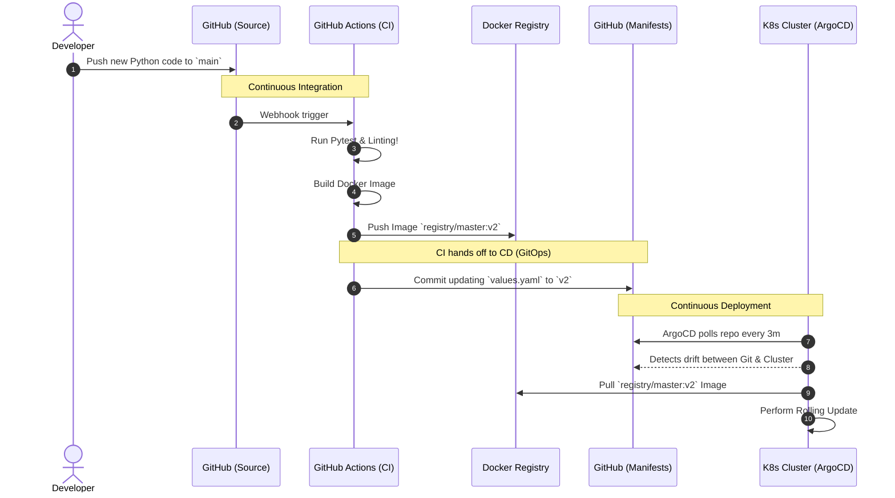
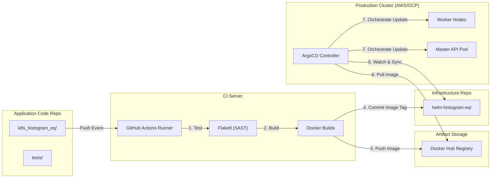

# Week 6: DevOps and CI/CD for Cloud-Native API Architectures

[<- back to syllabus](./ece465-ind-study-syllabus-spring-2026.html)

**Objective**: In this session, we transition from manually deploying containerized infrastructure (Week 5) to automating exactly how code transitions from a developer's laptop to a production cloud environment reliably, securely, and uniformly.

The core principles of this week are derived from modern distributed system deployment patterns and draw heavily from *DevOps and CI/CD for Cloud-Native API Architectures* and *CI/CD Design Patterns*. We will explore DevOps culture, Continuous Integration (CI), Continuous Deployment (CD), Progressive Delivery, and GitOps.

---

## 1. The DevOps Culture Shift

As organizations migrate toward microservices and cloud-native application patterns, the complexity of deploying software increases exponentially. In traditional monolithic development, teams were heavily siloed:
*   **Developers** wrote the code.
*   **QA** tested the code.
*   **Security** audited the code.
*   **Operations** deployed the software to physical servers and maintained uptime.

This model created massive bottlenecks. "It works on my machine" became the mantra of failed deployments.

**DevOps** is a cultural, professional, and technical movement designed to bridge the gap between Development and Operations. Its primary goal is to **reduce the cycle time** from code commit to production deployment while increasing software quality and predictability.

### APIs: The Connective Tissue
In cloud-native ecosystems, Application Programming Interfaces (APIs) are the fundamental building blocks. Because organizations build thousands of independent, loosely coupled microservices, APIs become the standard contracts for communication. This *API-First Development* forces infrastructure systems to provide automated, interface-driven deployments rather than relying on manual server configurations.

### Shift-Left Security (DevSecOps)
Waiting until the end of the software lifecycle to test for security creates massive delays and risk. The modern paradigm shifts security testing "left"—earlier in the development pipeline. Vulnerability scanning, static analysis, and compliance checks become integrated into the automated build process, moving from periodic external audits to continuous embedded validation.

---

## 2. Continuous Integration (CI)

Continuous Integration is the practice of merging all developers' working copies to a shared mainline repository several times a day.

When a developer commits code to Git (e.g., creating a Pull Request), a CI Pipeline automatically triggers.

### The CI Pipeline Stages
For modern cloud-native APIs, a typical CI pipeline executed via tools like **GitHub Actions**, **Jenkins**, or **CircleCI** contains several automated safety checks:

1.  **Linting & Style**: Enforces syntax and code quality standards (e.g., PEP8 for Python).
2.  **Unit Testing**: Validates individual functions in isolation.
3.  **SAST (Static Application Security Testing)**: Scans the raw source code for known security vulnerabilities (e.g., hardcoded passwords, SQL injection vectors).
4.  **SCA (Software Composition Analysis)**: Scans the `requirements.txt` or `package.json` for known CVEs (Common Vulnerabilities and Exposures) in third-party, open-source dependencies.
5.  **Contract Testing**: Specifically for APIs, verifies that the new code does not break the expected input/output JSON format required by other microservices.
6.  **Build & Artifact Generation**: If all tests pass, the CI pipeline compiles the code and wraps it in a Docker image, tagging it with a unique ID and pushing it to a secure Container Registry (like Docker Hub or Google Container Registry).

**The Golden Rule of CI**: If the pipeline fails, the build breaks, and the developer's code *cannot* be merged into the main branch.

---

## 3. Continuous Deployment & Delivery (CD)

Once we have a verified, immutable Docker image (the Artifact) stored in our Registry via CI, we must roll it out to our environments (Staging/Production) without taking the entire distributed system offline.

### Deployment Design Patterns

#### The Traditional Anti-Pattern: Big Bang Deployment
Taking the entire application offline, replacing all the servers with the new code, and turning it back on. Extremely risky, leading to significant downtime and frantic rollbacks if issues occur.

#### 3.1 Rolling Deployments
The orchestrator (e.g., Kubernetes) gradually replaces old container instances with new ones, one by one.
*   **Pros**: Zero downtime. Easy to implement in Kubernetes natively.
*   **Cons**: Both versions (v1 and v2) of the code are running simultaneously during the rollout. If v2 requires a breaking database migration, the system will crash.

#### 3.2 Blue-Green Deployments
Two identical production environments exist, dubbed "Blue" and "Green." At any time, only one environment (e.g., Blue) is actively serving user traffic. The new code is deployed completely to the Green environment. Testing is performed on Green. Once verified, the load balancer is instantly flipped from Blue to Green.
*   **Pros**: Instant, zero-downtime rollback. Just flip the load balancer back to Blue!
*   **Cons**: Resource intensive. You must pay for double the server capacity since you maintain two full production environments.

#### 3.3 Canary Deployments
Named after the "canary in a coal mine", this strategy routes a very small percentage of live user traffic (e.g., 5%) to the new version of the API while the remaining 95% goes to the stable version. The system monitors the canary for errors, CPU spikes, or latency. If stable, the traffic is gradually scaled up (10%, 25%, 50%, 100%).
*   **Pros**: Safest deployment method. Limits the "blast radius" of a hidden bug to a tiny fraction of users.
*   **Cons**: Complex to orchestrate. Requires advanced load balancers (Service Meshes) and robust monitoring (Observability) to automate the health checks.

---

## 4. GitOps and Infrastructure as Code (IaC)

As we learned in Week 5 with Docker Compose and Kubernetes YAML files, configuring infrastructure manually is tedious. **Infrastructure as Code (IaC)** dictates that *all* server, network, and deployment configurations should be textual code, checked into Version Control (Git).

### Push vs. Pull Deployments

**Traditional (Push-Based CD):**
A CI server like Jenkins finishes building the Docker image, uses embedded credentials, connects to the production Kubernetes cluster, and issues a `kubectl set image` command (pushing the change). This is a massive security risk, as the CI pipeline holds the "keys to the kingdom."

**GitOps (Pull-Based CD):**
GitOps establishes Git as the Single Source of Truth.
1. The CI pipeline finishes building the Docker image.
2. The CI pipeline *commits a change* to a separate `config-repo` Git repository, updating the YAML files to request the new image tag.
3. A Continuous Delivery agent **living inside** the Kubernetes cluster (like **ArgoCD** or **Flux**) constantly watches the Git repository.
4. ArgoCD notices the desired state in Git no longer matches the actual state of the cluster. It *pulls* the changes and applies them internally.

This eliminates the need for external systems to have root access to the production cluster, significantly tightening security boundaries.

---

## 5. Real-World Example: CI/CD Pipeline Architecture

Let's look at how we would architect a fully automated GitOps deployment pipeline for the Distributed Image Processor we built using `docker-compose` and Kubernetes in Week 5 (`k8s_histogram_eq`).

### 5.1 Pipeline Action Sequence

### 5.2 System Topology

By adopting these patterns, an organization guarantees that the software running in production is an exact, audited, tested, and secure replica of the developer's intent encoded in Git. 
