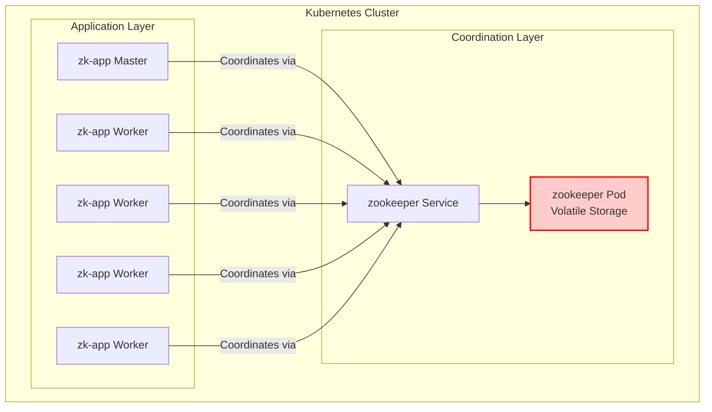

# ZooKeeper MapReduce Architecture: Original vs. Production

This document details the architectural evolution of the Distributed MapReduce cluster, contrasting the initial single-node ZooKeeper deployment with the updated, high-availability production ensemble.

---

## 1. Original Design: Single-Node Deployment

### Architecture Description
In the original design, the coordination layer consisted of a single Apache ZooKeeper pod managed by a standard Kubernetes `Deployment`. The application pods (`zk-app`) connected directly to this single instance to perform leader elections, create ephemeral locks, and store MapReduce job definitions as ZNodes.



### The "Amnesia" Vulnerability
While Kubernetes ensures high availability of *infrastructure*, it does not inherently guarantee the persistence of *state* for simple Deployments. If the single `zookeeper` pod crashes or is deleted:

1. **Infrastructure Recovery:** The Kubernetes ReplicaSet immediately spins up a replacement ZooKeeper pod. The `zookeeper` Service routes traffic to the new pod. The `zk-app` pods successfully reconnect. **To a casual observer, the system has "recovered".**
2. **Application State Loss:** Because the original ZooKeeper pod did not use a `PersistentVolumeClaim` (PVC), its `/data` directory was tied to the container's lifecycle. The new pod starts with a completely blank database.
3. **The Ripple Effect:**
    * All ephemeral locks (like the Master role) vanish.
    * All active MapReduce job definitions (`/jobs/job_id/...`) are erased.
    * The Python applications immediately trigger a new election from scratch, abandoning any jobs that were mid-computation because the synchronization barrier (the ZNodes) no longer exists.

---

## 2. Updated Design: High-Availability Production Ensemble

### Architecture Description
To make the application production-ready and fault-tolerant, ZooKeeper was migrated to a **3-node Ensemble** using a Kubernetes `StatefulSet`.

Key differences:
* **StatefulSet:** Guarantees ordered deployment and stable, unique network identifiers (e.g., `zookeeper-0`, `zookeeper-1`).
* **Headless Service:** (`zookeeper-hs`) allows the ZooKeeper nodes to discover each other and form a peer-to-peer voting quorum.
* **Persistent Volumes:** `volumeClaimTemplates` automatically dynamically provisions a dedicated persistent disk for each node's transaction logs and snapshots.
* **Service Load Balancing:** The application uses a standard `zookeeper:2181` Service that abstracts the ensemble, automatically routing client requests to healthy nodes.

```mermaid
graph TD
    subgraph Kubernetes Cluster
        subgraph Coordination Layer: ZK Ensemble
            ZK_HS[zookeeper-hs Headless Service<br/>Peer Discovery]
            
            ZK0[zookeeper-0] --- PVC0[(PVC 0)]
            ZK1[zookeeper-1] --- PVC1[(PVC 1)]
            ZK2[zookeeper-2] --- PVC2[(PVC 2)]
            
            ZK0 <..>|Quorum Sync| ZK1
            ZK1 <..>|Quorum Sync| ZK2
            ZK0 <..>|Quorum Sync| ZK2
            
            ZK_HS -.-> ZK0
            ZK_HS -.-> ZK1
            ZK_HS -.-> ZK2
        end

        ZKSvc[zookeeper Service<br/>Client Load Balancer] --> ZK0
        ZKSvc --> ZK1
        ZKSvc --> ZK2

        subgraph Application Layer
            APP1[zk-app Master]
            APP2[zk-app Worker]
            APP3[zk-app Worker]
        end
        
        APP1 -->|Session| ZKSvc
        APP2 -->|Session| ZKSvc
        APP3 -->|Session| ZKSvc
    end
    
    classDef persistent fill:#d4edda,stroke:#28a745,stroke-width:2px;
    class PVC0,PVC1,PVC2 persistent;
```

### Why State is Preserved During Failures
In this updated design, if a ZooKeeper node (e.g., `zookeeper-0`) crashes:

1. **Quorum is Maintained:** Nodes `zookeeper-1` and `zookeeper-2` still form a majority (2 out of 3). The cluster remains fully read/write operational.
2. **Client Sessions Survive:** The `zk-app` Kazoo clients automatically failover to one of the surviving nodes. Because the ZooKeeper session is maintained by the quorum, **ephemeral nodes are not dropped** (unless the client itself stays disconnected past the session timeout).
3. **Data is Safe:** Job definitions (`/jobs/`) remain intact in the memory of the surviving nodes.
4. **Seamless Recovery:** When Kubernetes restarts `zookeeper-0`, the StatefulSet ensures it reattaches to `PVC 0`. The node reads its persistent transaction logs, reconnects to the quorum via the Headless Service, syncs any missed operations from the leader, and resumes participating in the cluster without any data loss.

---

## 3. Empirical Fault-Tolerance Testing

To validate the high-availability architecture, a suite of End-to-End (E2E) system tests were developed (`tests/test_fault_tolerance.py`). These tests dynamically orchestrate MapReduce jobs and actively inject faults (pod deletions) mid-computation to prove that the state is preserved.

### Test 1: Application Worker Node Failure
* **Methodology:** An image is submitted. During the active "Map" phase (when workers hold ephemeral locks on image chunks), a random worker pod (excluding the Master) is abruptly killed using `kubectl delete pod`.
* **Expected Behavior:** The ZooKeeper session for the killed pod expires. Its ephemeral task locks in the `/jobs` znode tree vanish. Other active workers observe the unlocked tasks, acquire the locks, and resume processing.
* **Result:** **PASS**. The pipeline successfully recovered, computed the global CDF, equalized the image, and stitched the final result without losing the job.

### Test 2: ZooKeeper Node Failure
* **Methodology:** An image is submitted. During the active computation phase, a ZooKeeper node (e.g., `zookeeper-1`) is abruptly killed.
* **Expected Behavior:** The Kazoo clients in the `zk-app` pods temporarily lose connection to the dead node but immediately reconnect to the surviving nodes (`zookeeper-0` or `zookeeper-2`). Because the ensemble maintains a quorum (2/3 nodes), the ZK session ID remains valid, and no ephemeral nodes or job data are lost.
* **Result:** **PASS**. The application pods seamlessly failed over to the remaining quorum members. The MapReduce job completed without any interruption or state corruption, proving that the Quorum design successfully prevents the "Amnesia" vulnerability present in the original single-node architecture.
