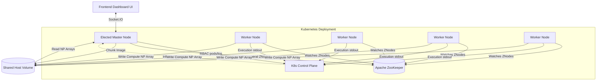
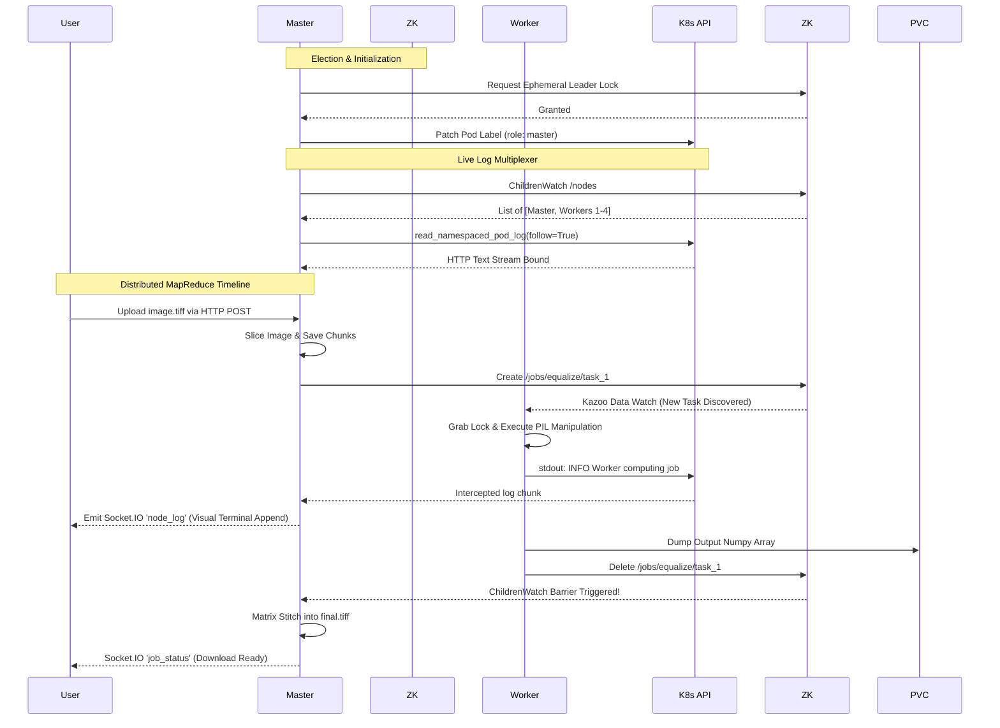

# Distributed MapReduce with Apache ZooKeeper & Kubernetes
[<- back to syllabus](../../../ece465-ind-study-syllabus-spring-2026.html)

This project demonstrates a homogeneous deployment topology utilizing Apache ZooKeeper for Leader Election and distributed MapReduce job coordination.

### Key Features
*   **Homogeneous Nodes**: Every pod runs the exact same Python image. There is no predefined "master" or "worker".
*   **ZooKeeper Leader Election**: Pods race via `kazoo` to acquire an ephemeral lock. The winner automatically assumes the Master role.
*   **Dynamic K8s Routing**: The elected Master utilizes the Kubernetes Python client to inject `role: master` into its own pod labels. The `master-service` internal DNS routes traffic *only* to the current leader.
*   **MapReduce Coordination**: If an image is submitted for histogram equalization, the Master slices it and drops task definitions into ZooKeeper znodes. Worker pods watch for these znodes, grab an ephemeral lock on a slice, compute the result, and report back. The Master stitches the final image together.
*   **Fault-Tolerant Auto-Scaling**: If the cluster detects `< 5` active nodes, the Master broadcasts a WebSocket alert to the frontend halting service until resources recover.
*   **Dynamic TIFF Expansion**: Automatically maintains and propagates `.tiff`, `.png`, and `.jpg` encoding bounds implicitly through native Pillow mapping over ZNodes.
*   **Distributed Logging UI**: The Master uses Kubernetes API RBAC to infinitely HTTP tail container Standard Output for every single node in the cluster seamlessly natively, multiplexing dynamic, visually isolated Masonry Grid mini-terminals over websockets!

### Software Architecture



### UML Sequence Execution



### Running with Minikube

1. **Start Minikube**:
   Ensure you mount a local folder into Minikube so the pods can share image files.
   ```bash
   minikube start --mount --mount-string="/tmp/shared-histogram:/data/shared"
   ```

2. **Load the Docker Image**:
   Build the image inside minikube's context so the cluster can pull it without pushing to DockerHub.
   ```bash
   eval $(minikube docker-env)
   cd courses/ece465/2026/weeks/week_09/k8s_zk_template
   docker build -t zk-app:latest .
   ```

3. **Deploy the Infrastructure**:
   ```bash
   kubectl apply -f k8s/rbac.yaml
   kubectl apply -f k8s/zookeeper.yaml
   kubectl apply -f k8s/storage.yaml
   kubectl apply -f k8s/app.yaml
   ```

4. **Verify Deployment**:
   ```bash
   kubectl get pods -w
   # Wait for zookeeper and 3 zk-app pods to initialize
   ```

5. **Expose the Frontend**:
   ```bash
   # Map the local port 8080 to the dynamically routed master-service
   kubectl port-forward svc/master-service 8080:80
   ```
   Navigate to `http://localhost:8080` to access the Master UI.
