# Week 9: Communication and Coordination

[<- back to syllabus](./ece465-ind-study-syllabus-spring-2026.html)

**Objective**: This week we move from defining overall architectural styles to understanding the underlying mechanisms that allow geographically separated components to **Communicate** reliably and **Coordinate** their actions without a centralized clock. This session heavily maps to the theories presented in the van Steen & Tanenbaum *Distributed Systems* textbook.

> 📖 **Reading Assignment:** Before proceeding with this week's exercises, please read **Chapter 4 (Communication)** and **Chapter 6 (Coordination)** in *Distributed Systems* (van Steen and Tanenbaum, Version 4.0.3x).

---

## 1. Communication in Distributed Systems

At the core of any distributed system is the ability to move data between nodes. While we have explored raw TCP/UDP sockets (Week 2/3), enterprise systems rely on higher-level abstractions.

### 1.1 Remote Procedure Calls (RPC)
The aim of RPC is to hide communication by making a remote function call look identical to a local function call. 
*   **Mechanism**: A client application calls a local "stub" function. The stub serializes (marshals) the parameters, opens a network socket, sends the data, and blocks until the server returns the serialized result.
*   **Challenges**: RPC cannot easily pass pointers/references. It also struggles with failures: if a client calls `charge_credit_card()` and the connection drops, did the server execute it and fail to send a reply, or did the server crash before execution? Dealing with *at-least-once* vs *at-most-once* semantics introduces high complexity.

### 1.2 Message-Oriented Communication
Unlike RPC's synchronous, tightly-coupled nature, Message-Oriented Middleware (MOM) allows asynchronous decoupling.
*   **Transient Messaging**: Like traditional sockets; if the receiver is not active when the message is sent, the message is lost.
*   **Persistent Messaging (Queues)**: Systems like RabbitMQ guarantee that a message sent by a producer is stored safely on disk by the middleware until a consumer comes online and reads it. This provides extreme resilience against sudden burst traffic.

---

## 2. Coordination and Synchronization

If multiple independent computers are working on a shared problem, how do they agree on the state of the world? 

### 2.1 The Problem of Clock Synchronization
In a single machine, there is one CPU clock. In a distributed system, every computer has its own physical quartz clock. Over time, these clocks drift apart due to microscopic hardware differences. 
*   If Server A creates a file at 12:00:01 and sends it to Server B, and Server B's clock thinks it is currently 11:59:59, Server B might assume the file was created "in the future" or incorrectly sequence events.
*   *Solution*: **Logical Clocks** (like Lamport timestamps) don't care about the *actual* physical time. They only care about causality: if Event A causes Event B, then Event B must have a larger timestamp than Event A.

### 2.2 Leader Election Algorithms
Many distributed systems require one node to act as a coordinator. If that coordinator crashes, the remaining nodes must elect a new one without human intervention.
1.  **The Bully Algorithm**: Every node has a numeric ID. When a node detects the leader is dead, it broadcasts an election message to nodes with *higher* IDs. If no higher node responds, it declares itself the leader ("bullying" the smaller nodes).
2.  **The Ring Algorithm**: Nodes are logically organized in a ring. An election message is passed around the ring, accumulating the IDs of all active nodes. Once it completes the circuit, the surviving node with the highest ID is elected as the new coordinator.

---

## 3. Apache ZooKeeper: Putting Theory into Practice

Implementing consensus algorithms (like Paxos or Raft) from scratch is notoriously difficult. Modern cloud-native architectures rely on highly consistent coordination services like **Apache ZooKeeper** (or `etcd`).

### What is ZooKeeper?
ZooKeeper is a centralized open-source service for maintaining configuration information, naming, providing distributed synchronization, and offering group services over large clusters. 

### How it solves Distributed Coordination:
*   **Znodes**: ZooKeeper maintains a hierarchical, in-memory file system. Data is stored in tiny files called `znodes`.
*   **Ephemeral Nodes**: A znode can be marked as ephemeral. This means it only exists as long as the client connection that created it is alive. If the client crashes, ZooKeeper instantly deletes the node. This is *perfect* for heartbeat monitoring and leader election.
*   **Watches**: Instead of a client constantly polling ZooKeeper to see if data changed, it sets a "Watch". ZooKeeper will instantly push a notification to the client the moment a znode is modified, added, or deleted.

### Implementing Leader Election with ZooKeeper
Instead of building the Bully algorithm, nodes simply use ZooKeeper's atomic creation:
1. All 10 worker nodes try to create an ephemeral znode at `/cluster/leader`.
2. ZooKeeper guarantees that only **one** creation request will succeed concurrently.
3. The node that succeeded knows it is the leader.
4. The remaining 9 nodes set a Watch on `/cluster/leader` and go to sleep.
5. If the leader crashes, its ephemeral node vanishes. ZooKeeper fires the Watch, waking up the 9 nodes. They all try to create `/cluster/leader` again.

---

## 4. Design & Implementation Exercise
**Task**: *The ZooKeeper Homogeneous MapReduce Array*

Move to the `k8s_zk_template` directory. We are rebuilding our Week 5 Image equalization engine to be completely fault-tolerant and homogeneous. 

You must deploy a Kubernetes application where **all** Pods run the exact same `app.py` code. Upon startup, the pods connect to a central ZooKeeper service in the cluster.
1. The Pods will race using `kazoo` to elect a Master.
2. The elected Master will use the Kubernetes API to add the label `role: master` to itself.
3. Kubernetes DNS will instantly map `http://master-service` to that specific pod!
4. The Master orchestrates a distributed MapReduce job by passing task slices not via direct HTTP, but by dropping JSON jobs into ZooKeeper `/jobs` znodes. The ephemeral workers watch this path, claim specific chunk jobs, and return the histogram logic securely.

---

## 5. Key Vocabulary & Tough Concepts

Before tackling the real-world architectural problems below, ensure you understand the following challenging technical vocabulary implicitly relied upon in Distributed Systems:

*   **Idempotency**: An operation is *idempotent* if performing it multiple times yields exactly the same result as performing it once. (For example, `set_x(5)` is idempotent, whereas `add_to_x(1)` is not). In distributed network architectures, designing API handlers to be idempotent (often by passing unique Transaction UUIDs) allows clients to safely retry failed network requests without causing duplicate actions (like double-charging a credit card).
*   **At-most-once Semantics**: An RPC middleware guarantees that an operation will be attempted exactly 1 time over the network. If it fails, it throws a fatal error and is never retried by the framework. Data safety is prioritized over reliability.
*   **At-least-once Semantics**: RPC guarantees that the middleware will retry the network operation indefinitely until an ACK is received. Execution reliability is prioritized, but without *Idempotency*, this is extremely dangerous.
*   **Clock Drift**: The phenomenon where separate computers' physical motherboard quartz clocks count seconds at microscopically different rates, leading to massive time de-synchronization across datacenters over weeks or months.
*   **Split-Brain Syndrome**: A catastrophic cluster failure where severed (Partition) causes a server farm to split in half. Assuming the other half is dead, *both* halves elect a new Master coordinator, leading to two Masters actively corrupting the database simultaneously. Coordination tools like Apache ZooKeeper explicitly solve this by requiring a strict $>50\%$ voting quorum to elect a leader.
*   **Ephemeral State**: Data that is intentionally temporary and explicitly tied to the active lifespan of a live network connection socket. If the client disconnects or crashes, the server instantly purges the data. 

---

## 6. Theoretical Problem Sets

The following problems bridge the theoretical concepts of Communication (Chapter 4) and Coordination (Chapter 6) into practical, real-world data center and internet-scale scenarios. Reference the *van Steen & Tanenbaum (v4.0.3x)* textbook for foundational models.

### Problem 6A (Easy): RPC Communication Semantics
**Reference:** *Chapter 4: Communication (RPC Semantics, Sec. 4.2.2, ~p. 182-185)*

**Scenario:** An e-commerce backend in an AWS Data Center uses Remote Procedure Calls (RPC) to communicate between a `CartService` and a `BillingService`. When a customer checks out over the internet (often dropping cellular connection), the `CartService` issues an RPC `process_payment(user_id, $50)` to the `BillingService`. A timeout occurs and no response is returned.

**Question:** What is the difference between *At-least-once* and *At-most-once* semantics in this scenario? Which is safer for internet-scale financial transactions, and how would you implement it from a design perspective?

**Worked Solution:**
1.  **Define the semantics:**
    *   *At-least-once* means the `CartService` will keep retrying the RPC indefinitely until it receives an ACK. If the network dropped the *reply* but not the *request*, the `BillingService` might execute the $50 charge multiple times.
    *   *At-most-once* means the RPC is sent exactly once. If it fails, an error is thrown. The payment will never be processed twice, but it might not be processed at all.
2.  **Evaluate Safety:** For financial transactions, *At-most-once* (or *Exactly-once*, which is practically impossible without distributed consensus) is safer than charging the user repeatedly.
3.  **Design Implementation:** Using **Idempotency**. The `CartService` generates a unique Transaction ID (UUID) and passes it in the RPC: `process_payment(user_id, $50, TXN_1234)`. We can now safely use an *At-least-once* retry loop. The `BillingService` coordinates by storing `TXN_1234` in a database. If the RPC is retried, the `BillingService` sees the UUID, skips the credit card charge, and simply returns the cached success response. 

### Problem 6B (Medium): Coordination via Logical Clocks
**Reference:** *Chapter 6: Coordination (Logical Clocks, Sec. 6.2, ~p. 306-310)*

**Scenario:** You have a distributed NoSQL database spanning three localized data centers (Nodes A, B, and C). They have distinct physical quartz clocks that suffer from clock drift. 
*   User 1 (connected to Node A) changes their profile picture.
*   User 2 (connected to Node B) immediately "Likes" the new profile picture.
Due to clock drift, Node B's physical clock is 5 minutes *behind* Node A. When the events replicate to Node C, Node C sees the "Like" timestamping *before* the "Profile Picture Change", creating an impossible reality.

**Question:** How does Lamport's Logical Clocks solve this without needing to physically synchronize the server clocks using NTP?

**Worked Solution:**
1.  **Discard Physical Time:** Instead of relying on quartz physical clocks, each node maintains a logical software counter, $L$.
2.  **Internal Events:** Before a node executes an event, it increments its own counter: $L = L + 1$.
3.  **Communication Events:** When Node A sends the "Profile Change" data to Node B, it attaches its current timestamp $L_A$. 
4.  **Causality Sync:** When Node B receives the message, it must respect that A's event *caused* B's subsequent event. Node B updates its own clock to be strictly greater than A's: $L_B = \text{MAX}(L_B, L_A) + 1$.
5.  **The Result:** When User 2 "Likes" the photo, Node B assigns a Lamport timestamp strictly higher than the "Profile Change". When Node C receives both replication streams, sorting by Lamport Timestamps guarantees absolute causal ordering, regardless of real-world physical drift.

### Problem 6C (Hard): Combining Pub/Sub Communication with Election Coordination
**Reference:** *Chapter 6: Coordination (Election Algorithms, Sec. 6.5, ~p. 339-344) & Chapter 4: Communication (Message-Oriented, Sec. 4.3, ~p. 192-205)*

**Scenario:** Millions of IoT smart-thermostats (Edge devices) connect over the public internet to a massive Data Center cluster. They communicate purely via an asynchronous, topic-based **Publish-Subscribe (Pub/Sub)** message broker (like MQTT). 
Within the Data Center, a cluster of 5 `Analytics` nodes process this data. Only one node can act as the "Coordinator" responsible for writing data to the Master SQL Database. The current Coordinator node catches on fire and is destroyed.

**Question:** Work through the exact steps of how the remaining 4 nodes utilize an Election Algorithm to coordinate, and how they subsequently communicate the result to the asynchronous Pub/Sub broker to ensure IoT traffic is not lost during the outage.

**Worked Solution (The Bully Algorithm + MOM):**
1.  **Failure Detection:** Node 3 attempts to send a heartbeat to the Coordinator (Node 5) and receives a TCP timeout. Node 3 suspects the coordinator is dead.
2.  **The Election (Coordination):**
    *   Node 3 initiates the *Bully Algorithm*. It sends an `ELECTION` message to all nodes with a higher ID (Node 4 and Node 5).
    *   Node 5 (dead) does not reply. Node 4 is alive and replies with an `OK` message, forcing Node 3 to stand down.
    *   Node 4 now holds the election. It sends an `ELECTION` message to higher nodes (Node 5).
    *   Receiving no reply, Node 4 promotes itself. It broadcasts a `COORDINATOR` message to Nodes 1, 2, and 3. The cluster is re-coordinated.
3.  **State Recovery (Communication):**
    *   IoT devices write continuously to the Pub/Sub broker asynchronously. Because messaging is *Persistent* (Section 4.3.2), the Pub/Sub broker simply buffers the millions of incoming MQTT messages in a queue while the Data Center was holding its election. No internet traffic was dropped.
4.  **Resuming Service:**
    *   The newly elected Coordinator (Node 4) opens a TCP connection to the Pub/Sub broker, subscribes to the `thermostat/data` topic, and begins draining the buffered message queue, writing the backlog to the SQL database.

---

## 7. Case Study: Evolution of the Distributed Image Processor

To bridge the gap between abstract theory and your practical Kubernetes exercises, let's explicitly compare the architectural topology you built in **Week 5 (`k8s_histogram_eq`)** against the highly resilient array you are deploying today in **Week 9 (`k8s_zk_template`)**.

### The Week 5 Architecture (Static & Synchronous)
In Week 5, we approached Kubernetes with a traditional **Service-Oriented** mindset:
*   **Topology**: We hardcoded a split topology. We wrote one explicit `master` Deployment and one explicit `worker` Deployment. 
*   **Communication**: The Master pod used synchronous **RPC-style HTTP** requests. It would open a direct TCP socket to a worker, send the image chunk, and block (wait) for the worker to return the histogram.
*   **The Single Point of Failure**: If a worker pod crashed (OOM killed by Docker) midway through processing its chunk, the HTTP connection would prematurely severed. The Master's request would throw a fatal Exception, and the entire user upload would fail. The Master had no intrinsic way to track or coordinate failures gracefully.

### The Week 9 Architecture (Homogeneous, Dynamic & Fault-Tolerant)
Today, we are moving to a purely distributed **Event-Based** mindset powered by an external Coordination Engine (Apache ZooKeeper).

*   **1. Homogeneous Topology (No more "Master" image)**:
    There is only *one* Docker image and *one* Kubernetes Deployment now. Kubernetes spins up 3 completely identical Pods. They are entirely agnostic to their role upon boot. 
*   **2. Dynamic In-Cluster DNS via Leader Election**:
    Instead of hardcoding a Master, the 3 identical pods use the `kazoo` Python library to race for a ZooKeeper lock. 
    The single pod that wins the race assumes the Master role. It then *recapitulates* its own environment: it issues a command to the internal Kubernetes API to patch its own Pod label to `role: master`. 
    Because our internal Kubernetes Service specifically targets `role: master`, the internal DNS seamlessly redirects all incoming user web-traffic strictly to whatever pod won the election! If that pod dies, another pod wins the election, changes its label, and the DNS dynamically swings to the new pod in milliseconds.
*   **3. Asynchronous Coordination (Znodes & Ephemeral Locks)**:
    Instead of brittle HTTP POSTs, the Master coordinates the MapReduce job exclusively by creating tiny `JSON` jobs inside ZooKeeper (`/jobs/<job_id>`). 
    The identical "Worker" pods simply place a Watch on that directory. When a job drops, they race to grab it. 
*   **4. Total Fault Tolerance**:
    Before a worker begins calculating a local histogram, it places an **Ephemeral ZNode Lock** over the job. 
    If that worker pod suddenly bursts into flames and dies, its TCP session with ZooKeeper terminates. ZooKeeper instantly realizes the worker is dead and purges the Ephemeral Lock.
    The remaining living workers immediately see that the job is "unlocked" and orphaned, allowing another worker to instantly claim it and compute the data. The external user never even suspects that a node physically exploded mid-process! This is the true power of **Distribution Transparency**.

### 5. Advanced Component Coordination & Fault-Tolerant State (UML)

To visually understand the real-time asynchronous data flow of the `kazoo` ZooKeeper Watchers, native K8s log shipping, and the `eventlet.tpool` OS-thread offloading mechanism, reference the execution diagrams below:

#### MapReduce Job Pipeline (UML Sequence)

```mermaid
sequenceDiagram
    participant U as User (Frontend)
    participant M as Master Pod (zk-app)
    participant Zk as ZooKeeper
    participant W as Worker Pods (1..4)
    
    U->>M: POST /upload (File Payload)
    M->>Zk: zk.retry(ensure_path, '/jobs/job_123')
    M->>M: eventlet.tpool (OS Thread): extract_chunks()
    
    rect rgb(30, 45, 60)
    Note right of M: Map Phase (Histograms)
    M->>Zk: zk.create('/jobs/job_123/histograms/task_0..4')
    Zk-->>W: Kazoo ChildrenWatch Trigger
    W->>Zk: zk.create('.../task_0/lock', ephemeral=True)
    Note over W: Worker claims task!
    W->>W: eventlet.tpool: process_histogram_task()
    W->>Zk: zk.set(..., histogram_data)
    W->>Zk: zk.create('.../task_0/done')
    end
    
    M->>Zk: Polling barrier on 'done' znodes
    Note over M: Master awaits all workers
    
    M->>M: eventlet.tpool: compute_global_cdf(histograms)
    
    rect rgb(30, 45, 60)
    Note right of M: Reduce Phase (Equalization)
    M->>Zk: zk.create('/jobs/job_123/equalize/task_0..4', CDF_Payload)
    Zk-->>W: Kazoo ChildrenWatch Trigger
    W->>W: eventlet.tpool: apply_cdf_task(CDF_Payload)
    W->>Zk: zk.create('.../task_0/done')
    end
    
    M->>M: eventlet.tpool: stitch_image()
    M->>U: SocketIO.emit('job_status', {url: final_path})
    M->>Zk: zk.delete('/jobs/job_123', recursive=True)
```



> [!NOTE] 
> **Why `eventlet.tpool`?** 
> If massive `numpy` image-slicing executions (e.g., 75MB `.tiff` chunks) run purely within Python's Eventlet GreenThreads, they consume 100% of the single CPU process, artificially starving the Kazoo ZooKeeper heartbeat thread. By explicitly wrapping Python's synchronous CPU-bound bottlenecks sequentially in `eventlet.tpool.execute()`, MapReduce processing is safely delegated to real OS threads while keeping the asynchronous network socket hub entirely available for continuous ZK ping orchestration!

## 6. Live Project Code & Download Sandbox

Now that we have covered the theory of message queues and ZooKeeper-orchestrated consensus, you can organically peruse the underlying application code supporting the MapReduce infrastructure.

### 📥 Project Download Options

Because GitHub does not natively allow you to download a single specific sub-directory natively from the Web UI, you have two primary methods to grab the project folder and deploy it locally onto your Minikube cluster:

1. **Option 1: Clone the remote repository & switch into the folder**
   You can natively clone the entire class repository securely via Git.
   ```bash
   git clone https://github.com/robmarano/robmarano.github.io.git
   cd robmarano.github.io/courses/ece465/2026/weeks/week_09/k8s_zk_template
   ```
2. **Option 2: Direct Directory Zip Download (via DownGit)**
   If you do not have Git installed or you prefer to pull the extracted folder purely in isolation, just click the link below to automatically package the `k8s_zk_template` directory into an isolated `.zip` archive.
   * [Download the `k8s_zk_template.zip` Project Archive Immediately](https://minhaskamal.github.io/DownGit/#/home?url=https://github.com/robmarano/robmarano.github.io/tree/master/courses/ece465/2026/weeks/week_09/k8s_zk_template)

### 🧐 Source Code Exploration

Before deciding to download to your local machine, you can interactively peruse the key architectural code elements operating beneath the MapReduce stack right here in your browser utilizing GitHub's native viewer. 

Click through the file links below to study the Python backend `kazoo` execution models, or investigate how the frontend CSS Masonry grid isolates HTTP cross-site scripting natively:

#### **Backend Orchestration (Python/ZooKeeper)**
* 🐍 **[`app.py` (Master/Worker ZooKeeper Event Hub)](./k8s_zk_template/app.py)** — This handles the primary Socket.IO web hooks, `bazoo.recipe.election` races, native event `ChildrenWatch` deployments, and the asynchronous `tpool` data arrays.
* 🐍 **[`core/image_processing.py` (MapReduce Data Pipeline)](./k8s_zk_template/core/image_processing.py)** — This handles extracting `.tiff` image partitions, serializing JSON histogram chunks natively for the `znode` payloads, and resolving final matrix equations.

#### **Frontend Diagnostic Dashboard**
* 🌐 **[`templates/index.html` (WebSockets & XSS Grid UI)](./k8s_zk_template/templates/index.html)** — Examines the native DOM element instantiation (`document.createElement`) to build live, secure, asynchronous terminal feeds.

#### **Kubernetes Infrastructure**
* 🐳 **[`k8s/zookeeper.yaml` & `k8s/app.yaml`](./k8s_zk_template/k8s/)** — Dive into the core manifestation topologies deploying the isolated ZooKeeper proxy node vs the 5 homogeneous MapReduce Python Nodes.
