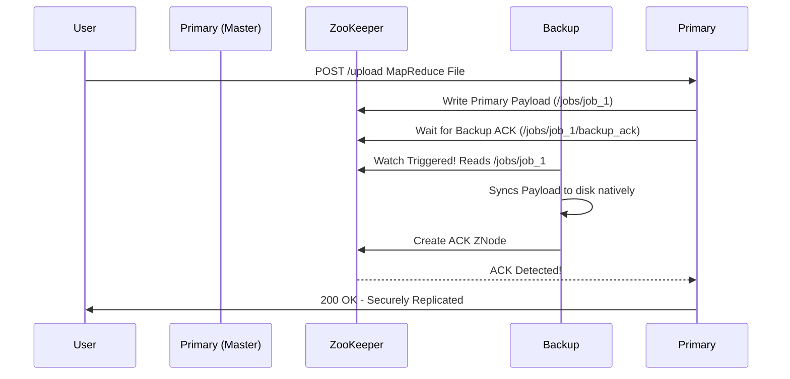

# ECE 465 Spring 2026: Week 10 - Consistency & Replication

> **Reading Assignment:** Chapter 7: Consistency and Replication — *Distributed Systems* by Maarten van Steen and Andrew S. Tanenbaum.

## 1. The Core Conflict: Replication vs. Consistency

In week 9, we utilized Apache ZooKeeper to create a highly available, robustly-coordinated MapReduce computation cluster. However, coordinating execution is only half the battle. In true distributed architectures, maintaining data integrity across physical networks is arguably the most complex problem software engineers face.

We physically copy (replicate) data across multiple machines for two primary reasons:
1.  **Reliability (Fault Tolerance):** If Node A's hard drive crashes, Node B has an identical copy of the database.
2.  **Performance (Scalability):** If 10,000 users request an image, distributing the read requests across 5 replicated servers prevents a single network bottleneck.

The **immediate consequence** of replication is the massive penalty of keeping those replicas identical. If a user modifies a file on Node A, Node B is instantly outdated. How quickly, and in what order, we enforce that Node B matches Node A defines our **Consistency Model**.

---

## 2. Data-Centric Consistency Models

Data-centric models define a systemic "contract" between the distributed data store and the software processes. If software processes obey the rules, the data store promises to return predictable, consistent results. 

*   **Strict Consistency:** The theoretical ideal. A read operation instantly returns the result of the most recent physical write. Because it demands instantaneous global synchronization regardless of physical distance, it directly violates the laws of physics. It is **physically impossible** in true distributed systems.
*   **Sequential Consistency:** All processes see all operations in the exact same order. If Node A writes `X=1` and Node B writes `X=2`, it does not matter if the final result is 1 or 2, as long as *every single reader on the network agrees* on the sequence.
*   **Causal Consistency:** A weakened form of sequential consistency. If Event B occurs *because* of Event A (e.g. inserting a row, then updating that row), all nodes must observe Event A before Event B. Concurrent, unrelated events can be observed in different orders.
*   **Eventual Consistency:** The backbone of massive internet services (DNS, Web Caches, modern CDNs). It guarantees that if no new updates are made to a specific piece of data, eventually, all replica nodes will slowly converge to the identical value. It provides maximum availability and minimum latency at the cost of temporary data staleness.

---

## 3. Client-Centric Consistency Models

While data-centric models worry about the entire cluster, client-centric models focus entirely on a single user's session state. If a user opens a web application on their phone, they do not care if the Tokyo datacenter matches the New York datacenter—they only care that their own actions logically make sense to them.

*   **Monotonic Reads:** If a user reads data value `X`, any subsequent read of `X` by that user will never return an *older* version of the data. 
*   **Monotonic Writes:** A write operation by a user is mathematically guaranteed to be completed before any subsequent write operation by the same user.
*   **Read Your Writes:** A critical UX requirement. If a user updates their profile picture, their next page refresh MUST show the new picture, even if a load balancer routes their refresh request to a totally different datacenter replica.
*   **Writes Follow Reads:** A write operation occurring after a read operation is guaranteed to take place on the same or a more recent version of the data.

---

## 4. Applied Mechanisms: Implementing Consistency in Python

In Week 9, we built the `k8s_zk_template` relying on `kazoo` and `eventlet.tpool` to distribute MapReduce tasks. Below, we extend that exact infrastructure, providing three worked examples demonstrating how to enforce consistency across your worker nodes.

---

### [EASY] Eventual Consistency via State Propagation 

**Theory:** We want to update global MapReduce parameters (e.g. `chunk_size_threshold`) natively across 5 Kubernetes Pod replicas without breaking the event loop. We don't care if a pod takes 5 seconds to update its local variable, we only care that it ultimately *converges*.

```python
# Eventual Consistency Configuration Sync
import time
from kazoo.client import KazooClient
from kazoo.recipe.watchers import DataWatch

zk = KazooClient(hosts='zookeeper:2181')
zk.start()

# Local Cache variable mapping the remote state
global_app_config = {"chunk_size": 1024}

# A DataWatch inherently establishes Eventual Consistency. 
# It triggers asynchronously whenever the ZNode content changes.
@DataWatch('/config/mapreduce_params')
def watch_global_config(data, stat, event):
    global global_app_config
    if data:
        # Upon propagation trigger, converge the local cache to match the Master state
        global_app_config = eval(data.decode('utf-8'))
        print(f"[Worker] Local Cache Eventual Convergence: {global_app_config}")

# Meanwhile, the Master Pod pushes an asynchronous write
def master_push_update():
    new_config = b'{"chunk_size": 2048}'
    # We overwrite the state. The update cascades across the network to all workers.
    zk.retry(zk.set, '/config/mapreduce_params', new_config)

# Network partitions or CPU starvation may delay the DataWatch callback, 
# but Zookeeper completely guarantees *eventual convergence* across all active sessions.
```

---

### [MEDIUM] Primary-Backup (Synchronous) Replication

**Theory:** In strict transaction pipelines (e.g. banking), we cannot afford eventual convergence. We must ensure a Primary replica handles the write and securely duplicates the payload to a Backup *before* acknowledging the user.



```python
# Synchronous Primary-Backup Transaction
import uuid
from kazoo.client import KazooClient

zk = KazooClient(hosts='zookeeper:2181')
zk.start()

def master_synchronous_write(payload_data):
    """ Executes as the Primary Leader Node """
    job_id = str(uuid.uuid4())
    job_path = f"/jobs/{job_id}"
    ack_path = f"{job_path}/backup_ack"
    
    # 1. Primary commits the original data payload
    zk.retry(zk.create, job_path, payload_data, makepath=True)
    print(f"[Primary] Committed {job_id} to Distributed Storage.")
    
    # 2. Synchronous Block: Await the Standby Replica to affirm synchronization
    print("[Primary] Waiting for Backup Replica to synchronize...")
    timeout = 10
    start_time = time.time()
    
    while time.time() - start_time < timeout:
        if zk.retry(zk.exists, ack_path):
            print(f"[Primary] Synchronous Backup Complete! Acknowledging User.")
            return {"status": "success", "job_id": job_id}
        time.sleep(0.5) # Poll fallback
        
    raise Exception("Synchronous Backup Timeout. Transaction Volatile!")

def backup_replication_listener(children):
    """ Executes on the Standby Worker Node """
    for job in children:
        job_path = f"/jobs/{job}"
        ack_path = f"{job_path}/backup_ack"
        
        if not zk.exists(ack_path):
            # 1. Replicate the payload locally
            data, stat = zk.get(job_path)
            print(f"[Backup] Successfully ingested replication for {job}")
            
            # 2. Emit Synced Verification ACK
            zk.create(ack_path, b"SYNCED")
```

---

### [HARD] Quorum-Based Replicated-Write (N-W-R Protocol)

**Theory:** Single Primary nodes establish severe bottlenecks. To solve this, Gifford's protocol demands $N$ replicas. When we write, we mandate a quorum of $W$ nodes accept it. When we read, we must check $R$ nodes. As long as **$R + W > N$**, at least one overlapping node in our Read request is mathematically guaranteed to possess the newest Write version! (Because the intersection of any $R$ nodes and the $W$ nodes must encompass at least one node.)

**Scenario:** We have 5 worker pods storing processed Numpy arrays ($N=5$). 
We set a Read Quorum of $R=3$ and Write Quorum of $W=3$. ($3 + 3 = 6 > 5$).

```python
# Quorum N,W,R Protocol leveraging Kazoo Version Timestamps
import eventlet
from kazoo.client import KazooClient
from kazoo.exceptions import BadVersionError

zk = KazooClient(hosts='zookeeper:2181')
zk.start()

N = 5 # Total Nodes
W = 3 # Write Quorum Target
R = 3 # Read Quorum Target

def quorum_write(payload_data, object_id):
    """ Perform a concurrent W=3 Quorum Write across N nodes """
    # Setup Znode architecture /objects/ID/replica_1..5
    replica_paths = [f"/objects/{object_id}/replica_{i}" for i in range(1, N+1)]
    
    # Concurrent mapping wrapper
    def write_replica(path):
        try:
            zk.ensure_path(path)
            # We increment the version counter iteratively to signify mutation
            data, stat = zk.get(path)
            zk.set(path, payload_data, version=stat.version)
            return True
        except Exception:
            return False # Network Drop / Node offline
            
    # Deploy writes entirely concurrently using Eventlet thread pool
    pool = eventlet.GreenPool(size=N)
    results = list(pool.imap(write_replica, replica_paths))
    
    # Calculate successful atomic writes
    success_count = sum(results)
    
    if success_count >= W:
        print(f"[Quorum] Write Success! Committed to {success_count}/{N} nodes.")
        return True
    else:
        print(f"[Quorum] Write Failed! Only {success_count} nodes achieved. Target {W}.")
        # Rollback logic required here
        return False

def quorum_read(object_id):
    """ Perform a concurrent R=3 Quorum Read to find absolute Truth """
    replica_paths = [f"/objects/{object_id}/replica_{i}" for i in range(1, R+1)] # Select any 3 nodes!
    
    def read_replica(path):
        try:
            data, stat = zk.get(path)
            return {"data": data, "version": stat.version}
        except Exception:
            return None
            
    pool = eventlet.GreenPool(size=R)
    results = [r for r in pool.imap(read_replica, replica_paths) if r is not None]
    
    if len(results) < R:
        raise Exception(f"Failed to achieve Read Quorum. Only {len(results)} nodes responded.")
        
    # Mathematical Guarantee: Find the payload possessing the maximum version!
    # Because W=3 and R=3 out of 5, at least ONE of these reads intersects the newest write!
    latest_replica = max(results, key=lambda x: x['version'])
    
    print(f"[Quorum] Read Truth Located! Version {latest_replica['version']}")
    return latest_replica['data']
```

In this Quorum protocol, even if 2 workers physically die during the write cycle, the data still completely commits because $W=3$. During ingestion, $R=3$ retrieves an intersecting node safely bypassing the offline replicas, providing **impenetrable Fault Tolerance integrated seamlessly into strong Data Consistency**.

---

## 5. Live Project Code & Download Sandbox

Now that we have covered the theory of message queues and ZooKeeper-orchestrated consistency, you can organically peruse and run the underlying application code supporting these replica models.

### 📥 Project Download Options

We have ported the Week 09 Homogeneous MapReduce architecture directly into Week 10 and augmented it with three runnable Python demonstration scripts spanning our Easy, Medium, and Hard consistency models. 

You have two primary methods to grab the project folder and deploy it locally onto your Minikube cluster:

1. **Option 1: Clone the remote repository & switch into the folder**
   You can natively clone the entire class repository securely via Git.
   ```bash
   git clone https://github.com/robmarano/robmarano.github.io.git
   cd robmarano.github.io/courses/ece465/2026/weeks/week_10/k8s_zk_template
   ```
2. **Option 2: Direct Directory Zip Download (via DownGit)**
   If you do not have Git installed or you prefer to pull the extracted folder purely in isolation, just click the link below to automatically package the `k8s_zk_template` directory into an isolated `.zip` archive.
   * [Download the `k8s_zk_template.zip` Project Archive](https://minhaskamal.github.io/DownGit/#/home?url=https://github.com/robmarano/robmarano.github.io/tree/master/courses/ece465/2026/weeks/week_10/k8s_zk_template)

### 🧐 Source Code Exploration

Before deciding to download to your local machine, you can interactively peruse the key architectural code elements operating specifically for these Replica Demonstration scripts:

* 🐍 **[`demo_easy_eventual.py`](./k8s_zk_template/demo_easy_eventual.py)** — Demonstrates passive **Eventual Convergence** across cluster nodes executing purely using `DataWatch` async listeners.
* 🐍 **[`demo_medium_primary_backup.py`](./k8s_zk_template/demo_medium_primary_backup.py)** — Illustrates robust **Primary-Backup** orchestration via `time.sleep` timeouts and ACK handshake verification between two autonomous daemon Greenlets.
* 🐍 **[`demo_hard_quorum.py`](./k8s_zk_template/demo_hard_quorum.py)** — The full robust execution of **Gifford's Quorum (N-W-R)** mathematical consistency guaranteeing replica stability upon partition failures.

---

### 🚀 Build & Deploy on Minikube

Once downloaded via the methods above, deploy the base infrastructure to Minikube to interact with the Python Demo scripts!

#### **Step 1: Deploy ZooKeeper & Python App to Kubernetes**
From inside the `k8s_zk_template` directory, target your Minikube environment:
```bash
# Target Minikube's Docker Engine
eval $(minikube docker-env)

# Build the generic week 10 python worker image
docker build -t zk-app:latest .

# Deploy the configuration array
kubectl apply -f k8s/storage.yaml
kubectl apply -f k8s/zookeeper.yaml
kubectl apply -f k8s/rbac.yaml
kubectl apply -f k8s/app.yaml

# Wait for 5 App worker pods to become healthy
kubectl rollout status deployment/zk-app
```

#### **Step 2: Engage the Code Demos Natively**
Because the python backend image automatically ingests all `.py` files inside the `/app/` directory, you can simply attach to *any* of the 5 running worker pods and force them to execute the demo algorithms using Python's standard interpreter!

Find an active Pod name:
```bash
kubectl get pods -l app=zk-app
# Note down an active pod name e.g. zk-app-123456789-abcde
```

Run the Eventual Consistency Demo inside the cluster:
```bash
kubectl exec -it <pod_name> -- python3 demo_easy_eventual.py
```

Run the Synchronous Primary-Backup Demo:
```bash
kubectl exec -it <pod_name> -- python3 demo_medium_primary_backup.py
```

Run the N-W-R Quorum Protocol Demo:
```bash
kubectl exec -it <pod_name> -- python3 demo_hard_quorum.py
```
