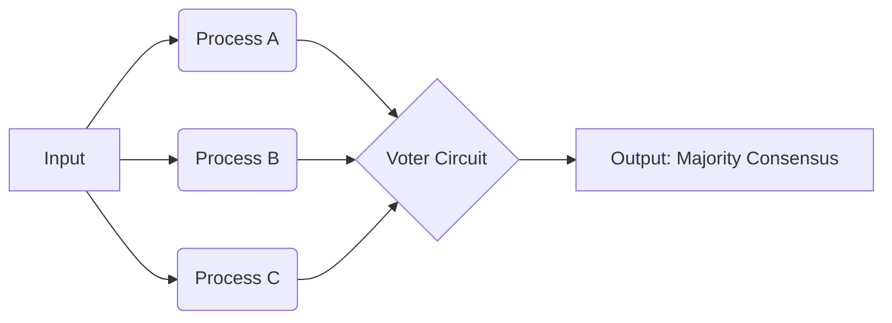
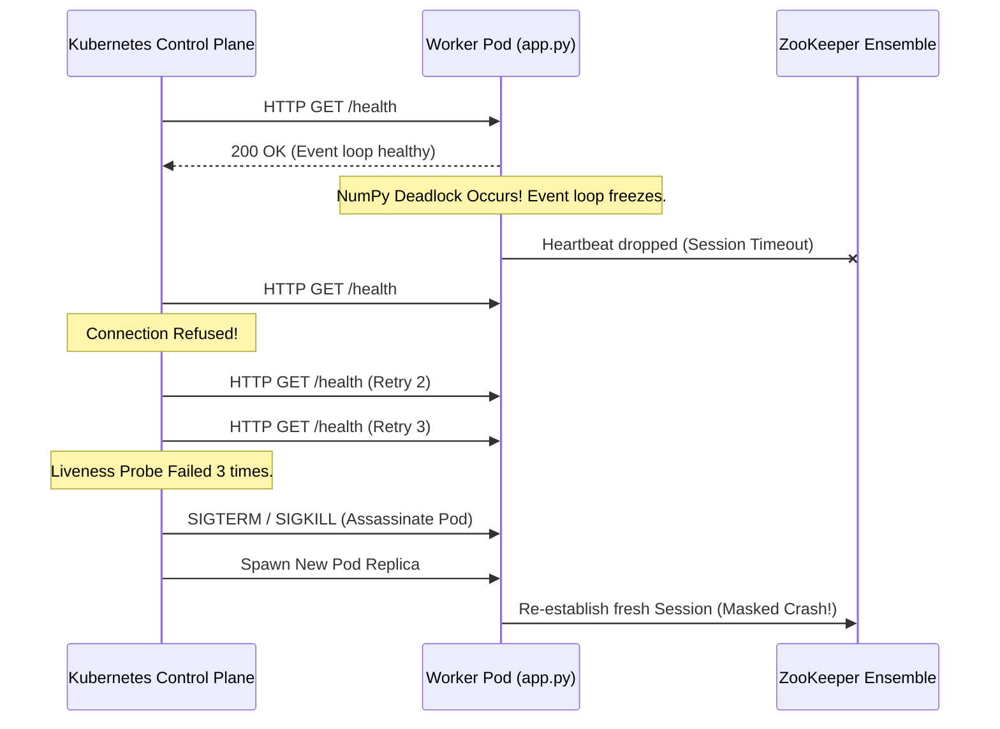

# ECE 465 Spring 2026: Week 11 - Fault Tolerance

> **Reading Assignment:** Chapter 8: Fault Tolerance — *Distributed Systems* by Maarten van Steen and Andrew S. Tanenbaum.

## 1. Basic Concepts of Dependability

As we scale distributed systems out from a single machine to a network of thousands of heterogeneous devices, the probability of failure approaches $100\%$. The primary metric of a successful distributed architecture is not whether it avoids failure entirely (an impossibility), but how **dependable** it remains when subjected to inevitable partial network drops, hardware crashes, and arbitrary logic bugs.

Dependability is classically measured across four critical axes:

1. **Availability:** The system is ready to be used immediately. It is measured as the probability that the system is functioning correctly at any given moment in time $t$. (e.g., "Five Nines" or 99.999% uptime).
2. **Reliability:** The ability of a system to run continuously without failure over a defined period of time. A highly available system might crash every hour but reboot in 1 millisecond. It is highly available, but highly *unreliable*.
3. **Safety:** When a system temporarily fails to operate correctly, nothing catastrophic happens. (Critical for pacemaker control systems, nuclear reactors, and autonomous vehicles).
4. **Maintainability:** How easily a failed system can be repaired and brought back online.

### Faults, Errors, and Failures
To build resilient architectures, we must distinguish the causal chain of disaster:
*   A **Fault** is the underlying cause (e.g., a cosmic ray flipping a bit in RAM, a bug in Python code).
*   An **Error** is the part of the system state that is incorrect due to the fault (e.g., a variable holding `null` instead of an integer).
*   A **Failure** occurs when the error propagates to the system boundary, causing it to fail to deliver its intended service (e.g., the web server returning an HTTP 500 status to a user).

Building a *Fault Tolerant* system means establishing mechanisms to intercept **Errors** before they can ever cross the physical boundary to become a **Failure**.

---

## 2. Failure Models

To design interception mechanisms, we must first mathematically define what a "failure" actually looks like on the network. Tanenbaum outlines a spectrum of failure models, ranging from the easiest to handle, to mathematically devastating scenarios.

| Failure Model | Description |
| :--- | :--- |
| **Crash failure** | A server halts, but was working correctly until it halted. (e.g., Power loss). |
| **Omission failure** | A server fails to respond to incoming requests. <br> • **Receive omission:** Fails to receive incoming messages. <br> • **Send omission:** Fails to send outgoing messages. |
| **Timing failure** | A server's response lies outside a specified time window. (e.g., Video stream buffering, algorithmic timeouts). |
| **Response failure** | The server's response is incorrect. <br> • **Value failure:** The value of the response is wrong (Algorithm logic bug). <br> • **State transition failure:** The server deviates from the correct control-flow state machine. |
| **Arbitrary (Byzantine) failure** | A server may produce arbitrary responses at arbitrary times. This includes malicious interference where a server actively lies to its peers to collapse the cluster. |

> [!WARNING]
> The **Amnesia Vulnerability** we solved in Week 09 using Kubernetes `StatefulSets` was a classic **Crash Failure**. The single ZooKeeper node halted. The hardest failures to solve are **Byzantine Failures**, where nodes remain online but maliciously broadcast corrupted data.

---

## 3. Failure Masking by Redundancy

If a system component is prone to crash, we mask the crash by introducing **Redundancy**.

1. **Information Redundancy:** Adding extra mathematical bits to data to detect or recover from flipped bits (e.g., Hamming Codes, TCP Checksums).
2. **Time Redundancy:** Simply re-executing an action if it fails (e.g., Retrying a timed-out HTTP POST request). Only effective for transient, non-deterministic faults.
3. **Physical Redundancy:** Adding extra physical hardware to the cluster.

### Triple Modular Redundancy (TMR)
The most common form of physical redundancy for fault-tolerance is TMR. We replicate the physical process three times and use a Voter circuit to elect the majority outcome.



If Process B suffers a **Value Failure** and outputs `0` while P1 and P3 output `1`, the Voter circuit masks the error by returning `1`. The system continues operating seamlessly despite a 33% hardware failure rate!

---

## 4. Process Resilience and Byzantine Agreement

Scaling Physical Redundancy up to modern distributed architectures involves organizing computing processes into logical **Groups**.

*   **Flat Groups:** All nodes are equal. Decisions are made collectively (e.g., Quorum voting). If one node crashes, the group loses a fraction of voting power, but the overall system survives immediately.
*   **Hierarchical Groups:** A Coordinator node commands the Workers. (e.g., Our Week 09 MapReduce Master). Highly efficient for load balancing, but introduces a Single Point of Failure (SPOF) requiring complex Leader Election if the Master crashes.

### The Byzantine Generals Problem
What happens if the workers in a flat group are not just crashing, but actively producing Byzantine (Arbitrary) failures? Can the cluster still reach an agreement?

In systems where nodes can lie, mathematical proofs dictate that a distributed cluster can only tolerate $k$ faulty nodes if the total number of nodes $N \geq 3k + 1$.
To tolerate a single malicious, lying node ($k=1$), you require a minimum cluster of **4 nodes** ($3(1) + 1 = 4$). The sheer overhead required to pass these cryptographic validation messages makes pure Byzantine fault tolerance exceptionally expensive, typically reserved for decentralized ledgers (Blockchains) or aerospace systems.

---

## 5. Reliable Client-Server Communication & RPC Semantics

When a client fires off a Remote Procedure Call (RPC) to a server, we must handle the reality that networks drop packets (Omission Failures).

If the client's request times out, it does not know if:
1. The request was lost on the way to the server.
2. The server crashed while processing it.
3. The server finished processing it, but the response was lost on the way back to the client.

Because of this ambiguity, we define RPC execution under failure scenarios using strict semantics:

*   **At-Least-Once Semantics:** The client just keeps blindly retrying the request until it gets an answer. This guarantees the operation executed at least once. **Danger:** Highly destructive if the operation is not *idempotent*. (e.g., Blindly retrying "Charge this credit card $10" could accidentally charge the user $50 if the previous 4 network responses were just dropped).
*   **At-Most-Once Semantics:** The server tracks a unique ID for the RPC and guarantees it will never execute it twice. If a crash occurs mid-execution, it simply reports failure to the client. It executed zero or one times, but never twice.

---

## 6. Distributed Recovery

When a failure does inevitably slice through all of our redundancy and masking mechanisms, the system must engage in **Recovery** to return to a mathematically correct state.

### Forward vs. Backward Recovery
*   **Forward Recovery:** The system attempts to find a new correct state from which it can continue executing. This requires anticipating the fault ahead of time (e.g., Using Error Correcting Codes to fix a broken database packet on the fly).
*   **Backward Recovery:** The system gives up on the current state and restores the system from a previous, known-correct state. (e.g., Restoring a Database from a nightly backup).

### Distributed Checkpointing
Backward recovery requires **Checkpointing**—saving the entire distributed system state to stable storage. 
*   **Independent Checkpointing:** Every node saves its state to disk completely independently on a timer. When a crash occurs, nodes roll back to their last local checkpoint. However, this often triggers the **Domino Effect**: Node A rolls back, forcing Node B to roll back because it depends on messages from Node A, dragging the entire network back to its initial boot state!
*   **Coordinated Checkpointing:** Before saving to disk, all nodes execute a protocol (like a Two-Phase Commit) to ensure they all freeze and take a global, synchronized snapshot of the network simultaneously.

### Message Logging
Because Coordinated Checkpointing is incredibly expensive to pause the network to execute, modern systems prefer **Message Logging**. 
The system takes infrequent, uncoordinated checkpoints, but securely logs *every single network message* to disk in order. If a crash occurs, the node restores from the last local checkpoint and literally replays the message log chronologically to deterministically catch back up to the present moment!

---

## 7. Applied Fault Tolerance: The Two-Phase Commit (2PC)

A Coordinated Checkpoint (or any distributed transaction) requires a fault-tolerant agreement protocol. The textbook defines the **Two-Phase Commit (2PC)** as the industry standard for ensuring that either *all* nodes commit the transaction to disk, or *none* do.

### The 2PC Algorithm in Python (Pseudo-Code)
```python
# The Coordinator orchestrates the Two-Phase Commit
def coordinator_2pc(transaction_data, participants):
    # --- PHASE 1: The Voting Phase ---
    votes = []
    for node in participants:
        # Ask each node to prepare. If they reply "VOTE_COMMIT", they mathematically 
        # guarantee they have written the intent to their local disk and WILL NOT crash.
        response = send_rpc(node, "PREPARE", transaction_data)
        votes.append(response)
        
    # --- PHASE 2: The Decision Phase ---
    if "VOTE_ABORT" in votes or timeout_occurred(votes):
        # If even one node crashes or aborts, the entire transaction is rolled back globally!
        for node in participants:
            send_rpc(node, "GLOBAL_ABORT")
        return "Transaction Failed safely."
        
    else:
        # Every single node voted to commit. We pass the point of no return.
        for node in participants:
            send_rpc(node, "GLOBAL_COMMIT")
        return "Transaction Succeeded atomically."
```
> [!WARNING]
> **The Blocking Vulnerability:** If the Coordinator physically crashes *after* Phase 1 but *before* broadcasting the Global decision in Phase 2, the Participants are permanently deadlocked. They have locked their local databases and are blocked waiting for the Coordinator to reboot. This is why the much more complex **Three-Phase Commit (3PC)** exists to introduce timeouts.

---

## 8. Live Project: Observability & Kubernetes Crash Masking

We have upgraded our ZooKeeper Sandbox into `k8s_dist_histo` for Week 11. This week, we specifically focus on **Crash Failure Masking**. 

In our Python Eventlet backend, heavy computational tasks (like NumPy calculations) can accidentally starve the asynchronous event loop. If the network thread deadlocks, ZooKeeper will drop the connection. How do we mask this failure?

### The Kubernetes Liveness Probe Architecture
We injected a `/health` endpoint into the Flask application, and instructed the Kubernetes Control Plane to ping it every 10 seconds.



### 📥 Project Download & Exploration
You can interact with the live Fault Observability Dashboard, which uses WebSockets to broadcast Kazoo TCP disconnections and Leader Elections directly to the UI.

1. **Option 1: Clone the remote repository**
   ```bash
   git clone https://github.com/robmarano/robmarano.github.io.git
   cd robmarano.github.io/courses/ece465/2026/weeks/week_11/k8s_dist_histo
   ```
2. **Option 2: Direct Directory Zip Download (via DownGit)**
   * [Download the `k8s_dist_histo.zip` Project Archive](https://minhaskamal.github.io/DownGit/#/home?url=https://github.com/robmarano/robmarano.github.io/tree/master/courses/ece465/2026/weeks/week_11/k8s_dist_histo)

### 🚀 Deploying and Triggering Failures
```bash
eval $(minikube docker-env)
docker build -t zk-app:latest .
kubectl apply -f k8s/
```
Once deployed, open the Web UI. You can **trigger a Crash Failure** by manually deleting a pod via the terminal:
```bash
kubectl delete pod -l role=master
```
Watch the UI's **Fault Tolerance Observability** panel instantly detect the crash, renegotiate the ZooKeeper lock, promote a new Leader, and automatically spin up a replacement pod seamlessly!
