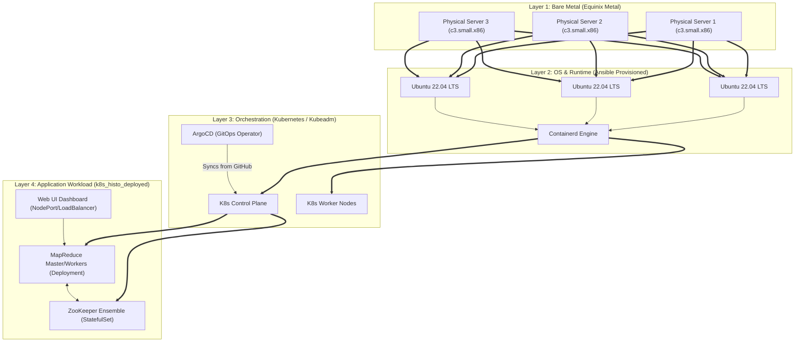
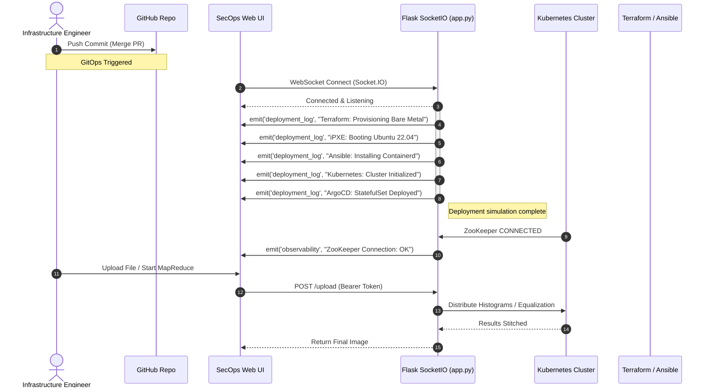

# ECE 465 Spring 2026: Week 13 - Cloud-Based Bare Metal & GitOps Deployment

> **Reading Assignment:** Real-World Deployments and Configuration Management. Supplemental reading on declarative infrastructure vs. imperative automation.

## 1. Escaping the Virtual Sandbox
Throughout the semester, we have utilized Kubernetes (`minikube`) running inside virtual machines on your local laptops. While Virtual Machines (VMs) provide immense isolation, they incur a virtualization penalty (the hypervisor overhead). 

When designing high-frequency trading platforms, massive machine-learning MapReduce clusters, or ultra-low-latency edge devices, you must deploy directly to **Bare Metal**. 

Deploying to bare metal introduces a severe physical challenge: *How do you install an Operating System onto thousands of blank hard drives simultaneously, without manually inserting a USB drive into each rack?*

---

## 2. Bare Metal Provisioning (PXE, MAAS, Tinkerbell)

To automate physical hardware, we rely on **PXE (Preboot Execution Environment)** and its modern successor, **iPXE**. 

When a bare metal server powers on, before it checks its hard drive, its Network Interface Card (NIC) broadcasts a DHCP request asking: *"Who am I, and where is my bootloader?"*

### Bare Metal as a Service (BMaaS)
To manage these PXE broadcasts at scale, we use automated provisioning engines:
*   **MAAS (Metal As A Service):** Created by Canonical (Ubuntu), MAAS acts as a full cloud-like orchestrator. It answers the PXE requests, automatically inventories the physical CPU/RAM/Disks, and pushes a fresh OS image onto the bare drive over the network.
*   **Tinkerbell:** A cloud-native, microservice-based provisioning engine (originally built by Equinix Metal). It uses declarative Kubernetes-style YAML manifests to define exactly what OS and scripts should be burned into the server during the PXE boot phase.

---

## 3. Infrastructure Automation: IaC vs. Configuration Management

Once the physical servers are powered on and running a raw OS (like Ubuntu 22.04), we must automate the installation of our software. We divide this into two categories.

### A. Infrastructure as Code (IaC) - *The "What"*
IaC tools are **Declarative**. You write code declaring *what* the final state of the datacenter should be, and the tool figures out how to make it happen.
*   **Terraform:** The industry standard. You write `.tf` files stating: *"I need 3 Bare Metal servers in New York."* Terraform communicates with the cloud provider APIs (like AWS or Equinix Metal) to securely order, provision, and network the hardware. Terraform is excellent for *creating* the raw compute resources.

### B. Configuration Management - *The "How"*
Once Terraform creates the servers, Configuration Management tools SSH into those servers to imperatively execute commands, install packages, and manage files.
*   **Chef:** Uses "Cookbooks" and "Recipes" (written in Ruby) to manage system configurations. It typically requires an agent running continuously on the physical server.
*   **Ansible:** The modern favorite for its simplicity. It is "agentless" (it just uses standard SSH) and executes sequential tasks defined in YAML **Playbooks**. We use Ansible to log into the raw Ubuntu servers, install Docker, and run `kubeadm init` to turn the raw servers into a Kubernetes cluster.

---

## 4. GitOps: Continuous Kubernetes Deployment

With Kubernetes running on our physical hardware, how do we deploy our MapReduce Sandbox? We could manually type `kubectl apply -f k8s/`, but that is prone to human error and undocumented changes.

Enter **GitOps**. 
GitOps mandates that your Git repository (e.g., GitHub) is the *single source of truth* for your live system. 
*   **ArgoCD:** An operator installed inside the Kubernetes cluster. It continuously monitors your GitHub repository. If you merge a Pull Request that updates the ZooKeeper Docker image from `v1` to `v2`, ArgoCD detects the change and automatically executes the rollout in the live cluster.
*   **Self-Healing:** If an attacker (or clumsy engineer) manually deletes a pod in production using `kubectl delete`, ArgoCD detects the cluster has drifted from the Git definition, and instantly respawns the pod.

---

## 5. Live Project: `k8s_histo_deployed`

This week, we migrated our sandbox to include a physical `deploy/` directory containing the exact scripts used to stand up the architecture:
1.  **`deploy/terraform/main.tf`**: The Terraform code to rent physical Equinix Metal servers.
2.  **`deploy/ansible/playbook.yml`**: The Ansible playbook to install `kubelet` and initialize the Kubernetes Control Plane.
3.  **`deploy/gitops/argocd-app.yaml`**: The ArgoCD declarative definition that binds the live cluster to the GitHub repository.

### Infrastructure Observability
We have also upgraded the UI's **SecOps Dashboard** to include **Infrastructure Deployment Observability**. 
When you deploy the application and open the Web UI, the Python backend will simulate the deployment pipeline sequence, streaming the Terraform, Tinkerbell, Ansible, and ArgoCD rollout events directly to the browser before the cluster accepts MapReduce workloads.

---

## 6. Architecture & Implementation Design

To visualize the complexity of deploying a distributed application onto bare metal, study the following software architecture and sequence diagrams.

### 6.1 System Topology Architecture
This diagram illustrates the hierarchical layers of our deployment, moving from the physical hardware up to the application logic.

### 6.2 Deployment Pipeline & Observability Sequence
This sequence diagram shows how the newly implemented Infrastructure Deployment Simulator in `app.py` streams live rollout telemetry to the SecOps Dashboard via WebSockets.

---

## 7. Connecting the Dots: Real-World Bare Metal Walkthrough

We have covered the theory of escaping the hypervisor sandbox (Section 1), PXE provisioning (Section 2), IaC vs. Configuration Management (Section 3), GitOps (Section 4), and visualized the topology (Section 6). 

Now, let us walk through a highly detailed, step-by-step tutorial on how you, as a Distributed Systems Engineer, will actually design, install, configure, deploy, and observe the `k8s_histo_deployed` application on physical hardware.

### Phase 1: Hardware Design & Acquisition (Terraform)
You begin with nothing but an architecture diagram and a corporate credit card. Your first goal is to acquire physical servers.

1.  **Design the Topology:** You decide you need a highly available (HA) cluster. According to distributed consensus theory, ZooKeeper requires an odd number of nodes to form a mathematical quorum. You design a 3-node bare metal cluster.
2.  **Execute IaC:** Rather than calling a datacenter and racking servers manually, you navigate to `deploy/terraform/main.tf` in your project repository.
3.  **Apply Configuration:** You run `terraform apply`. Terraform authenticates with the Equinix Metal API and reserves three `c3.small.x86` physical machines in the NY5 datacenter.

### Phase 2: OS Installation (iPXE & Tinkerbell)
Terraform powers on the physical servers. The hardware has blank NVMe drives.
1.  **PXE Broadcast:** The physical NICs on the servers wake up and broadcast DHCP requests over the Equinix network.
2.  **Tinkerbell Intercept:** The datacenter's Tinkerbell instance intercepts the broadcast. Based on the MAC address registered by your Terraform script, Tinkerbell streams an iPXE bootloader into the server's RAM.
3.  **Image Burn:** The bootloader downloads an Ubuntu 22.04 LTS image over the network and flashes it directly to the local NVMe drives. The servers reboot into a fresh OS.

### Phase 3: Cluster Configuration (Ansible)
Your 3 servers are now running Ubuntu, but they don't know what Kubernetes is.
1.  **Agentless SSH:** You navigate to `deploy/ansible/playbook.yml`. Ansible uses standard SSH keys to connect to all 3 servers simultaneously.
2.  **Imperative Setup:** Ansible executes a sequence of imperative bash commands:
    *   It disables `swap` (a strict requirement for the `kubelet`).
    *   It installs the `containerd` container runtime.
    *   It downloads and installs the `kubeadm`, `kubelet`, and `kubectl` binaries.
3.  **Kubeadm Init:** Finally, Ansible runs `kubeadm init` on Node 1 (forming the Control Plane) and `kubeadm join` on Nodes 2 and 3. You now have a physical Kubernetes cluster!

### Phase 4: GitOps Deployment (ArgoCD)
The physical cluster is running, but it is empty. We need to deploy `k8s_histo_deployed` and ensure it stays updated.
1.  **Bootstrap GitOps:** You install the ArgoCD operator into the cluster.
2.  **Apply the Binding:** You run `kubectl apply -f deploy/gitops/argocd-app.yaml`. This single command tells the cluster: *"Look at the `k8s/` directory in our GitHub repository. Make this physical cluster match whatever is in that folder."*
3.  **Continuous Synchronization:** ArgoCD clones the repository, reads `zookeeper.yaml` and `app.yaml`, and instructs the Kubernetes API to spin up the StatefulSets, Deployments, and PersistentVolumes across your 3 bare metal servers.

### Phase 5: Operation & Observability
With the GitOps pipeline fully automated, your day-to-day job shifts to management and observability.

1.  **Connect to the Dashboard:** You run `kubectl port-forward svc/master-service 8080:80` and open your browser to `http://localhost:8080`.
2.  **Watch the Simulator:** The UI instantly establishes a WebSocket connection with the Python `app.py` backend. You watch the **SecOps & Infrastructure Observability Dashboard** light up with blue `[IaC / GitOps]` events, streaming a simulated replay of Phases 1 through 4.
3.  **Observe ZooKeeper:** Once the deployment finishes, the Kazoo client connects to the StatefulSet, emitting a green `ZooKeeper Connection: OK` event.
4.  **Manage Faults:** You are now ready to execute chaos engineering (as covered in Week 11 and 12). If you SSH into a physical server and run `iptables -A OUTPUT -p tcp --dport 2181 -j DROP`, you will instantly see `WARNING: SUSPENDED` telemetry in the observability dashboard. If you change the code to fix the issue and `git push`, ArgoCD will automatically roll out the new Docker image to the physical servers, bringing the cluster back to health.
